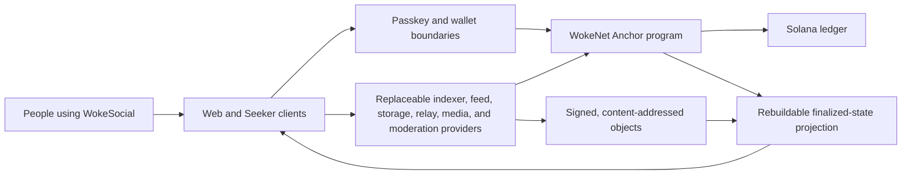

# WokeSocial

**An open, portable social platform with verifiable protocol state on Solana.**

[](LICENSE)


WokeSocial is an open social platform for everyone, being built for
`woke.social`. WokeNet is its portable protocol and Anchor smart-contract layer
on Solana. Together, they aim to make public identity, social relationships,
and signed content independently verifiable without forcing ordinary people to
understand wallets, addresses, or tokens just to participate.

> [!IMPORTANT]
> This is active pre-release development, not a production service. No WokeNet
> program has been published to Solana devnet or mainnet-beta, no `$WOKE` mint
> exists, and no release-grade Solana Seeker application has been published.

> [!TIP]
> **Contributors are wanted.** Product engineers, protocol and Solana
> developers, security reviewers, accessibility specialists, designers,
> safety practitioners, technical writers, test engineers, and community
> builders can all make a meaningful contribution. Start with
> [CONTRIBUTING.md](CONTRIBUTING.md) and the
> [contributor guide](docs/DEVELOPMENT.md). The source repository is currently
> private and access is invite-only. People who already have a direct channel
> to [@AlexBTC420](https://github.com/AlexBTC420) may request access there; a
> public contributor-intake channel has not yet opened.

## At a glance

| Name                   | Meaning                                                                                                             |
| ---------------------- | ------------------------------------------------------------------------------------------------------------------- |
| **WokeSocial**         | The social product, flagship web application, services, and planned native clients                                  |
| **WokeNet**            | The portable WokeSocial protocol, Anchor program, identifiers, SDK boundaries, and exact Solana deployment metadata |
| **`woke.social`**      | The canonical product origin                                                                                        |
| **`sociallywoke.com`** | A legacy redirect-only hostname; never a separate app or WebAuthn origin                                            |

WokeNet is **not** a blockchain, Solana fork, validator implementation, RPC
network, or separate consensus system. Solana validators and RPC providers are
external and replaceable. This repository does not ship a Firedancer/Agave
topology or operate “WokeNet nodes.”

The flagship experience is designed to feel like a polished consumer product.
Compact public state targets the WokeSocial program on a selected Solana
cluster. Signed content, media, private messages, search, recommendations, and
other high-volume concerns remain in independently operable offchain layers.

The configured source remote is the private GitHub repository
`AlexBTC420/wokesocial`; the local workspace remains named `wokenet`. Source
hosting is not a public deployment, audit, or release record.

## Explore the project

| If you want to…                  | Start here                                                                                                                                       |
| -------------------------------- | ------------------------------------------------------------------------------------------------------------------------------------------------ |
| Understand the product           | [Product specification](docs/PRODUCT_SPEC.md), [platform expansion](docs/PLATFORM_EXPANSION.md), and [roadmap](docs/ROADMAP.md)                   |
| Understand the system            | [Architecture](docs/ARCHITECTURE.md), [protocol](docs/PROTOCOL.md), and [ADRs](docs/DECISIONS/)                                                  |
| Set up a development environment | [Development guide](docs/DEVELOPMENT.md)                                                                                                         |
| Find work and contribute         | [Contributing guide](CONTRIBUTING.md), [developer handoff](docs/DEVELOPER_HANDOFF.md), and [task evidence](TASKS.md)                             |
| Review security or privacy       | [Security policy](SECURITY.md), [security design](docs/SECURITY.md), [threat model](docs/THREAT_MODEL.md), and [privacy design](docs/PRIVACY.md) |
| Operate or evaluate a deployment | [Deployment](docs/DEPLOYMENT.md), [operations](docs/OPERATIONS.md), and [final report](FINAL_REPORT.md)                                          |
| Browse all documentation         | [Documentation index](docs/README.md)                                                                                                            |

### Product horizon

The approved direction expands Woke.social beyond the current social
foundation into decentralized long- and short-form video, pseudonymous `.woke`
names, transparent contribution points, a portable avatar and creator-item
marketplace, optional minimal-disclosure verification, open-model AI creation
tools, sourced social-sentiment research, bounded noncustodial automation, and
published product governance.

Those capabilities are planned, not shipped. Their dependency order, privacy
and economic boundaries, verification requirements, and GitHub workstreams are
defined in [Platform Expansion](docs/PLATFORM_EXPANSION.md) and
[epic #12](https://github.com/AlexBTC420/wokesocial/issues/12).

The planned Woke AI product family—Athena for highest reasoning, Kairos for
balanced default use, and Hermes for fast agentic work—is specified in
[Woke AI Platform](docs/AI_PLATFORM.md). The owner-provided Pinkman, Inc.,
Woke Social, Inc., Woke AI, Inc., and ICEFAM Records, LLC. structure and its
unverified legal-status boundary are recorded in
[Organization and Product Ownership](docs/ORGANIZATION.md).

## Project status

This repository began from an empty workspace on 2026-07-28. It is under active
multi-phase implementation. The local foundation, a connected protocol-to-web
slice, and several broader protocol/service paths are implemented and tested,
but nothing is production-ready.
[`TASKS.md`](TASKS.md) records the verification boundary; an unchecked broader
requirement may contain a tested subset without being complete.

| Area | Current state |
| --- | --- |
| Architecture and specifications | Initial baseline implemented; v1 conformance work remains |
| Monorepo and local infrastructure | Implemented and verified locally with PostgreSQL, Redis, Kubo, and hardened service-container profiles |
| WokeNet | The protocol namespace, Anchor program, portable identifiers, deployment manifest schema, SDK boundaries, and indexer bindings are implemented for Solana. Local-validator evidence exists; no devnet or mainnet-beta WokeNet program deployment has been published |
| Social protocol | The generated IDL contains 43 instructions, 19 account layouts, and 33 events. The predeployment community-membership v2 slice replaces creator assignment with member-authorized join/leave plus creator-or-scoped-delegate remove/ban. The handle surface program-enforces deterministic `anon_….woke` ownership from immutable identity origins; fresh passkey identity registration atomically creates the identity and anonymous claim, while custom-name settlement remains open. The wider local-validator surface covers identity/profile references, one-way identity deactivation, handles, root rotation, scoped delegation, delayed guardian-threshold recovery, social actions, communities/governance, posts, reactions, tombstones, and a quarantined legacy payment ABI |
| Signed content and storage | A strict 29-family portable object registry, including current schema-v2 profile, community, and community-membership objects plus read-compatible historical v1 objects, canonical signed manifests, local CAS, multi-provider storage, IPFS/Kubo, and an Arweave-compatible permanent-storage adapter are implemented and tested |
| Open indexer | Finalized Solana RPC synchronization, exact decoding and projection of all 33 IDL events including one-way identity deactivation, canonical profile-v2, governance-bound community-v2, and member-signed community-membership-v2 verification, exact CID/manifest-URI verification, accepted/pending/terminal ingestion, checkpoint-independent bounded hydration, suppression-aware replay, 18 ordered PostgreSQL migrations, RPC failover, DLQ, provenance, and REST APIs are implemented. Privacy-safe community discovery, exact-address membership status, deterministic `public-match-v2` search, and strict checkpoint-covered `.woke` name resolution complement the consumer-safe feed projections; fork/reorg evidence, independent-provider reconciliation, and production-scale rebuilds above 50,000 events remain incomplete |
| Feed service | Independently replaceable chronological, following, community, media, bounded-trending, explainable recommendation, and third-party reconciliation engine implemented and tested |
| Relay | Replaceable signed WebSocket transport, bounded finalized key and expiring opaque-topic subscription authorizer HTTP adapters, and multi-relay failover client implemented and tested; independent authorizer deployments and E2EE remain external |
| Flagship web application | Complete required route surface, production build, responsive/a11y states, provider settings, and real passkey-service registration/sign-in are implemented. The localnet composer atomically registers one passkey-derived identity plus random `.woke` claim, migrates legacy identity-only accounts, signs canonical text-post envelopes, stores exact bytes in local CAS, simulates and finalizes Solana post references, waits for exact indexer projections, survives reload after an ambiguous response without rebroadcast, strictly resolves the finalized name, and renders restored anchor proofs after replay. This path is development-localnet only; public-cluster transactions, community joining, authenticated following, media upload/playback, cross-device safety, and complete offline caching remain open |
| Moderation and safety | Replaceable signed label/report/appeal service, encrypted durable PostgreSQL case ledger, retention/legal-hold lifecycle, transparency aggregation, locked-by-default authorization, and restricted case reads are implemented; production authorizer/SSO and complete specialist product workflows remain blocked |
| Passkeys and recovery | Replaceable WebAuthn service, durable one-time ceremonies/sessions, discoverable browser registration/sign-in, ciphertext-only PRF key-bundle sync, fresh operation signing, and one verified development-localnet protocol-identity/text-publication path are implemented and tested. Delegation lifecycle, recovery, sponsorship, public-cluster execution, and complete device flows remain open |
| End-to-end encrypted messaging | Experimental pairwise-only adapter delegates real Olm sessions to pinned Matrix Rust crypto WASM, authenticates outer envelopes before state mutation, and passes 13 adversarial real-device cases; volatile storage, browser packaging, attachments, safety UX, and reporting remain non-production |
| Media pipeline | Resumable authenticated worker, strict MIME/hash/container checks, real ClamAV scanning, metadata-free image/video/audio processing, HLS, waveform output, unsigned media manifests, and independent preprocessed publication are implemented and tested; flagship upload integration remains open |
| Creator payments and `$WOKE` | No `$WOKE` mint or successful payment flow exists. The existing lamport-denominated tip/subscription ABI is legacy and quarantined: bootstrap, execution, authority mutation, and unpause fail without state/balance changes. Portable metadata truthfully accepts SOL or exact SPL asset details and rejects `{ kind: "woke" }`; a real SPL/Token-2022 mint, reviewed authorities/tokenomics, a new mint-aware ABI, migration, SDK/UI/indexer work, tests, and audit are required before any `$WOKE` payment claim |
| Solana Seeker app | An Expo/React Native Android foundation implements the Mobile Wallet Adapter connection boundary, exact Solana deployment verification, a read-only chronological feed, verified public-community discovery, and unit-test coverage. Community discovery is read-only: identity selection, manifest signing, simulation, Mobile Wallet Adapter transaction approval, finality, and indexer-catch-up are not connected. It is not a release: no verified Seeker-device run, transaction-signing flow, reproducible signed APK, signing provenance, secure update/rollback evidence, store submission, or publication exists |
| Production deployment | Not authorized or attempted |

The fixed development-localnet program ID is
`9kFGJEzA7uKvJ1wTvKRWoFadRU7WFnpwWEGP6APro3dD`. It is a development identifier,
not evidence of a devnet or mainnet-beta deployment.

### Verified local evidence

- `pnpm setup` installs checksum-verified, project-local Rust 1.89.0, Solana
  2.3.0, and Anchor 0.32.1 development toolchains; starts the pinned local
  containers; and applies PostgreSQL migrations.
- `pnpm test:programs` performs an Anchor SBF build and passes a real
  31-case Solana local-validator suite covering core actions, handle
  release, all six delegated social variants, delayed guardian recovery,
  one-member-one-vote proposal/vote/finalization, quarantined legacy payment paths,
  and adversarial authorization, substitution, snapshot, replay, cancellation,
  epoch, threshold, and payment-quarantine paths. The payment tests prove
  bootstrap, execution, authority mutation, and unpause fail without state or
  balance changes; no successful payment flow exists.
- `pnpm test:vertical-slice` starts a fresh validator and disposable PostgreSQL,
  proves the canonical 10-event history, then drives real Chromium through a
  one atomic passkey-created identity plus anonymous `.woke` claim and two text
  posts. The first post loses its forwarded response after finality, reloads a
  locked finalized intent, and reconciles without a duplicate transaction. The
  strict resolver proves the name-to-stable-identity-to-current-root binding;
  the expanded 14-event projection is destroyed and replayed to exact state,
  and both post transaction signatures render on the restored feed/detail
  surface. All audited secret-match and forbidden-field counts are zero. This
  is local Solana program evidence, not a public deployment claim.
- The updated package run covers deterministic canonical bytes and identifiers, Ed25519
  verification across 29 portable object families, local CAS integrity, storage
  replication, recoverable SDK publication, manifest verification, exhaustive
  current-IDL indexing, and in-memory rebuild. That focused baseline
  includes 149 configuration unit cases plus four verified-database-TLS
  integration cases, 206 indexer unit cases across 21 files, 36 isolated
  indexer PostgreSQL cases across 12 files, 38 feed-service cases, and 25
  shared rate-limiter unit cases plus six real-Redis integration cases.
  The workspace-wide membership-v2 gates pass; counts not explicitly updated
  for that slice retain the prior published baseline and should not be treated
  as a newly captured aggregate.
- Relay tests exercise 81 unit cases and 34 real-loopback WebSocket integration
  cases, including signed envelopes, locked-by-default authorization, bounded
  retention, backpressure, failover, reconnect, deduplication, subscription
  scope enforcement, and relay-local gap detection.
- Thirteen real-WASM messaging cases create independent devices, establish
  authenticated Olm sessions through opaque directory requests, verify
  sender-signed routing metadata before stateful decryption, reject relay
  mutation without consuming the honest copy, enforce local and remote
  revocation, bound dependency stalls, and keep plaintext out of directory and
  relay artifacts. The adapter exposes no group/room API and rejects its
  memory-only storage mode in production.
- The media worker passes 70 adversarial unit cases and three real
  Sharp/FFmpeg/ffprobe integrations. Its hardened Compose profile additionally
  passes benign/EICAR scans through the production adapter and digest-pinned
  ClamAV 1.5.3 while both containers run unprivileged with read-only roots and
  no published clamd port.
- Container integration tests pass against PostgreSQL and Kubo. The PostgreSQL
  test projects signed profile/post/tombstone manifests, a follow edge, duplicate
  delivery, feed filtering, and deterministic rebuild.
- The 46-page Next.js route surface builds for production; 109 web unit tests
  and 210 desktop and mobile-viewport Playwright cases pass, with two deliberate
  duplicate mobile-viewport passkey lifecycle cases skipped. The suite includes
  automated axe WCAG A/AA checks across 45 route fixtures in both desktop and
  mobile-viewport projects, plus
  semantic connected-post coverage and a real virtual-authenticator
  atomic-registration, logout, and discoverable-sign-in journey.
- The replaceable authentication service passes 34 unit/API security and
  retention cases, four isolated PostgreSQL integration cases, and one
  real-browser WebAuthn ceremony case. Initial credential/root-wrapper/account
  activation, same-root passkey addition, and authentication/session issuance
  are atomic at their respective store boundaries; revocation is step-up
  protected and invalidates service sessions. The service never receives a PRF
  result or plaintext signing seed and does not claim to create or revoke the
  protocol identity or Solana program delegation.
- The moderation provider passes 56 unit cases and four isolated PostgreSQL
  cases, including append-only ledger enforcement, runtime-role deletion
  denial, readiness privilege checks, and retention-safe maintenance behavior.
- Digest-pinned OCI images for authentication, feed, relay, and moderation
  services have been locally built and exercised as unprivileged users with
  read-only roots, dropped capabilities, bounded process counts, and explicit
  liveness/readiness behavior.
- The dependency audit currently reports no known vulnerabilities after exact
  patched-version overrides; a checksum-pinned Gitleaks wrapper and CI security
  workflow are configured.

## How it fits together



Solana is the ledger and execution environment. WokeNet commits compact,
verifiable public facts and content references. Replaceable providers handle
querying and high-volume data, while clients verify the network, program,
signatures, hashes, and provider provenance appropriate to each operation. See
the [architecture document](docs/ARCHITECTURE.md) for trust boundaries,
authority, failure behavior, and data placement.

## Architectural commitments

- Identity and the social graph must survive the flagship client and database.
- Public content is versioned, content-addressed, signed, and independently
  verifiable.
- PostgreSQL indexers are disposable projections, never canonical state.
- RPC providers, content gateways, indexers, relays, storage providers,
  moderation providers, and feed providers are replaceable.
- Sensitive personal information and private messages never go onchain.
- A public or unlisted open-community join/leave must be authorized by the
  member identity. A creator root or current scoped delegate may remove or ban
  only an existing membership; `banned` is terminal.
- The public indexer may answer one exact verified membership-PDA status query
  for an open public/unlisted community, but it exposes no roster, member or
  actor identity, signer authority, moderation reason, or manifest location.
- Private content is encrypted before it reaches storage or relays.
- Deletion is implemented with client/indexer suppression, storage-provider
  requests where possible, key destruction for encrypted content, and signed
  tombstones. Permanent or replicated copies cannot be dishonestly promised
  away.
- Ordinary identities, posts, reading, and social participation are not
  token-gated, and no NFT is required.
- No `$WOKE` mint exists. The name is reserved for a possible future
  SPL/Token-2022 asset; it is not SOL, lamports, a native fee currency, or a
  currently usable payment instrument.
- The non-release Android foundation targets Solana Seeker and Mobile Wallet
  Adapter. Its current feed and community discovery are read-only; a release
  still requires the missing wallet-backed mutation flow, device evidence,
  transaction-intent tests, reproducible builds, controlled signing, signed-APK
  provenance, security review, secure update/rollback evidence, and explicit
  distribution approval.

## Documentation

The [documentation index](docs/README.md) is the canonical map of project
documentation. Its main collections are:

| Collection                | Documents                                                                                                                                                                           |
| ------------------------- | ----------------------------------------------------------------------------------------------------------------------------------------------------------------------------------- |
| Product and experience    | [Product specification](docs/PRODUCT_SPEC.md), [brand](docs/BRAND.md), [accessibility](docs/ACCESSIBILITY.md), [roadmap](docs/ROADMAP.md)                                           |
| Architecture and protocol | [Architecture](docs/ARCHITECTURE.md), [protocol](docs/PROTOCOL.md), [decentralization](docs/DECENTRALIZATION.md), [architecture decisions](docs/DECISIONS/)                         |
| Trust and safety          | [Security design](docs/SECURITY.md), [threat model](docs/THREAT_MODEL.md), [privacy](docs/PRIVACY.md), [moderation](docs/MODERATION.md), [legal review scope](docs/LEGAL_REVIEW.md) |
| Build and verification    | [Development](docs/DEVELOPMENT.md), [testing](docs/TESTING.md), [deployment](docs/DEPLOYMENT.md), [operations](docs/OPERATIONS.md)                                                  |
| Evidence and delivery     | [Task record](TASKS.md) and [final verification report](FINAL_REPORT.md)                                                                                                            |

## Repository layout

```text
apps/
  web/                  Complete required route surface and connected read-only slice
  mobile/               Non-release Expo/React Native Seeker and Mobile Wallet Adapter foundation
  auth-service/         Replaceable WebAuthn RP, sessions, and ciphertext-only key-bundle sync
  indexer/              Finalized Solana RPC synchronizer and rebuildable projection
  feed-service/         Replaceable chronological/recommendation feed engine
  relay/                Non-authoritative signed WebSocket transport and client
  moderation-service/   Signed label and restricted report/appeal provider
  media-worker/         Resumable, verified, noncustodial media preparation
packages/
  protocol/             Implemented canonical schemas, signatures, hashes, and IDs
  storage/              Local, memory, multi-provider, IPFS, and Arweave adapters
  sdk/                  Post/profile/community/membership publication plus quarantined legacy payment helpers
  ui/                   Implemented accessible design-system subset
  config/               Implemented shared typed local configuration
  crypto/               WebCrypto hashing, HKDF, sealed envelopes, and passkey key wrapping
  messaging/            Pairwise-only Matrix Rust crypto WASM adapter
  test-fixtures/         Deterministic public protocol fixtures and golden values
programs/
  social_protocol/      Implemented Anchor core-protocol subset
network/
  solana/               WokeNet deployment manifests and Solana cluster metadata
infra/                  Local and provider-neutral infrastructure
scripts/                Reproducible setup, verification, and operations
docs/                   Product, protocol, security, and operator docs
```

Production messaging, complete recovery UX, payment UX, release-grade Seeker delivery,
and other incomplete boundaries are not presented as false-success services.
The moderation, authentication, pairwise encryption, recovery-program,
quarantined payment-program/SDK/indexer, and media paths are implemented
subsets, not claims that the full safety, protocol identity, account-recovery,
messaging, creator-economy, mobile, or publication products are complete.

## Quick start

### Prerequisites

- Node.js `22.23.1`
- pnpm `11.2.2` through Corepack
- A running Docker daemon with Docker Compose
- Git

Rust `1.89.0`, Solana `2.3.0`, and Anchor `0.32.1` are installed into the
project-local `.local/toolchains` directory by `pnpm setup`. Do not silently
substitute other versions: program builds and evidence are tied to the pinned
toolchain.

### Install and run

```sh
corepack enable
pnpm install --frozen-lockfile
pnpm setup
pnpm dev
```

The checked-in `.env.example` contains intentionally public,
development-only values. Copy it to `.env` only when you need local overrides,
and never commit real credentials or production endpoints. `pnpm setup`
validates the exact Node/pnpm toolchain, installs the project-local chain
toolchain, starts PostgreSQL, Redis, and Kubo/IPFS, validates configuration, and
applies workspace migrations.

Useful root commands:

```sh
pnpm test
pnpm test:integration
pnpm test:e2e
pnpm measure:performance
pnpm test:programs
pnpm test:vertical-slice
pnpm lint
pnpm typecheck
pnpm build
```

`pnpm test` is the fast workspace unit suite. Container integrations,
Solana local-validator tests, the connected local proof, and browser tests
remain explicit commands:

```sh
pnpm test:integration
pnpm test:programs
pnpm test:vertical-slice
pnpm test:e2e
pnpm measure:performance
```

`pnpm verify:all` composes the workspace gates, container integrations, browser
suite, local production-browser performance observation, Solana local-validator
program suite, connected local slice, dependency audit, and local
secret scan when the required local services are available. It does not deploy
to devnet or mainnet-beta, publish a Seeker APK, or create a `$WOKE` mint.

`pnpm dev` loads `.env` or the checked-in local-only `.env.example`, starts and
waits for PostgreSQL, Redis, Kubo, the private ClamAV network, and the
containerized media worker, reapplies idempotent local migrations, then starts
the implemented workspace development processes. Relay and moderation run in
an explicitly loopback-only advisory mode. The command rejects production
environments and non-loopback service binds before it enables those two
development-only overrides. Standalone services remain locked by default. Stop
persistent containers with `pnpm infra:down`.

For focused workflows, troubleshooting, testing layers, and contribution
expectations, continue with [docs/DEVELOPMENT.md](docs/DEVELOPMENT.md).

## Contributing

WokeSocial is actively looking for contributors. Valuable work is not limited
to writing application code:

- web, mobile, protocol, indexer, provider, and infrastructure engineering;
- Solana program review, transaction safety, and independent conformance work;
- threat modeling, privacy engineering, abuse prevention, and moderation
  operations;
- accessibility auditing, inclusive design, UX research, and content design;
- deterministic testing, developer experience, documentation, and release
  evidence; and
- community stewardship, governance research, and contributor onboarding.

Because the GitHub repository is currently private, access is invite-only.
Prospective contributors who already have a direct channel to
[@AlexBTC420](https://github.com/AlexBTC420) may request access there; a public
contributor-intake channel has not yet opened.
Please read [CONTRIBUTING.md](CONTRIBUTING.md), the
[Code of Conduct](CODE_OF_CONDUCT.md), and the
[development guide](docs/DEVELOPMENT.md) before proposing a change. Never put
vulnerabilities, secrets, private user content, or personal data in an issue or
pull request.

## Security and privacy

Do not report a security vulnerability in a public issue. The private reporting
process is documented in [`SECURITY.md`](SECURITY.md).

Never commit seed phrases, private keys, passkey material, session keys,
database credentials, provider tokens, or production RPC URLs with embedded
credentials. Development examples must use deterministic local-only fixtures.

The privacy and legal documents in this repository are technical implementation
support. They are not legal advice and require review by qualified counsel
before a public launch.

## Licensing

**Source-available dual license — not OSI open source.**

| Track | Rights | Cost |
| --- | --- | --- |
| **Section A** | Read, audit, test, benchmark, non-commercial evaluation, security research | Free |
| **Section B** | Production, SaaS, commercial redistribution, government operational use | **Paid** |

- Full legal text: [`LICENSE`](LICENSE)
- How to buy production rights: [`COMMERCIAL_LICENSE.md`](COMMERCIAL_LICENSE.md)
- Short banner: [`NOTICE`](NOTICE)

Transparency and validation are free. Running this as a product, SaaS, or
government production system requires a written Section B license from the
copyright holder. Historical MIT snapshots remain under MIT for recipients who
obtained them while MIT applied; **current default-branch code is dual-licensed.**

Third-party dependencies retain their own copyright and license terms. For
example, the messaging adapter's Matrix crypto dependency is documented in its
[third-party notices](packages/messaging/THIRD_PARTY_NOTICES.md).

By contributing, you accept the CLA terms in [`LICENSE`](LICENSE) (copyright
assignment / exclusive commercializable license). Contributing does **not**
grant free production rights.
