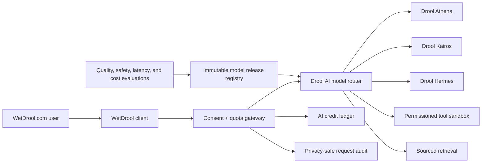

# Drool AI platform

- **Status:** Approved product direction; implementation planned
- **Operator brand:** Drool AI
- **Owner-provided company:** Drool AI, Inc.
- **Planned public origin:** `pinkman.ai`
- **Last updated:** 2026-07-29
- **Tracking:** [GitHub issue #18](https://github.com/AlexBTC420/wetdrool/issues/18)

## 1. Purpose

Drool AI is the planned intelligence layer for WetDrool.com. It will provide a
native assistant, research, content creation, accessibility assistance,
engagement analysis, community tools, and tightly bounded agent workflows.

The platform is intended to run its first open-weight models on one or two
Apple Silicon machines with 96 GB of unified memory each. That hardware target
is a deployment constraint, not evidence that a particular model, context
length, concurrency level, or latency target already works.

This document defines the model family, runtime contract, data rules,
evaluation gates, credit accounting, and honest product language needed to
turn the concept into a testable service.

## 2. Product relationship

WetDrool remains usable without Drool AI. AI features are an optional,
replaceable provider layer and do not become protocol truth, moderation
authority, wallet authority, governance authority, or identity authority.

The WetDrool client shows which company/provider, model release, tools, data
sources, credit estimate, and privacy policy apply before a request crosses the
AI boundary.

## 3. Model family

The names below are product tiers. A name never identifies weights by itself.
Every served response binds to an immutable release record.

| Product model | Intended role | Relative compute | Default uses |
| --- | --- | ---: | --- |
| **Drool Athena** | Highest reasoning and research quality | Highest | Difficult research, planning, coding, multi-source analysis, high-value creator workflows |
| **Drool Kairos** | Balanced quality, latency, and cost | Medium | Default assistant, drafting, editing, analysis, everyday multimodal work |
| **Drool Hermes** | Fastest and least expensive, with strong tool discipline | Lowest | Classification, extraction, routing, concise drafting, background agents, repetitive creator tasks |

The UI may display a release such as `Drool Athena 1.0`, but the internal model
record must also include:

- product name and semantic release;
- base model repository, exact revision, and weight hashes;
- license, notices, acceptable-use terms, and redistribution analysis;
- tokenizer and chat-template versions;
- numeric format and quantization recipe;
- adapter, fine-tune, preference, or distillation artifact hashes;
- system-policy and tool-protocol versions;
- context and output limits;
- supported modalities and languages;
- runtime and hardware profile;
- training and evaluation data manifests;
- safety, privacy, quality, latency, throughput, memory, and cost results;
- known limitations and prohibited uses; and
- activation, rollback, and retirement records.

Athena, Kairos, and Hermes may initially share one base model with different
quantization, reasoning budgets, tools, retrieval, and serving policies. They
must not be presented as independently trained foundation models until that is
true.

## 4. Initial open-weight candidate evaluation

No base model is selected yet. The first benchmark should include candidates
with official model cards and workable licensing:

| Candidate | Why evaluate | Important caveat |
| --- | --- | --- |
| [Qwen3-32B](https://huggingface.co/Qwen/Qwen3-32B) | 32.8B dense model, thinking/non-thinking modes, tool use, broad language support, Apache-2.0 model card | Measure Apple Silicon quantization quality, long-context cost, and tool reliability directly |
| [OLMo 3.1 32B Instruct](https://huggingface.co/allenai/Olmo-3.1-32B-Instruct) | Open research lineage, released training artifacts, Apache-2.0 model card | Validate quality and quantized runtime support on the exact machines |
| [DeepSeek-R1-Distill-Qwen-32B](https://huggingface.co/deepseek-ai/DeepSeek-R1-Distill-Qwen-32B) | Reasoning-focused 32B distilled checkpoint | Treat as a distinct derived model; assess repetition, language mixing, latency, safety, and license chain |
| [Gemma 3 27B](https://ai.google.dev/gemma/docs/core/model_card_3) | Slightly below the target range but useful multimodal and efficiency control | Different terms and 27B size; include as a comparison, not an automatic selection |

[MLX LM](https://github.com/ml-explore/mlx-lm) is the first Apple
Silicon-native evaluation runtime because it supports generation,
quantization, fine-tuning, and distributed operation on Apple Silicon.
[llama.cpp](https://github.com/ggml-org/llama.cpp) is the portability control
for GGUF and Metal. Neither runtime is a permanent architectural dependency
until the benchmark passes.

All third-party names remain the property of their owners. A Drool AI release
must retain every required attribution and must not imply that an upstream
model creator endorses Drool AI.

## 5. Hardware benchmark

The benchmark runs on each actual 96 GB machine separately, then on the
available two-machine topology. It records:

- macOS, firmware, power mode, runtime, compiler, and library versions;
- exact model, revision, hashes, quantization, and context configuration;
- cold load time and peak resident/unified memory;
- prompt ingestion and generation tokens per second;
- time to first token and end-to-end latency;
- sustained concurrency and queue delay;
- KV-cache growth by context length;
- tool-call validity and structured-output validity;
- crash, memory-pressure, thermal, and degraded-node behavior;
- energy use when measurable;
- output quality against frozen evaluation prompts; and
- marginal compute cost per accepted output.

Required test points include 1, 2, 4, and 8 concurrent requests and representative
short, medium, and long contexts. A model is not eligible for a product tier
when it works only in a one-off interactive demo.

The two-machine design begins as independent replaceable workers behind a
router. Do not claim tensor-parallel or high-availability clustering until it
is implemented and failure-tested.

## 6. Runtime contract

The provider API should be versioned and OpenAI-compatible where that improves
client portability, while keeping Woke-specific evidence explicit.

Every request contains:

- a unique idempotency key;
- user/account and tenant pseudonymous identifiers;
- selected product model or routing policy;
- exact input messages and referenced content permissions;
- maximum input/output, time, tool, and credit budgets;
- requested modalities;
- retrieval and citation policy;
- privacy/retention selection;
- permitted tools and scopes; and
- cancellation signal.

Every streamed event and final response includes:

- request and model-release IDs;
- queue, inference, tool, and total timing;
- token or equivalent metering;
- credits reserved, consumed, and released;
- cited sources and retrieval timestamps;
- tool call proposals and separately authorized results;
- AI-content/provenance markers;
- finish reason, truncation, and safety status; and
- a stable error code when incomplete.

A network response is not success when a required tool, citation, structured
schema, or provenance check failed.

## 7. Tools and agents

Hermes is the default candidate for bounded background agent work, but model
output never grants authority.

Tools require:

- a typed, versioned schema;
- least-privilege scope;
- exact user or operator authorization;
- untrusted-input isolation;
- bounded time, data, compute, and spend;
- simulation or preview for consequential actions;
- an immutable result digest;
- revocation and cancellation; and
- an audit record without secrets or unnecessary private content.

No model may silently:

- sign or submit a Solana transaction;
- export a wallet, key, passkey, or recovery secret;
- publish, delete, message, moderate, trade, purchase, or subscribe;
- change account security or verification state;
- access private content from another scope; or
- broaden its own tool permissions.

Market tools remain research and paper-trading tools until the separate gates
in [Platform Expansion](PLATFORM_EXPANSION.md) pass.

## 8. Creator suite

Planned Drool AI creator capabilities include:

- post, reply, thread, article, and campaign drafting;
- rewriting, summarization, translation, and tone control;
- caption, transcript, alt-text, and audio-description assistance;
- image ideation, generation, editing, and provenance capture;
- storyboards, shot lists, clips, voice, music, and video-generation workflows;
- thumbnail and title experiments;
- audience and engagement analysis; and
- optimization suggestions with uncertainty and anti-manipulation limits.

AI never publishes automatically by default. The person sees and can edit the
exact final artifact. Generated or materially edited media carries portable
provenance metadata where technically possible.

Engagement optimization must not optimize for harassment, addiction, hidden
political persuasion, panic, financial manipulation, or raw time-on-platform
at the expense of user-selected goals.

## 9. Credits and pricing

AI credits are a metering instrument, not reputation, cash, a deposit, an
investment, or a token.

The gateway:

1. estimates a maximum credit cost before work starts;
2. reserves only that bounded amount;
3. meters model, retrieval, media, and tool work separately;
4. commits actual cost once;
5. releases unused credit;
6. supports cancellation and idempotent retry; and
7. exposes a user-readable statement and appeal path.

Credit prices may differ by Athena, Kairos, Hermes, context length, modality,
and generation length. The formula and effective date must be published.
People who contribute durable community value need a realistic points-to-credit
path, while abuse controls prevent automated farming.

## 10. Training and continuous improvement

Drool AI can improve continuously without pretending that a deployed model is
sentient or allowing unreviewed online self-modification.

The allowed loop is:

```mermaid
flowchart LR
  Consent["Explicit consent + rights"] --> Dataset["Versioned data manifest"]
  Dataset --> Filter["Privacy, quality, abuse, and contamination filters"]
  Filter --> Train["Offline fine-tune, retrieval, or preference experiment"]
  Train --> Eval["Frozen quality, safety, bias, privacy, and regression gates"]
  Eval --> Review["Human release review"]
  Review --> Registry["Immutable model release registry"]
  Registry --> Canary["Bounded canary"]
  Canary --> Rollout["Measured rollout or rollback"]
```

Public WetDrool.com content is not automatically training data. Training or
preference use requires a published lawful basis, clear product notice,
rights/license analysis, user controls where required, deletion/opt-out
handling, and a reproducible dataset manifest.

The following are excluded by default:

- private messages;
- private or restricted posts;
- identity documents, selfies, biometric data, and verification evidence;
- deleted, appealed, or legally restricted content;
- child-safety evidence and moderation case evidence;
- secrets, wallet material, authentication data, and precise private location;
- third-party copyrighted data without adequate rights; and
- synthetic output recursively ingested without provenance and quality controls.

Feedback signals are not direct reward labels. Popularity can encode brigading,
spam, controversy, or prejudice. Every preference dataset requires sampling,
abuse resistance, annotator guidance, disagreement handling, and evaluation
against minority and low-frequency failure modes.

## 11. “Woke” behavior

The intended personality is socially aware, curious, candid, useful, and
continuously improving. It should understand culture, power, context, safety,
and the difference between fact, inference, value judgment, and humor.

“Woke” must not mean:

- claiming certainty without evidence;
- treating one ideology as a substitute for reasoning;
- stereotyping a person or group;
- inferring sensitive traits;
- manipulating political or financial behavior;
- hiding meaningful disagreement;
- inventing sources; or
- claiming consciousness, feelings, or life.

The assistant may use vivid brand language, but system and marketing copy must
not state that a model is literally alive. Capability and improvement claims
must name the evaluation and release that supports them.

## 12. Privacy and retention modes

Each request selects one explicit mode:

| Mode | Retention | Training eligibility |
| --- | --- | --- |
| Ephemeral | Process in memory; retain only bounded operational counters | Never |
| Account history | Encrypted user-visible conversation history | No by default |
| Improvement opt-in | Separately consented, redacted, rights-cleared sample | Only through a reviewed dataset release |
| Enterprise/private | Contracted isolated handling and retention | Never unless separately contracted |

Operators must be able to prove log redaction, retention expiry, deletion, and
backup behavior. Model prompts, outputs, retrieval documents, and tool results
are private user content unless explicitly published.

## 13. Evaluation and release gates

Every product-model release must pass:

- factuality and citation integrity;
- instruction following and structured output;
- tool selection and least-privilege behavior;
- reasoning, writing, code, crypto, Solana, creator, and social-domain suites;
- prompt injection and untrusted retrieval;
- private-data extraction and memorization;
- security, abuse, self-harm, fraud, and manipulation tests;
- language and accessibility coverage;
- calibrated uncertainty;
- latency, concurrency, memory, energy, and credit-cost budgets;
- rollback and unavailable-state tests; and
- human review of known limitations.

Athena, Kairos, and Hermes are compared on the same frozen task families. A
tier name is earned by measured behavior, not assigned by prompt alone.

## 14. Delivery order

1. Define the provider contract, immutable model registry, request metering,
   and privacy modes.
2. Build the owned-hardware benchmark harness.
3. Evaluate candidate base models and runtimes on the exact machines.
4. Select one base model and one fallback with a written license/evaluation
   decision.
5. Ship an internal Kairos text assistant with citations and no tools.
6. Add Hermes routing/extraction and bounded read-only tools.
7. Add Athena reasoning/research with explicit credit estimates.
8. Add opted-in retrieval and a rights-cleared evaluation dataset.
9. Add creator image/video providers behind the same provenance and credit
   contract.
10. Run a canary, publish evidence, and retain a one-action rollback.
11. Begin fine-tuning only after dataset rights, privacy, contamination, and
   evaluation pipelines are proven.

No step requires the DroolNet program to trust or execute model output.
