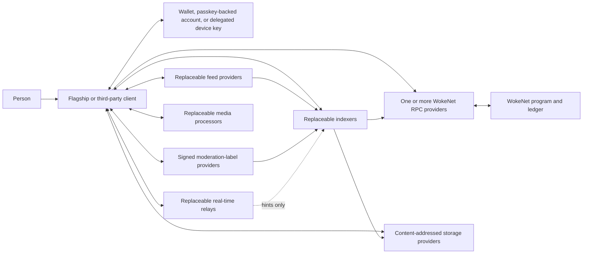
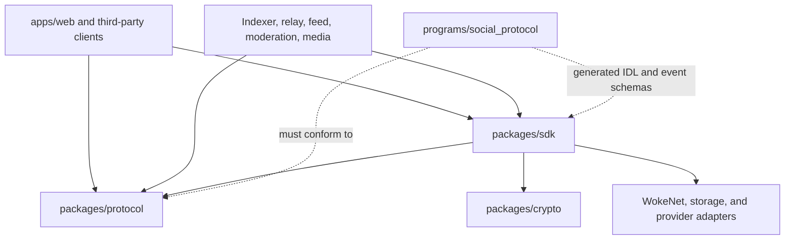
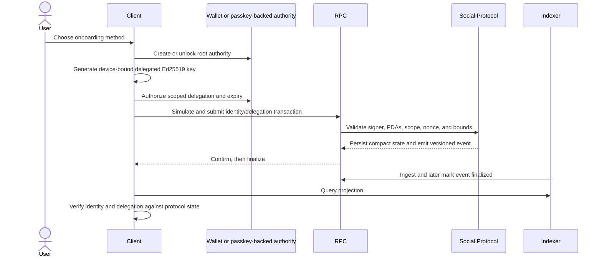
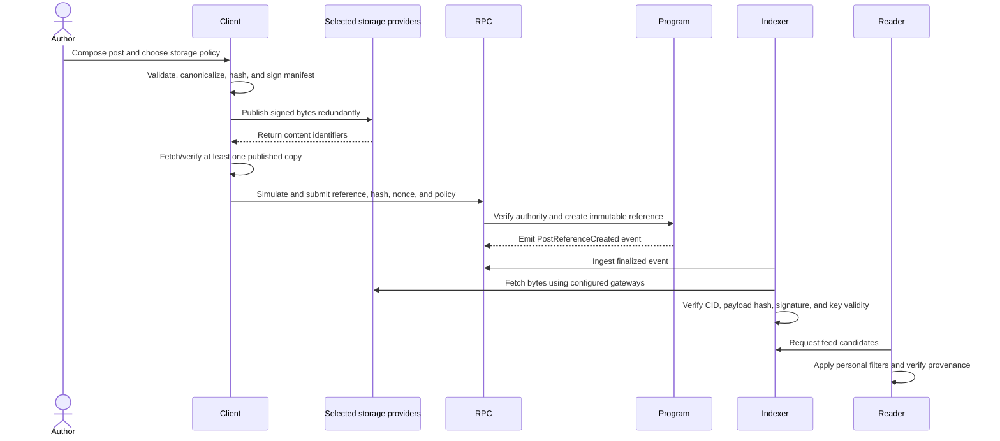
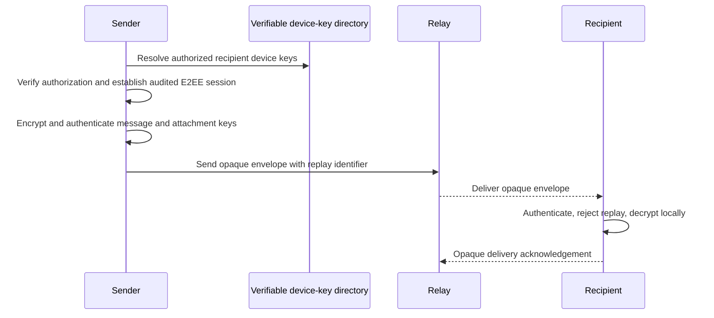
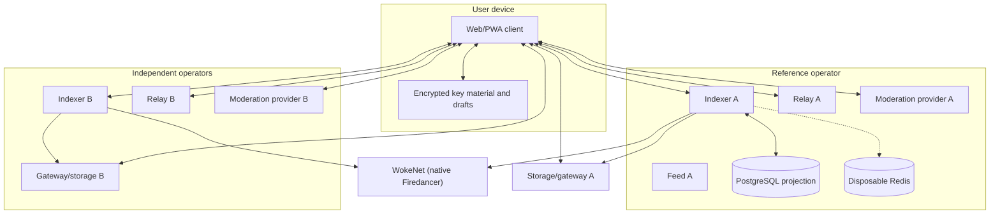

# WokeSocial Architecture

## Document status

- **Design status:** Initial architecture baseline
- **Implementation status:** Foundation and experimental core subsets implemented
- **Deployment status:** Solana-wire compatibility harness and local-container
  testing only; no native Firedancer cluster, persistent WokeNet localnet,
  test network, staging network, or production network
- **Last verified:** 2026-07-28

This document distinguishes the implemented subset from the intended complete
architecture. Source and automated tests exist for the boundaries marked
implemented below; all other components remain planned. The connected
Agave-backed compatibility slice proves one validator-to-indexer-to-web path,
but neither independent component suites nor that compatibility slice prove a
native Firedancer or complete-product path.

## Architectural goals

WokeSocial is designed as an open social protocol with a polished reference
client. The architecture must preserve these properties:

1. An identity and its public social graph can outlive the flagship client.
2. Public content can be authenticated without trusting a WokeSocial
   database.
3. PostgreSQL, Redis, relays, indexers, feed providers, storage vendors, and RPC
   providers are replaceable.
4. Sensitive data, authentication secrets, moderation evidence, and private
   messages never become public WokeNet state.
5. Private messaging uses established end-to-end encryption and does not treat a
   relay as an authority.
6. Official services can honor deletion and safety requests without falsely
   claiming that already replicated immutable data can always be erased.
7. Protocol behavior is reproducible from versioned public specifications,
   schemas, program binaries, and signed objects.

## System context

No arrow to a hosted service implies authority. A client must verify signed
objects, hashes, key authorization, tombstones, and relevant onchain state
itself or through a verifiable SDK.

## Authority model

The architecture distinguishes four kinds of state. Treating them as
interchangeable would break the decentralization and privacy requirements.

| State class | Examples | Authority | May be rebuilt? |
| --- | --- | --- | --- |
| Verifiable protocol state | Identity roots, delegations, handle claims, public follow edges, community authority, post references, payment settlement, revocations, tombstones | WokeNet program state and finalized ledger history | Yes, from the configured deployment slot and public content |
| Signed portable objects | Profile and post manifests, media manifests, policies, moderation-label feeds, feed-provider descriptors | Valid signatures plus authorized key state and content hashes | Yes, from any provider retaining the bytes |
| Derived projections | Timelines, search indexes, notification lists, counters, entitlement caches | Never authoritative; each record must retain provenance | Yes, deterministically |
| Private or ephemeral service state | Encrypted message envelopes, typing/presence, rate limits, local drafts, private abuse evidence, recovery contact data | The relevant user, encrypted conversation, or scoped operator policy | Not necessarily; minimize and apply retention limits |

See:

- [ADR-0001: Authority Boundaries and Layering](DECISIONS/0001-authority-boundaries-and-layering.md)
- [ADR-0003: Onchain and Offchain Data Split](DECISIONS/0003-onchain-offchain-data-split.md)
- [ADR-0006: Passkey Authentication and Account-Key Boundary](DECISIONS/0006-passkey-account-key-boundary.md)
- [ADR-0007: Messaging Cryptographic Engine](DECISIONS/0007-messaging-cryptographic-engine.md)
- [ADR-0008: Canonical Domain Transition](DECISIONS/0008-canonical-domain-transition.md)
- [ADR-0009: Sovereign WokeNet on Native Firedancer](DECISIONS/0009-sovereign-wokenet-firedancer.md)

## Monorepo boundaries

The status column is authoritative for the current repository. Planned paths are
not scaffolded as empty services.

| Path | Responsibility | Authority constraints | Current status |
| --- | --- | --- | --- |
| `apps/web` | Flagship Next.js client | Must allow alternate endpoints and independently verify protocol objects | Complete required route surface, strict bounded public-search/post reads, provider settings, resilient local composer/preferences/export, and real passkey-service lifecycle paths; protocol-identity and transactional adapters remain absent |
| `apps/auth-service` | Replaceable WebAuthn relying party, short-lived service sessions, and credential-bound encrypted root-wrapper custody | Never becomes the protocol identity or receives PRF output, plaintext seeds, or private keys | Exact-origin/RP user-verifying ceremonies, discoverable credentials, atomic initial credential/wrapper/activation, same-root passkey addition, atomic authentication/session issuance, step-up revocation, bounded retention, OpenAPI, real-browser verification, and fail-closed custody/recovery policy implemented |
| `apps/indexer` | WokeNet Solana-format RPC and content ingestion, PostgreSQL projections, public query API | Database is disposable and noncanonical | Finalized live synchronization, exhaustive 32-event current-IDL projection including payments, signed-manifest verification, memory/PostgreSQL rebuild, eleven migrations, indexed bounded public search, provenance, DLQ, and read-only APIs implemented; native Firedancer RPC remains blocked |
| `apps/relay` | WebSocket delivery of presence, typing, notifications, and encrypted envelopes | Hints and transport only | Signed advisory protocol, fail-closed server, bounded in-memory state, privacy-safe observability, and multi-relay failover client implemented and tested over real loopback sockets; production key authorizer and E2EE remain external |
| `apps/moderation-service` | Policy evaluation, reports, appeals, signed labels | Cannot rewrite protocol objects or become a global speech authority | Signed label/report/appeal verification, AES-256-GCM restricted evidence, append-only memory/PostgreSQL case ledger, scoped assertions and conflict overrides, retention/legal holds, due/expiry transitions, transparency aggregation, restricted reads, OpenAPI, and security controls implemented; production authorizer/SSO and specialist workflows remain blocked |
| `apps/feed-service` | Explainable, selectable feed scoring | Results are recommendations, never protocol truth | Deterministic chronological/following/community/media scopes, bounded-window trending, explainable recommendations, third-party order reconciliation, bound cursors, local safety filtering, source checkpoints, and noncanonical disclaimers implemented and tested |
| `apps/media-worker` | Validation, metadata stripping, transcoding, thumbnails, captions, and malware scanning | Clients may publish independently processed compliant media; worker output is unsigned | Authenticated resumable uploads, exact chunk/source hashes, strict MIME/container validation, metadata-free image/video/audio profiles, HLS, waveforms, bounded processing, real ClamAV INSTREAM with fresh database provenance, content-addressed publication, and independent preprocessed mode implemented and tested |
| `apps/docs` | Human and generated protocol/API documentation | Generated reference must derive from canonical schemas | Planned |
| `programs/social_protocol` | Compact WokeNet/Solana-format state, authorization, events, and native WOKE settlement | Canonical only for explicitly documented onchain facts | Forty instructions, 19 account layouts, and 32 events cover config, identity/profile reference, handles, rotation/delegation/recovery, social actions, communities/governance, posts/reactions/tombstones, native WOKE tips, weekly subscriptions, receipts, and entitlements in the compatibility oracle; other governance models, execution, token assets, and native Firedancer evidence remain open |
| `packages/protocol` | Versioned schemas, canonical serialization, identifiers, validation | Single source of truth for portable object formats | Strict modular v1 schemas and builders for all 29 current portable object families, RFC 8785 bytes, bounded primitives, transitions, SHA-256 IDs/CIDs, Ed25519 proofs, and intrinsic/external authorization boundaries implemented |
| `packages/storage` | Content-addressed publication and retrieval | Provider receipts never replace local integrity verification | Local/memory CAS, multi-provider quorum/failover, IPFS/Kubo, and consent-gated Arweave-compatible adapters implemented |
| `packages/sdk` | Signing, verification, WOKE instruction construction, provider clients | Must not silently trust flagship endpoints | Operation-scoped signed recoverable publication and provider pool plus seven IDL-aligned Anchor instruction builders, exact payment planning, exact-byte version-0/legacy transaction compilation, detached-signature verification, bounded strict RPC simulation/status parsing, same-byte broadcast/rebroadcast, finalized transaction confirmation, and finalized-account proof verification; a complete generated account client, flagship wallet/passkey signer integration, executable-artifact attestation, finalized receipt/entitlement proof orchestration, and native Firedancer execution remain absent |
| `packages/crypto` | Thin wrappers around platform and reviewed cryptographic libraries | No custom cryptographic primitives | WebCrypto random/hash/HKDF/AES-GCM sealed-envelope and credential-bound WebAuthn-PRF key-wrapping primitives implemented and tested; ceremonies are implemented at the web/auth-service boundary, while no messaging protocol is claimed here |
| `packages/messaging` | Pairwise E2EE adapter over the pinned Matrix Rust crypto WASM engine | WokeSocial device authorization remains authoritative; directory and relay cannot authorize devices or receive plaintext | Real Olm sessions, opaque bounded upload/query/claim routing, before/after local and remote authorization checks, canonical sender-signed envelopes verified before state mutation, replay/corruption/wrong-device rejection, revocation, fixed errors, private construction, and disabled room/group APIs implemented; only volatile test/development storage exists and production rejects it |
| `packages/ui` | Accessible design primitives and tokens | No protocol authority | Initial brand, tokens, themes, and shared primitives implemented |
| `packages/config` | Shared typed configuration and observability contracts | Secrets remain external; retired Solana runtime variables fail closed | Typed `WOKENET_*` root/indexer configuration, canonical-origin enforcement, production constraints, and safe summaries implemented |
| `packages/test-fixtures` | Deterministic keys, manifests, events, and adversarial fixtures | Test-only; never production secrets | Clearly labeled deterministic `wokenet:v1` public test keys plus signed profile/post/reply/tombstone fixtures and golden values implemented |
| `infra` | Local containers and provider-neutral deployment examples | Must not imply a mandatory cloud | Digest-pinned PostgreSQL, Redis, Kubo, patched ClamAV, and hardened optional authentication/feed/media plus fail-closed relay/moderation service profiles implemented and locally health-checked |

Code dependencies should point inward toward stable protocol contracts:

Applications must not copy protocol schemas. Generated bindings may be checked
for drift in CI, but the versioned schema and program IDL remain the inputs.

## Runtime layers

### 1. WokeNet protocol layer

WokeNet is a sovereign Solana-protocol-compatible network with WOKE as its
native currency. It is not a Solana-operated cluster. Production and network
development runtimes are restricted to full native Firedancer; Frankendancer
and Agave validator/RPC processes are forbidden. The exact upstream source,
downstream patch queue, native RPC capability gate, genesis policy, and
unlaunchable production templates live under `network/wokenet/`.

The native runtime is not production-ready. At the pinned revision, full native
Firedancer has no production release and lacks application-critical RPC
methods. The existing Agave-backed local validator is retained only as a
Solana-wire compatibility oracle for Anchor program and client behavior. It is
not WokeNet deployment evidence. See
[ADR-0009](DECISIONS/0009-sovereign-wokenet-firedancer.md).

The Anchor program is intended to hold only compact, high-value, verifiable
state:

- protocol configuration and version compatibility;
- identity roots, authority rotation, recovery state, and delegated keys;
- handle claims;
- public follow/block edges where explicitly selected for portability;
- community authority, roles, membership commitments, and governance settings;
- content references and hashes rather than bodies or media;
- public reactions/reposts where their cost and privacy impact are acceptable;
- payment settlement and entitlement commitments;
- revocations and deletion tombstones.

The program must emit sufficient versioned events to reconstruct projection
state. Every instruction must validate signer authority, PDA derivation,
ownership, relationship constraints, bounded inputs, replay identifiers, and
checked arithmetic. Account layouts, maximum sizes, rent, compute, and
transaction-size budgets must be measured before any native WokeNet test
deployment.

The current compatibility-localnet implementation covers configuration,
identity and profile references, collision-safe handles, root rotation, scoped
delegations, delayed recovery, root/delegated social actions, blocks,
communities and membership, one-member-one-vote governance, posts, reactions,
tombstones, native WOKE tips, weekly subscriptions, permanent receipts, and
entitlement state. Its fixed development program ID is
`9kFGJEzA7uKvJ1wTvKRWoFadRU7WFnpwWEGP6APro3dD`. Native SBF builds and real
Agave local-validator compatibility tests pass; additional governance models,
proposal execution, token assets, native Firedancer/public-network evidence,
and production authority controls remain open.

### 2. Signed content layer

Public content is a signed, immutable, versioned object. A post edit creates a
new revision referencing the prior revision; it never mutates bytes in place.
Objects are encoded and hashed according to
[PROTOCOL.md](PROTOCOL.md) and
[ADR-0002](DECISIONS/0002-canonical-serialization-and-hashing.md).

Storage adapters provide identical operations for local development, IPFS, and
Arweave-compatible publication. Provider responses are not trusted until bytes
are locally hashed and signatures are verified. Ordinary posts default to a
deletion-compatible storage policy. Permanent publication requires explicit,
informed consent.

The current TypeScript implementation covers all 29 registered v1 portable
object families, RFC 8785 canonicalization, SHA-256 identifiers, Ed25519
proofs, local and memory CAS, multi-provider quorum/failover, IPFS/Kubo, and a
consent-gated Arweave-compatible path. Media-manifest content is produced by
the worker but deliberately remains unsigned until a client signs it. Unit and
real Kubo/processor integrations verify those paths. Shared Rust/TypeScript
golden vectors, a funded Arweave upload, and a general browser WokeNet
writer remain absent.

### 3. Projection and discovery layer

An open-source indexer reconstructs queryable state from finalized WokeNet
data, signed manifests, and signed policy feeds. PostgreSQL contains projections
and ingestion provenance, not truth. Redis, if enabled, is restricted to
disposable queues, rate limits, and caches.

The indexer must support:

- idempotent ingestion and finality-aware rollback;
- full replay from a configured deployment slot;
- account/event reconciliation;
- manifest signature and hash verification;
- checkpoints, backfills, dead letters, and retry limits;
- deterministic migrations and a one-command rebuild;
- structured logs, traces, metrics, and health/readiness endpoints.

See [ADR-0004](DECISIONS/0004-indexer-projection-and-replay.md).

The current indexer synchronizes finalized program logs through configurable
WokeNet RPC providers via the Solana-compatible wire API, enforces exact
32-event IDL drift, verifies referenced manifests, and projects implemented
identity/social/community/governance/recovery/payment state into memory or
PostgreSQL with raw-event provenance, checkpoints, bounded retry/dead letters,
and deterministic rebuild. Seventy-nine unit and thirteen isolated PostgreSQL
cases pass, including fresh-database search index/timeout/snapshot/parity and
payment migration/window-constraint probes. Native Firedancer RPC/fork
evidence, portable proposal-manifest verification, viewer-aware search, and
universal cross-action identity sequencing remain open.

### 4. Replaceable convenience services

Relays, feed providers, moderation providers, media workers, sponsorship
services, and hosted indexers improve latency or usability. Each has a public
interface, a health/capability document, explicit trust indicators, and
conformance tests. A client can configure more than one endpoint and must
degrade gracefully when the preferred endpoint fails.

See [ADR-0005](DECISIONS/0005-provider-replaceability.md).

Working replaceable subsets now include storage quorum/failover, the open
indexer, feed provider, signed relay, moderation provider, authentication
service, endpoint configuration, and media preparation worker. Sponsorship and
production multi-provider orchestration remain absent.

### 5. Client layer

The flagship web client is a reference implementation, not a privileged
protocol participant. It owns familiar onboarding and safety UX while hiding
unnecessary blockchain details. It must:

- work in read-only mode without a wallet or WOKE;
- support wallet and passkey-backed onboarding;
- describe every signature or transaction in human language;
- retain a chronological fallback and explain recommended feeds;
- expose alternate RPC, indexer, gateway, relay, feed, and moderation endpoints;
- filter blocks, mutes, tombstones, and selected moderation labels locally;
- remain usable in degraded or offline-reading mode;
- never display wallet addresses as a default identity label.

The reference client implements the complete required route surface, connected
home/post reads, provider settings, a device-local composer, privacy/safety
preferences, exact-identity feed hiding, scoped export, and real
virtual-authenticator passkey registration/sign-in against the replaceable auth
service. Wallet, protocol-identity, transaction, moderation, recovery, payment,
deletion, and messaging mutations remain visibly disabled. The production
build, 79 unit cases, and 206 passing desktop/mobile Playwright cases—including
90 axe scans over 45 route fixtures—pass; two desktop-only passkey lifecycle
flows are deliberately skipped in the duplicate mobile project. The connected post-detail route has semantic browser
coverage but is not part of the current axe matrix.

## Principal data flows

### Identity and delegated device key

Passkeys authenticate access to a local or securely wrapped account key; the
protocol must not put email addresses, WebAuthn attestation details, device
fingerprints, or recovery contacts onchain.

### Public post publication

If storage succeeds but anchoring fails, the client retains a recoverable
publication receipt and can retry anchoring without republishing. If anchoring
succeeds but all gateways are unavailable, the UI shows a verifiable unavailable
item rather than fabricating post content.

### Deletion request

Deletion has layered semantics:

1. The author signs a deletion intent and, where applicable, submits an onchain
   tombstone.
2. Official indexers suppress the referenced content and retain only the
   minimum audit/provenance record required by policy.
3. The client requests deletion or unpinning from configured mutable providers.
4. Caches and search projections expire or purge the item.
5. The UI explains that independent replicas or permanent storage may retain
   earlier bytes.

Deletion never authorizes silently rewriting a signed object.

### Encrypted direct message

The pairwise adapter now proves this cryptographic core with the real pinned
Matrix Rust crypto WASM engine on two independent devices, opaque directory
requests, current WokeSocial device authorization, sender-signed outer
envelopes verified before Olm state mutation, and 13 adversarial
replay/corruption/revocation/lifecycle tests. Messaging remains disabled in production
until encrypted persistent state, browser WASM/CSP packaging, attachment and
safety-verification UX, durable replay state, relay integration, and
independent review are complete. Group/room APIs are absent and require a
separate security gate.

## Trust boundaries

| Boundary | Untrusted input | Required control |
| --- | --- | --- |
| Browser ↔ wallet/passkey | Transaction requests, wallet response, origin state | Human-readable intent, origin binding, simulation comparison, explicit user consent |
| Client/indexer ↔ WokeNet RPC | Accounts, blocks, signatures, simulation data | Multiple endpoints, exact genesis/program allowlists, commitment checks, cross-provider comparison for sensitive actions, native-Firedancer capability checks |
| Client/indexer ↔ storage | Bytes, MIME declarations, redirects, gateway metadata | CID/hash verification, signature verification, size limits, safe URL policy, decompression limits |
| Public input ↔ services | Manifests, queries, uploads, webhook-like callbacks | Runtime schemas, authorization, rate limits, output encoding, SSRF/path traversal defenses |
| Relay ↔ client | Presence/events/envelopes | Treat events as hints; authenticate envelopes; replay protection; reconcile public facts |
| Media worker ↔ published media | Malformed files and codec payloads | Sandboxing, MIME sniffing, resource limits, metadata stripping, malware-scanning hook |
| Moderator ↔ evidence | Highly sensitive user disclosures | Least privilege, encryption, audit log, retention/deletion policy, conflict controls |
| CI/CD ↔ production authority | Artifacts, secrets, upgrade instructions | Protected environments, reproducible/verifiable builds, multisig authority, signed provenance |

## Data stores and retention

| Store | Allowed data | Forbidden role |
| --- | --- | --- |
| WokeNet accounts and ledger | Compact public protocol state and references | PII, private messages, secrets, media, large post bodies |
| Content-addressed providers | Signed public manifests; encrypted restricted content; media manifests | Plaintext private messages or decryption keys |
| PostgreSQL | Rebuildable projections, provenance, operator-scoped private records in isolated schemas | Sole source of identity, social graph, signed content, or entitlement truth |
| Redis | Rate-limit counters, queues, cache entries, short-lived coordination | Durable protocol state, session authority, irreplaceable jobs |
| Relay store | Opaque encrypted envelopes with short retention and delivery metadata | Message plaintext or canonical public content |
| Client storage | Encrypted keys, drafts, preferences, verified cache | Plaintext long-lived private keys or hidden tracking identifiers |

Private operator records and public projections should use different databases
or at least separate roles and schemas. A public indexer rebuild must not require
private moderation or recovery data.

## Consistency and failure model

- **Onchain writes:** A transaction may be observed at `confirmed` for responsive
  UI but is not treated as durable until `finalized`. Financial entitlements and
  destructive security actions use finalized state.
- **Signed objects:** Immutable once published. Revisions and tombstones form
  explicit directed links.
- **Indexer:** Eventually consistent. Every API response exposes the projection
  checkpoint and source commitment.
- **Relay:** At-most-temporary delivery optimization. Clients reconnect,
  deduplicate, and reconcile.
- **Storage:** Multi-provider. A successful publication requires local hash
  verification and the configured replication threshold.
- **Feed:** Deterministic for the same inputs and algorithm version where
  practical. Results expose provider, version, checkpoint, and explanation
  factors.
- **Moderation:** Labels are assertions by named providers. Clients combine
  personal, community, provider, and lawful operator policy.

Expected degraded behavior:

| Failure | Required user-visible behavior |
| --- | --- |
| Preferred RPC unavailable | Fail over; allow cached reading; block unsafe writes with a clear retry state |
| Indexer unavailable or stale | Try another indexer; show checkpoint/staleness; retain direct verification tools |
| Gateway unavailable | Try another gateway/provider; show unavailable content with its verified reference |
| Relay unavailable | Poll/reconcile public updates; queue encrypted outgoing envelopes locally when safe |
| Feed provider unavailable | Use following or chronological local/indexer feed |
| Media worker unavailable | Preserve draft; allow protocol-compliant preprocessed upload where supported |
| Sponsorship unavailable | Keep browsing free; offer another sponsor or transparent self-funded transaction |

## Security architecture

Security controls are cross-cutting rather than isolated in one service:

- strict runtime validation at every untrusted boundary;
- content security policy, secure headers, safe URL handling, CSRF defenses where
  stateful cookies are used, and output encoding;
- delegated keys with explicit scopes, expiry, rotation, and revocation;
- transaction simulation with recipient, program, mint, amount, fee, and account
  diffs shown before signing;
- no application hot wallet holding user funds;
- least-privilege service identities and separate credentials per environment;
- dependency and secret scanning, locked dependencies, artifact provenance, and
  reproducible native Firedancer and verifiable social-program builds;
- multisig-controlled production program upgrade authority, with a documented
  path to immutability;
- structured logs that exclude secrets, message plaintext, sensitive identity
  attributes, and unnecessary wallet addresses;
- privacy-preserving telemetry disabled by default in local development.

The formal threat model, controls, and residual risks belong in
`docs/THREAT_MODEL.md` and `docs/SECURITY.md`; their absence must be treated as a
launch blocker.

## Observability contract

Each network service is expected to expose:

- `GET /health/live` for process liveness;
- `GET /health/ready` for dependency and checkpoint readiness;
- structured JSON logs with request/trace IDs and redaction;
- OpenTelemetry-compatible traces and metrics;
- build version, schema compatibility range, and provider identity;
- indexer-specific finalized slot and lag;
- queue depth and dead-letter counts where applicable.

Health endpoints must not reveal secrets, private user data, internal network
addresses, or moderation evidence.

## Deployment topology

The currently verified connected development slice runs a
Solana-wire-compatible test validator, PostgreSQL, local content-addressed
storage, and the minimum services needed for the vertical slice. That validator
is a compatibility oracle, not WokeNet. A native development/localnet
environment uses `firedancer-dev --no-agave`; a public test or production
validator/RPC node uses the native `firedancer` binary. Both require a supported
Linux host and remain activation blocked until native RPC parity exists.
Production may distribute each replaceable service across different operators
and providers.

Local setup automation, a fixed development program ID, and local container
configuration exist. The downstream Firedancer source is pinned and
materializable, but no native cluster or production genesis exists. Production
activation, provider deployment, release promotion, and public WokeNet
operations remain blocked.

## Smallest complete vertical slice

The acceptance target remains one end-to-end path rather than disconnected
component harnesses:

1. Create an identity root and scoped delegated key on a local validator.
2. Create or update a signed profile manifest and anchor its verified reference.
3. Canonicalize and sign a text-post manifest.
4. Publish it to local content-addressed storage and verify the returned bytes.
5. Anchor the manifest reference and hash through the WokeNet social program.
6. Ingest the finalized event and manifest into a rebuildable indexer projection.
7. Display the verified post in the reference web feed.
8. Follow another identity and reflect the edge in the following feed.
9. Delete the projection, replay from the deployment slot, and obtain the same
   feed result.
10. Exercise the entire path through automated tests using a real local validator.

The slice is complete only when clean setup, lint, type checking, unit tests,
program tests, integration tests, production build, and a reproducible
projection rebuild pass.

The compatibility slice is implemented and verified end to end: a fresh
wire-compatible validator, signed local content-addressed storage, the
production indexer and PostgreSQL projection, destructive replay, production
web build, and desktop/mobile Chromium all participate. This evidence validates
program and application compatibility only. It does not prove that native
Firedancer processed the transactions, so the equivalent WokeNet slice
remains blocked.

## Architectural verification checklist

- [x] Implemented program accounts, events, and PDA seeds match the documented
      core subset, including identity
      `origin_authority + identity_nonce` and tombstone
      `author_identity + post_reference` derivations.
- [ ] Canonical serialization produces shared golden vectors in Rust and
      TypeScript.
- [ ] Signatures, content identifiers, and onchain hashes are verified at every
      ingestion and display boundary.
- [ ] Indexer rebuilds from public data without a private backup.
- [ ] Alternate RPC, storage, indexer, relay, feed, and moderation endpoints pass
      conformance tests.
- [ ] Private messages use an audited E2EE implementation and relays cannot read
      plaintext.
- [ ] Official clients honor tombstones and documented deletion requests.
- [ ] Critical flows meet WCAG 2.2 AA and function with keyboard-only input.
- [ ] Threat-model, static-analysis, security, resilience, and local-validator
      tests pass.
- [ ] A third party can run an indexer and build a compatible client from public
      artifacts.

## Related decisions

- [ADR-0001: Authority Boundaries and Layering](DECISIONS/0001-authority-boundaries-and-layering.md)
- [ADR-0002: Canonical Serialization and Hashing](DECISIONS/0002-canonical-serialization-and-hashing.md)
- [ADR-0003: Onchain and Offchain Data Split](DECISIONS/0003-onchain-offchain-data-split.md)
- [ADR-0004: Indexer Projection and Replay](DECISIONS/0004-indexer-projection-and-replay.md)
- [ADR-0005: Provider Replaceability](DECISIONS/0005-provider-replaceability.md)
- [ADR-0009: Sovereign WokeNet on Native Firedancer](DECISIONS/0009-sovereign-wokenet-firedancer.md)
