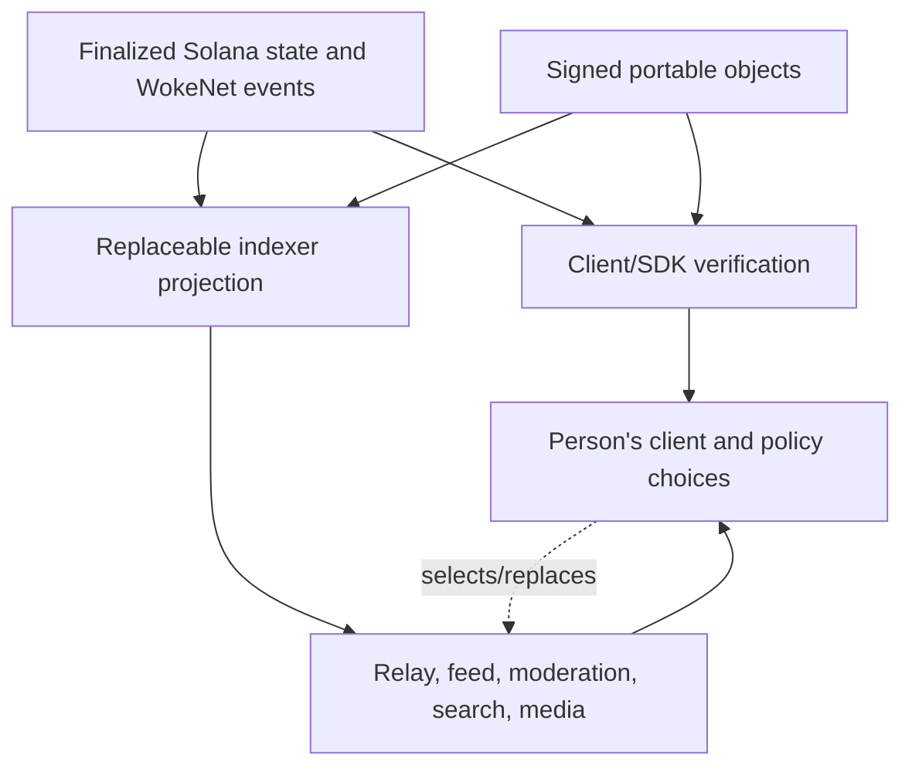

# Decentralization Assessment

## Current assessment

- **Assessment date:** 2026-07-29
- **Implementation:** Experimental local subsets; replaceability is not
  end-to-end verified
- **Deployments:** No public WokeNet program deployment; a disposable Solana
  local validator and local containers only
- **Classification:** **Design intends decentralization; the project does not
  currently qualify as decentralized**

An experimental WokeNet program, public/read-only client subset,
schema/SDK/storage packages, indexer projection/API, endpoint configuration,
and local infrastructure now exist. They pass separate unit, Solana
local-validator, container, and responsive-web browser suites. “Replaceable”
remains a design target until a public Solana deployment, independently
operated clients and indexers, conformance tests, and migration exercises prove
it.

WokeNet is the protocol and smart-contract deployment layer for WokeSocial on
Solana. It is not a chain, fork, validator, RPC implementation, or native fee
currency. No `$WOKE` mint exists. The current lamport-transfer payment ABI is
legacy and quarantined: it cannot execute, cannot grant entitlements, and
cannot be unpaused. Any future `$WOKE` support requires an explicitly approved
SPL or Token-2022 mint plus a new mint-aware ABI and migration. The canonical
public origin is `https://woke.social`; `sociallywoke.com` is redirect-only.

## Component matrix

| Component | Canonical or convenience layer | Current operator | Can users replace it? | Can third parties run it? | Failure behavior | Censorship risk | Privacy risk | Migration procedure | Planned improvement |
| --- | --- | --- | --- | --- | --- | --- | --- | --- | --- |
| Solana ledger | Canonical ledger and finality layer for deployed WokeNet program facts | Disposable local validator only; no public deployment recorded | Users can select compatible RPC providers, but one identity namespace is bound to an exact Solana genesis hash and program ID | Solana validators and RPC providers are external to this repository | Writes stop; cached/public offchain reading continues | Validator/RPC inclusion pressure | Public timing and relationship metadata | New protocol namespace and explicit signed migration | Deploy to a named Solana cluster; cross-check RPCs; document cross-deployment migration; minimize onchain data |
| WokeNet social protocol program | Canonical only for documented identity, authorization, reference, governance, and tombstone facts; the legacy payment ABI is quarantined | Disposable Solana local validator; no public program deployment | Not within one namespace; compatible clients may support other program IDs | Source and SBF build exist; verifiable public deployment remains open | New writes stop; signed content remains verifiable; projections remain readable | Upgrade/freeze authority could block or change writes | Public accounts/events expose graph metadata | Export state; deploy reviewed version; user-authorized migration links | Complete protocol, publish a verifiable Solana deployment, establish multisig/timelock, and define an immutability path |
| Program upgrade/config authority | Governance control, not user-content authority | None | Planned transparent authority profile | Multisig/governance tooling may be independently operated | Unsafe upgrade is blocked if quorum unavailable | Concentrated authority can alter protocol | Signer identities/operations may be observable | Rotate through governed onchain procedure | Publish signers, thresholds, delay, emergency scope, and immutability path |
| Identity root and delegations | Canonical authorization state | Disposable Solana local validator for the implemented subset | Wallets/device implementations replaceable; identity PDA persists | A compatible client can target the repository program source; no public WokeNet deployment or conformance result | Revoked/expired devices cannot write; alternate authorized device may recover | Client can hide identity but cannot rewrite finalized authority | Public delegation graph can fingerprint devices if overdescribed | Rotate root, revoke device, link migration under delay | Integrate delegation, root rotation, and delayed guardian recovery into independent clients and test on Solana devnet |
| Signed public manifests | Canonical portable content assertion | Test publishers only | Provider-neutral publication pipeline exists; conforming third-party implementation remains untested | Repository source exists; no release | Existing bytes verify even if an app disappears | A provider can withhold bytes, not forge them | Public content and revision history are visible | Export canonical envelopes/CIDs and republish | Shared cross-language schemas/vectors and independent publisher |
| Local/IPFS content storage | Availability layer; bytes verified by CID/signature | Local CAS and Kubo test operator | Local/memory/IPFS adapters and multi-provider interface exist | Runnable from repository source; package not released | Gateway/provider failover; content may be unavailable if unreplicated | Unpinning/gateway filtering | Fetches leak interests and IP metadata | Repin/export verified bytes; update location hints | Persistent replication status, privacy-aware gateways, health proofs |
| Arweave-compatible storage | Optional permanence layer | None | Optional and never default | Yes where network/tooling permits | Permanent bytes remain; publishing may stop | Gateway filtering cannot reliably erase network data | Permanent disclosure is irreversible | Keep CID/hash and choose another gateway; deletion cannot be guaranteed | Explicit consent receipt and prominent permanence warning |
| Solana RPC providers | Convenience access to the ledger | Configurable local-validator endpoint; no public provider profile recorded | Provider settings exist; health-based failover is planned | Any compatible Solana RPC provider can serve the documented methods | Fail over, degrade to cached reading, or stop unsafe writes | RPC can omit/delay data or transactions | RPC sees addresses, requests, timing, and IP | Change provider profile; verify Solana genesis hash, program ID, and checkpoints | Cross-check sensitive reads, test failover, and document provider diversity |
| Open indexer | Rebuildable projection | Local test process | Web endpoint selection exists | Read-only API/projection and finalized synchronizer run against the disposable Solana local validator; public deployment synchronization is unverified | Fail over or show stale checkpoint; canonical data remains | Operator can omit query results | Queries reveal interests; private data must be excluded | Switch endpoint or rebuild from deployment slot and public manifests | Solana RPC sync against a public deployment, provenance API, and conformance fixtures |
| PostgreSQL projection | Disposable operator storage | Local container | Replaced with indexer instance, not user-trusted as authority | Yes with current projection source | Queries/search fail; synthetic-event rebuild is tested | Operator can alter projection | Centralized query logs and any scoped operator records | Clear network projection and deterministically replay supplied events | Rebuild from actual chain history; separate private schemas and retention controls |
| Redis/queues | Ephemeral cache, rate limits, coordination | Local container; not used as protocol state | Operator implementation detail | Yes | Cache miss, delayed jobs, or reduced rate limiting; no truth loss | Queue operator can delay convenience work | Temporary identifiers may leak behavior | Flush and recreate | Wire only disposable functions, strict TTLs, and no durable authority |
| Real-time relay | Convenience transport and hints | Local tested signed WebSocket service | Multi-relay client accepts injected URLs and performs failover | Signed protocol, server, and client source are runnable; no independent operator result | Reconnect/fail over; reconcile public state; queue safe encrypted sends | Can delay/drop envelopes and presence | Sees connection/message timing and routing metadata | Add relay, rotate mailbox token, replay/reconcile | End-user selection UX, metadata minimization, short retention, capability documents, and independent conformance |
| E2EE messaging sessions | Conversation participants and current WokeSocial device authorization govern plaintext/session use | Experimental pairwise devices in 13 real-WASM cases | Relay/directory are injected replaceable interfaces; production encrypted state export is open | Pairwise adapter source and tests are runnable; no browser release/conformance result | Relay/directory loss delays new sessions/delivery; signed outer metadata prevents a relay from poisoning Olm state with a modified honest envelope | Operators can deny, delay, or reorder delivery/key lookup but cannot authorize devices or forge authenticated plaintext | Routing/timing/size and pseudonymous engine public keys remain visible; endpoint compromise reveals local plaintext/state | Change directory/relay independently; production state export and migration remain required | Persistent encrypted browser store, durable replay, browser packaging, relay interop/failover, attachments/safety UX, independent review; group APIs stay absent |
| Feed provider | Convenience recommendation ordering | Local tested seven-mode provider | Typed endpoint selection exists; deterministic chronology/following fallback is implemented | Public HTTP/OpenAPI provider source is runnable; no independent operator result | Fall back to another feed or deterministic chronology | Can down-rank/omit content | Behavioral profiles can expose sensitive interests | Select provider; reset/delete personalization | End-user selection UX, production candidate integration, versioned algorithms, and independent conformance |
| Moderation-label provider | Signed assertion layer, not content authority | Local tested label/report/appeal provider | Provider contracts are replaceable; per-user/community subscription UX remains planned | Signed provider, OpenAPI, and durable local implementation are runnable; no independent operator result | Provider labels become unavailable; personal controls and lawful client policy remain | Provider can overlabel or omit labels | Labels/evidence can expose sensitive traits | Subscribe/unsubscribe; export community policy and appeals receipts | End-user provider selection, signed-feed subscription, versioned taxonomy, transparency exports, and conflict controls |
| Community policy/governance | Canonical commitments plus signed portable policy | Local Solana program and verified public-manifest projection | Community can select moderation/feed/indexer providers | Exact one-member/one-vote creation commitment and privacy-safe directory/detail/search are locally runnable; full policy portability has no independent operator result | Verified public reads continue through another compatible indexer; governance writes depend on program/RPC | Admin or governance capture | Private/restricted manifests, membership, and reports must stay encrypted and out of public discovery | Export rules/roles; migrate with member-approved signed/onchain link | Membership/join and governance UX, lifecycle/update protocol, anti-sybil options, emergency review, independent policy hosting |
| Media processor | Convenience transformation service; unsigned output never becomes identity authority | Local hardened worker plus private ClamAV profile | Yes; clients may resubmit by source hash or publish validated preprocessed media | Source, OpenAPI, OCI build, processing profiles, and preprocessed path are runnable | Upload remains resumable/retryable; use another worker or self-process if unavailable | Worker can refuse, delay, or omit derivatives but cannot sign for users | Raw uploads, timing, source size/type, and accessibility declarations are visible to the chosen worker | Preserve source hash and declaration; cancel/resume or submit to another worker; client signs final manifest | Browser integration, production multi-provider replication, stronger codec sandboxing, load evidence, and independent review |
| Search service | Derived index inside the open indexer | Local tested memory/PostgreSQL projection and typed web client | Change `WOKESOCIAL_INDEXER_URL`; explicit-network API is independently runnable | Source, OpenAPI, migration, deterministic `public-match-v2` person/post/public-community policy, and tombstone/privacy tests are runnable; no independent operator result | Search shows an explicit degraded state; direct verified object/profile/public-or-unlisted-community lookup and canonical data remain | Can omit or reorder results, though the response declares its ranking version/checkpoint | Search logs reveal interests; private fields, protected communities, and memberships are excluded by contract | Rebuild from public protocol data or select another compatible indexer | Viewer-aware safety filtering, events/creator discovery, scale/load evidence, query-log retention controls, and independent conformance |
| Sponsored transaction service | Optional Solana transaction fee payer; never a `$WOKE` mint or payment substitute | None | Planned sponsor list; users may self-fund network fees in SOL | Planned documented API | Browsing works; write waits, changes sponsor, or user pays the Solana network fee | Sponsor can deny transactions | Sponsor sees identity, timing, and abuse signals | Select sponsor or self-fund the same transaction | Blind/minimized tokens where feasible; strict published limits |
| Passkey/recovery assistance | Replaceable convenience around identity authority; onchain policy remains canonical | Local replaceable WebAuthn service | Service URL is runtime-configurable; ciphertext bundles are portable records, while complete export UX is open | Service source, OpenAPI, PostgreSQL migrations, and container are runnable; no release/conformance result | Existing protocol keys remain authoritative; service loss blocks its sessions/bundle sync but cannot sign | Operator can deny authentication or delete ciphertext, not forge protocol signatures | Credential metadata, account timing, and network metadata are visible; PRF output/plaintext keys are not | Export encrypted wrappers, register another credential/service, then authorize/revoke protocol keys separately | Integrate the implemented guardian primitive into recovery UX; complete export/multi-device/email assistance, drills, and independent review |
| Flagship web client | Reference convenience client | Local development only | Provider settings exist; full migration/export does not | Source is public but no release/self-host conformance result exists | Other clients/direct tools remain possible | Client may hide reachable content | Client sees browsing/session data | Export settings/keys safely; configure or move to another client | Complete endpoint controls, local verification, export, and static mirror |
| Seeker Android client | Reference native convenience client and MWA wallet handoff | Non-release local source only | Uses the same public protocol/provider interfaces; complete export/migration remains open | Expo/React Native source and focused tests exist; no signed release or independent build result | Verified reading can degrade; unsafe signing stops on deployment/wallet mismatch | App or distribution channel can hide content or withhold updates | Wallet account, RPC/indexer requests, device state, and store telemetry may expose behavior | Export portable settings/state, disconnect wallet, install a verified compatible client | Device/MWA conformance, reproducible signed APK, signing/update provenance, independent client, and distribution approval |
| Protocol schemas, SDK, and docs | Public interpretation layer; schemas define portable formats | Experimental repository source; no release | Any client can implement the documented subset | Repository source exists; no independent build result | Development slows but published versions remain usable | Maintainer could bias future versions, not rewrite signed history | Minimal; SDK telemetry forbidden by default | Pin released schemas; fork implementation; negotiate versions | Distributable schemas, generated references, signed releases, shared golden vectors |
| DNS and `woke.social` (`sociallywoke.com` redirect only) | Discovery convenience only | Domain owner; no service configured | Alternate client/provider URLs planned | Yes | Bookmarks, alternate discovery, and content IDs still work | Domain seizure can redirect users | DNS/hosting sees access metadata | Use independently published provider profiles and mirrors; never make the legacy redirect host a separate identity namespace | DNSSEC where supported, signed discovery document, decentralized mirror |
| Telemetry/error tracking | Optional operator convenience | None | Must be opt-in/configurable | Yes | Product remains functional without telemetry | Operator can suppress evidence of outages | High if events contain identity/content | Disable or select operator; delete per retention policy | Consent, redaction, aggregation, no private-content capture |

## Authority flow

Only finalized WokeNet program facts from the exact configured Solana
genesis/program binding and valid signed objects may establish public protocol
claims. Local-validator results establish local evidence only. Convenience
services can select, order, label, transport, or transform data, but cannot
silently create protocol truth.

## Required portability bundle

A user or community export is planned to contain:

- Solana genesis hash, program ID, deployment slot, and schema versions;
- identity URI and relevant account/event proofs;
- active and revoked public-key/delegation records;
- canonical signed profile, content, policy, and tombstone envelopes;
- CIDs, provider receipts, and replication status;
- public social/community edges or replay cursors;
- encrypted private preferences and message/session export only where the
  selected cryptographic protocol can do so safely;
- selected provider profiles and feed/moderation settings;
- a manifest of every exported file with byte length and digest.

The bundle must be consumable without contacting a WokeSocial-operated API or
the `woke.social` origin. Secrets require separate encryption and an explicit
user-held recovery key.

## Migration exercises

These tests are required before any “decentralized” production claim:

1. **Client loss:** Disable the flagship client and recover identity/profile in
   an independently built client.
2. **Indexer loss:** Destroy PostgreSQL, rebuild from the deployment slot and
   public manifests, and compare deterministic projections.
3. **Provider failover:** Remove the preferred RPC, gateway, indexer, relay,
   feed, and moderation endpoint one at a time; verify documented degraded mode.
4. **Storage migration:** Export verified bytes from one provider, republish to
   another, and retrieve them by the original integrity identifier.
5. **Relay migration:** Move an encrypted conversation to another relay without
   changing the conversation's cryptographic authority.
6. **Community migration:** Export rules, roles, governance configuration, and
   provider selections; load them in another compatible client/indexer.
7. **Authority recovery:** Revoke a compromised device and recover through the
   configured delay/cancel process without vendor-only secrets.
8. **Program migration:** Reproduce the program build, verify deployed code and
   authority, then test an explicit user-approved migration path.

Each exercise needs automated assertions where possible and a dated,
reproducible report.

## Qualification gates

| Requirement | Status | Evidence needed |
| --- | --- | --- |
| Identity survives loss of flagship client | Not met | Independent-client recovery test |
| Social graph rebuilds without flagship database | Partially evidenced | Local-event PostgreSQL replay passes; replay from a public Solana deployment and an independent comparison remain |
| Public content verifies independently | Partially evidenced | Canonical signature/hash/CID verification passes locally; shared cross-language vectors and an independent client remain |
| Third party can operate an indexer | Not met | Public source, runbook, conformance result |
| Third party can build a compatible client | Not met | Released schemas, SDK/IDL, sample client test |
| Users can select alternate RPC/gateway/indexer/relay | Partially evidenced | Endpoint controls and storage/relay failover subsets pass; public Solana RPC/indexer and full client E2E failover remain |
| Community policy and moderation are portable | Not met | Export/import and alternate-provider test |
| Company cannot rewrite signed content | Partially evidenced | TypeScript canonical signature verification passes; authorization-history and independent-client checks remain |
| No proprietary interpretation API is required | Not met | Complete public specifications and generated refs |
| Production upgrade authority is transparent | Not met | Deployed program, verifiable build, published multisig |
| WokeNet deployment is independently reproducible | Not met | Verifiable Solana program build/deployment, connected-slice report, and second-operator result |
| Migration away from company infrastructure is tested | Not met | Full migration exercise report |

## Centralization risks that remain even after implementation

- Solana validator concentration and reliance on popular RPC providers are
  external dependencies and current concentration risks.
- Solana network fees and WokeNet program-upgrade governance remain protocol
  dependencies even after multiple application operators exist.
- Any future `$WOKE` mint would add mint authority, token-program, liquidity,
  custody, regulatory, and integration risks; no mint currently exists.
- Popular gateways, RPC providers, clients, and moderation providers may become
  de facto central points through network effects.
- DNS, app-store distribution, payment rails, and legal obligations can constrain
  the flagship operator.
- Content availability depends on someone retaining bytes; content addressing
  provides integrity, not persistence.
- Strong privacy is difficult when public social relationships and timing are
  recorded onchain.
- Key recovery adds trusted people or services and creates an abuse target.
- Moderation portability can fragment policy while shared providers can
  concentrate power.

These are tradeoffs to measure and disclose, not reasons to call convenience
services canonical.

## Next verification milestone

The disposable Solana local-validator slice already proves identity, profile,
signed post, local content-addressed storage, WokeNet onchain reference, open
indexer, following feed, tombstone suppression, and a clean projection rebuild.
The next decisive evidence is the same connected flow against a verifiable
Solana devnet deployment through independently configured RPC providers,
followed by a second independent application/indexer operator. Until those
tests pass with published fixtures, end-to-end replaceability remains
architectural intent and production activation remains blocked.
