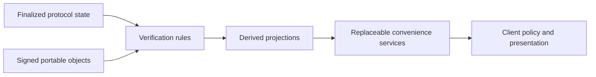

# ADR-0001: Authority Boundaries and Layering

- **Status:** Accepted design; implementation pending
- **Date:** 2026-07-28
- **Owners:** Protocol and platform architecture

## Context

Social applications commonly allow a hosted database, moderation service, or
API to become the real source of truth even when some records are onchain.
Socially Woke requires identity, public relationships, and signed content to
survive the flagship operator while keeping private information off public
infrastructure.

## Decision

Use four explicit state classes:

1. **Verifiable protocol state:** finalized Solana accounts/events for compact
   authorization, public relationship, reference, tombstone, governance, and
   settlement facts.
2. **Signed portable objects:** immutable profiles, posts, media manifests,
   policies, and label assertions whose signatures and hashes can be verified
   independently.
3. **Derived projections:** PostgreSQL/search/feed/notification views with source
   provenance. They are disposable and rebuildable.
4. **Private or ephemeral state:** encrypted messages, drafts, private
   preferences/evidence, rate limits, caches, queues, typing, and presence.

Authority resolves inward:

A convenience service may order, label, cache, transport, or transform data. It
may not create an identity, alter a signed object, override a tombstone, or grant
a settlement entitlement without the documented verifiable input.

Private state is authoritative only within its narrow relationship: for
example, conversation participants determine message plaintext and an operator
determines its scoped private case record. Neither becomes global protocol
truth.

## Invariants

- Every projected record retains network, program, slot/transaction or object
  ID, verification status, and schema version.
- API responses disclose checkpoint/staleness and provider identity.
- Redis and relays contain no irreplaceable state.
- The public indexer can rebuild without recovery, moderation-evidence, or
  messaging databases.
- Clients verify or expose verification of hashes, signatures, delegation, and
  finality.
- Operator policy is published and distinguished from personal, community, and
  protocol validity rules.

## Consequences

- Reads are eventually consistent and UI must represent unavailable,
  unverified, pending, and finalized states.
- More provenance and verification work is required than in a conventional
  CRUD application.
- Private service records need isolated roles, schemas, retention, and exports.
- Independent clients can disagree on ranking or moderation while agreeing on
  signatures and protocol facts.

## Rejected alternatives

- **Hosted database as canonical:** prevents independent reconstruction.
- **Everything onchain:** leaks sensitive relationships, is costly, and cannot
  safely hold large/private content.
- **Relay as event authority:** turns low-latency infrastructure into a hidden
  consensus service.
- **One global moderation authority:** conflicts with user/community choice and
  creates a censorship choke point.

## Verification

This decision is not implemented until a clean indexer rebuild reproduces a
tested local-validator vertical slice and the client passes tests against an
alternate indexer/provider set.
