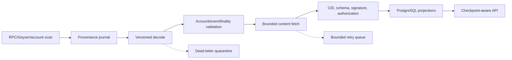

# ADR-0004: Indexer Projection and Replay

- **Status:** Accepted design; implementation pending
- **Date:** 2026-07-28
- **Owners:** Indexer and protocol architecture

## Context

Social queries need PostgreSQL-style projections, but treating the database as
canonical would prevent independent operation. Solana observations can be
duplicated, delayed, or rolled back before finality, and referenced content may
be unavailable or malicious.

## Decision

Build the indexer as a deterministic, idempotent projection pipeline:



The published program deployment slot is the replay origin. Confirmed
observations may power clearly marked pending UI, but only finalized observations
enter durable public projections or payment entitlements.

### Idempotency and provenance

An event source key is:

```text
genesis_hash / program_id / transaction_signature /
instruction_index / event_index / event_schema_version
```

Every projection row retains its source key, source slot/blockhash, object ID,
verification result, and schema version. Inserts use idempotent constraints.
Account snapshots also record account pubkey, data hash, observed slot, and
account version.

### Checkpoint and replay

The durable checkpoint records the last completely scanned finalized slot, its
blockhash, program/schema ranges, and ingestion build version. A slot is
checkpointed only after every discovered event has reached a terminal state:
projected, validly suppressed, or quarantined with a reproducible reason.
Transient content unavailability remains a retryable state without inventing
content.

A rebuild:

1. creates an empty projection schema;
2. verifies genesis hash, program ID, deployment slot, and schema support;
3. replays finalized history in bounded slot ranges;
4. reconciles current program accounts against event-derived state;
5. fetches and verifies referenced signed objects;
6. applies revisions, revocations, and tombstones;
7. emits deterministic counts/digests for comparison;
8. atomically promotes the rebuilt schema after validation.

Pre-finality fork data is isolated and reversible by provenance. Finalized
history mismatch is a critical corruption/provider alarm, not an automatic
rewrite.

## Failure handling

- Unsupported versions and malformed events enter a dead-letter quarantine with
  bounded raw bytes and no public projection.
- Hash/signature/authorization failures are terminal invalid records and never
  appear as verified content.
- Timeouts and unavailable providers retry with exponential backoff, jitter, and
  a maximum attempt policy.
- Multiple providers may be compared for sensitive mismatches.
- Redis may coordinate retries but PostgreSQL retains enough job provenance to
  recover after Redis loss.

## Consequences

- Full replay is slower and more complex than restoring a proprietary snapshot.
- Projection migrations need forward build and rollback/promotion procedures.
- APIs must expose checkpoint and verification state.
- Operators may offer signed snapshots as accelerators, but every snapshot must
  be independently checkable and never required.

## Rejected alternatives

- **Database backup as genesis:** makes the operator authoritative.
- **Webhooks only:** cannot independently backfill or prove completeness.
- **Projecting confirmed data as final:** permits forked state and false
  entitlements.
- **Infinite retries:** hides poison data and blocks progress.
- **Trusting gateway bytes:** enables CID substitution and manifest spoofing.

## Verification

Tests must cover duplicate events, out-of-order delivery, fork rollback,
checkpoint restart, unsupported versions, corrupt/missing content, provider
failure, tombstone persistence, full replay, and equality of the rebuilt
vertical-slice projection.
