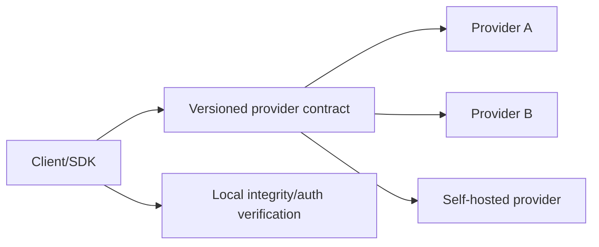

# ADR-0005: Provider Replaceability

- **Status:** Accepted design; implementation pending
- **Date:** 2026-07-28
- **Owners:** Client, SDK, and service architecture

## Context

An open protocol can still be centralized if its reference client hard-codes one
RPC, gateway, indexer, relay, feed, moderation, media, or sponsorship service.
Simple URL fields are insufficient when providers have incompatible behavior or
silent proprietary extensions.

## Decision

Each provider class has:

1. a versioned public capability document;
2. a typed adapter/interface in the SDK;
3. conformance fixtures shared with the reference implementation;
4. health, timeout, retry, and circuit-breaker rules;
5. an ordered user/operator profile supporting multiple endpoints;
6. explicit trust, privacy, retention, and feature disclosures;
7. an export/import format that does not contain secrets by default.

Initial provider classes are RPC, storage publisher, content gateway, indexer,
relay, feed, moderation labels, media processor, transaction sponsor, recovery
assistant, telemetry, and frontend discovery.

Adapters normalize transport and capability discovery, not protocol truth.
Integrity, signatures, authorization, finality, and personal filtering remain in
shared verification code.

## Failover policy

- Safe idempotent reads may fail over automatically.
- Writes use stable semantic nonces and report exactly which endpoints accepted
  them.
- Transaction submission never combines a simulation from one provider with an
  unexamined materially different transaction from another.
- Storage success requires the configured replication threshold and local byte
  verification.
- Relay events are deduplicated and reconciled.
- Feed failure falls back to following/chronological ordering.
- Moderation-provider failure retains personal controls and published lawful
  client policy; it does not silently disable safety UI.
- Sponsorship failure never blocks browsing and never changes the intended
  transaction without new consent.

## Compatibility rule

No essential protocol feature may require a proprietary extension. Optional
extensions:

- use reverse-DNS names;
- declare whether they are critical;
- degrade visibly when unsupported;
- never change the interpretation of canonical v1 objects;
- have a documented standardization path before becoming essential.

Default provider lists may be curated for usability, but users can inspect,
add, remove, reorder, test, and export endpoints. Privacy-impacting changes
require explicit notice.

## Consequences

- The client needs endpoint management and diagnostics UX.
- Conformance and fault-injection suites become launch requirements.
- Lowest-common-denominator contracts may lag provider-specific optimizations;
  optional capabilities address this without hidden authority.
- Multi-provider use can leak more metadata, so clients need privacy-aware
  routing and should avoid unnecessary fan-out.

## Rejected alternatives

- **Hard-coded flagship endpoints:** creates operational and censorship choke
  points.
- **Environment variables only:** helps operators but not end users or portable
  profiles.
- **Blind automatic failover:** can duplicate writes, leak data, or change trust
  assumptions.
- **Provider response as verification:** transport success does not prove
  protocol validity.

## Verification

For each class, run the same contract suite against the reference provider and
at least one independent or deliberately minimal implementation. End-to-end
tests remove each preferred provider and verify the documented fallback,
staleness indicators, write idempotency, and migration path.
