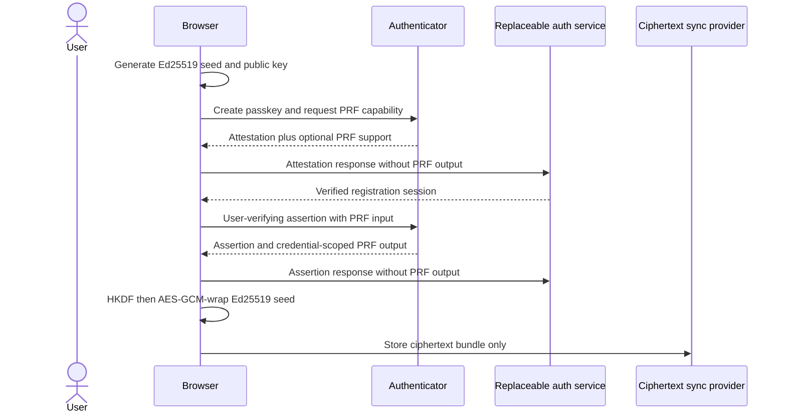

# ADR-0006: Passkey Authentication and Account-Key Boundary

- **Status:** Accepted; key wrapping, replaceable relying-party service, and
  browser ceremonies implemented; protocol onboarding and recovery pending
- **Date:** 2026-07-28
- **Owners:** Identity, web, security, and protocol

## Context

WebAuthn credentials authenticate a person to a relying party. They do not
natively produce Ed25519 signatures accepted by Solana or by WokeSocial's v1
portable-object protocol. Treating a WebAuthn P-256 assertion as a Solana
signature would be false, while sending an account private key to an
authentication service would create application custody.

The WebAuthn PRF extension can return credential-scoped high-entropy output after
user verification. The extension is optional, and a result is not guaranteed
during credential creation. Its output may be suitable for client-side key
derivation but must not be serialized into a registration or authentication
response sent to the relying-party server.

## Decision

The passkey-first path separates three authorities:

1. The WebAuthn credential authenticates an account session to the selected
   relying-party service.
2. A locally generated Ed25519 root or delegated seed signs Solana transactions
   invoking the selected WokeNet program and signs portable protocol objects.
3. A supported WebAuthn credential's 32-byte PRF output derives a wrapping key
   for that Ed25519 seed entirely in the client.

`@wokesocial/crypto` implements the third boundary using domain-separated
HKDF-SHA-256 and AES-256-GCM. The ciphertext is authenticated against:

- a domain-separated digest of the WebAuthn credential ID;
- the exact root-versus-delegation key purpose; and
- the corresponding Ed25519 public key.

The PRF output and plaintext seed never enter the bundle. An untrusted service
may synchronize the ciphertext, salt, credential binding, purpose, and public
key without gaining signing authority.

Each additional passkey wraps the same account seed independently. Revoking a
WebAuthn credential removes its server authentication authority and deletes its
corresponding synchronized wrapper, but onchain device/delegation revocation is
a separate protocol action.

## Required fallback behavior

PRF support is not universal. A client MUST detect support and MUST NOT silently
fall back to:

- a server-held plaintext or reversibly encrypted key;
- an encryption key derived from an email, password, credential ID, or
  WebAuthn signature;
- export of PRF results to the relying-party server; or
- a cosmetic “passkey account” that cannot sign protocol actions.

Until another custody design receives security review, a device without PRF
support offers an existing-wallet path or a clearly explained local recovery-kit
path. It does not claim passkey-backed recovery.

## Session and recovery boundary

An authentication service may hold single-use challenges, public credential
records, short-lived sessions, encrypted bundle bytes, anti-abuse counters, and
offchain recovery contact data. It is a replaceable convenience layer and is
never the protocol identity.

Email assistance may notify and authenticate access to a delayed recovery
workflow, but email alone cannot immediately rotate the onchain root. Recovery
requires versioned protocol configuration, a delay, notification, cancellation,
replay protection, and explicit treatment of every delegated key.

## Consequences

- Passkey ceremonies require a secure context, exact relying-party/origin
  checks, user verification, single-use challenges, and duplicate credential-ID
  rejection.
- Clients must deliberately remove client-only PRF results from JSON sent to a
  server.
- Loss of every wrapper and every recovery method still loses the account; the
  UI must encourage multiple credentials or an explicit recovery kit.
- A synced passkey may move between devices while its encrypted wrapper does
  not. Every usable credential must therefore be registered atomically with its
  own credential-bound wrapper; root export and recovery remain separate,
  visible capabilities.
- WebAuthn backup eligibility and current backup state inform recovery guidance
  but never grant protocol authority by themselves.

## Rejected alternatives

- **Server custody of an embedded wallet:** violates the noncustodial boundary
  and creates a breach-wide signing target.
- **Use the WebAuthn signature as a Solana signature:** the algorithms and signed
  messages are incompatible.
- **Derive a stable key from repeated WebAuthn signatures:** signatures are not a
  key-derivation interface and may be randomized.
- **Make email the identity:** creates a proprietary recovery authority and puts
  a mutable personal identifier above the protocol root.
- **Assume PRF support:** locks out valid authenticators and encourages unsafe
  fallback behavior.

## Verification

The key-wrapping primitive has deterministic and adversarial vectors for wrong
credentials, wrong PRF outputs, purpose/public-key substitution, malformed
bundles, unsupported fields, and invalid key sizes. The replaceable
authentication service and flagship browser path additionally verify:

1. real registration and discoverable authentication through a Chromium virtual
   authenticator;
2. explicit removal of client-only PRF results before every server request;
3. durable, atomically consumed PostgreSQL challenges plus hashed, revocable
   sessions;
4. atomic initial credential/wrapper/account activation, same-root additional
   credential registration, credential binding, logout, and local
   unwrap/public-key verification;
5. atomic authentication counter/session issuance against concurrent
   revocation, including PostgreSQL rollback; and
6. service-passkey listing plus fresh-step-up revocation that deletes the
   selected wrapper and revokes service sessions; and
7. bounded cleanup for provisional accounts, ceremonies, and sessions.

Remaining gates are root export/recovery UX, reviewed non-PRF fallback behavior,
Solana local-validator identity creation and rotation using only the unwrapped
client key, WokeNet delegation/device-authority integration, load/restore
evidence, and independent review of the browser-to-protocol flow.
