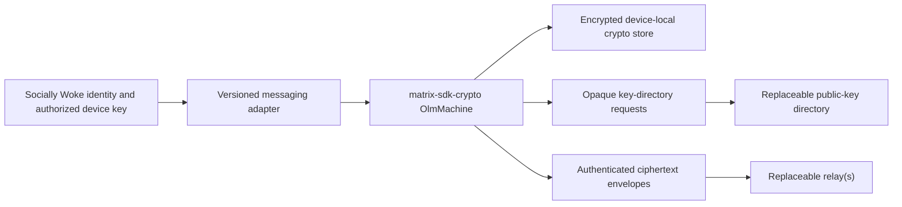

# ADR-0007: Messaging Cryptographic Engine

- **Status:** Accepted; pairwise real-WASM adapter implemented, production
  persistence/browser/interoperability gates pending
- **Date:** 2026-07-28
- **Owners:** Messaging, client, relay, security, and protocol

## Context

Socially Woke requires asynchronous one-to-one messaging with device keys,
forward secrecy, authentication, replay resistance, verification, rotation, and
revocation. A static sealed-box construction would not provide the required
ratchet properties. Implementing X3DH, a Double Ratchet, or a group protocol in
this repository would be unaudited custom cryptography and is prohibited.

The engine must run in browsers, persist state locally in encrypted storage, and
remain independent of the flagship relay. It must not turn a hosted Matrix
homeserver, Signal service, or Socially Woke database into the identity or
message authority.

## Decision

Use the Apache-2.0
[`@matrix-org/matrix-sdk-crypto-wasm`](https://www.npmjs.com/package/@matrix-org/matrix-sdk-crypto-wasm)
binding to the Rust `matrix-sdk-crypto` engine behind a Socially Woke-owned,
versioned adapter. The upstream project describes `OlmMachine` as a standalone
end-to-end-encryption state machine with no network I/O. The
[Matrix Rust SDK](https://github.com/matrix-org/matrix-rust-sdk) describes the
crypto crate as production ready and used by multiple shipped clients. Matrix
has also published its migration from deprecated `libolm` to the audited,
memory-safe
[`vodozemac` implementation](https://www.matrix.org/blog/2024/08/libolm-deprecation/).

The first production-eligible scope is pairwise device sessions only. Group
messaging remains disabled behind a build-time feature gate until independent
membership-change, key-sharing, removal, history-visibility, and
interoperability gates pass.

## Authority and naming boundary

- A Matrix-shaped user or device identifier used internally by the engine is an
  encoding detail, not an account, homeserver dependency, or protocol identity.
- Each engine device key must be bound to a current Socially Woke identity
  delegation or separately signed device-key assertion before another client
  trusts it.
- The key directory distributes public key material and one-time keys but cannot
  authorize a device, forge authenticated plaintext, or silently revive a
  revoked delegation.
- The relay transports only bounded ciphertext and delivery metadata. It never
  receives plaintext, session state, attachment keys, safety-number secrets, or
  the encrypted local-store key.
- Engine state is single-writer. Multiple tabs or processes must coordinate a
  lease because the upstream browser crypto store is not safe for concurrent
  writers.

## Required adapter behavior

The adapter will expose typed operations for:

1. device creation and signed public-key publication;
2. one-time and fallback-key upload/claim;
3. pairwise session establishment;
4. encrypt, decrypt, acknowledge, and replay rejection;
5. safety-number or emoji/QR verification;
6. device-list refresh, rotation, revocation, and session invalidation;
7. encrypted attachment-key envelopes;
8. encrypted local state export/import with rollback protection; and
9. reporter-selected plaintext disclosure that is constructed only on the
   reporting device.

Raw upstream request objects and Matrix room semantics do not cross the public
Socially Woke API. The adapter version pins the upstream event formats it
understands and rejects unknown critical algorithms or downgrade attempts.

## Metadata boundary

Olm protects message content, not all metadata. A relay or key-directory
operator may still observe connection IP and timing, sender mailbox,
recipient-device routing, ciphertext size, retry patterns, and key-request
activity. Clients should pad within bounded buckets where practical, use opaque
short-lived mailbox capabilities, fetch in batches, and avoid presence by
default. Documentation and UI must not claim metadata invisibility.

## Rejected alternatives

- **Custom X3DH/Double Ratchet implementation:** unaudited cryptographic protocol
  engineering and an unacceptable launch risk.
- **Static X25519 plus AEAD envelopes:** lacks a mature asynchronous prekey and
  ratchet state machine, forward secrecy across messages, and tested recovery
  behavior.
- **Official `@signalapp/libsignal-client`:** technically capable, but currently
  AGPL-3.0-only and exposes an unstable application-integration surface designed
  for Signal's own clients. It may be revisited only after qualified licensing
  review and an interoperability plan.
- **Legacy `libolm`:** deprecated in favor of the audited Rust implementation.
- **Treat a hosted Matrix service as the account system:** conflicts with
  Socially Woke identity authority and replaceable-relay requirements.
- **Enable group encryption immediately:** group membership and history
  semantics create a substantially larger security surface than pairwise
  sessions.

## Verification gates

The current pairwise adapter has demonstrated gates 1, the covered portions of
2 and 5, 7 for its in-process directory/relay artifacts, and the dependency
audit portion of 9. Specifically, 13 real-WASM cases exercise independent
devices, Olm session establishment, canonical sender-device signatures over
outer routing metadata and ciphertext, relay mutation rejection before
stateful decryption, post-session loss/reordering,
duplicate/corruption/wrong-device rejection, current local and remote Socially
Woke authorization before and after sensitive operations, revocation/rotation,
bounded dependency failure, malformed-Unicode rejection, production
volatile-storage denial, plaintext absence/zeroization, fixed errors, private
runtime construction, and absent group APIs. No Matrix room/group interface
crosses the public adapter.

No messaging screen may claim production E2EE until the remaining automated and
review gates demonstrate:

1. browser WASM/CSP packaging and the same real-engine cases outside Node;
2. pre-key-message retry/failover in addition to the tested post-session
   loss/reordering behavior;
3. prekey exhaustion and fallback-key rotation behavior;
4. safety-number change on device replacement;
5. revoked-device exclusion from every new session and attachment key;
6. encrypted persistent state, wrong-key failure, rollback detection, and
   single-writer coordination;
7. deployed relay and key-directory inspection cannot recover plaintext;
8. loss/retry/failover across at least two relays without duplicate plaintext
   delivery;
9. continuing upstream security-advisory review for the exact pinned engine
   release; and
10. independent review of the adapter, identity binding, local storage, and
    metadata claims.

Group messaging requires a separate ADR amendment and security report before
the feature gate can be enabled.
