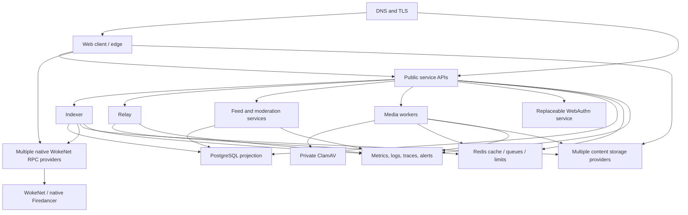

# Deployment

Last reviewed: 2026-07-28

## Document status

This document specifies the intended provider-neutral deployment model. The
local development foundation exists and has been tested: an environment
template, digest-pinned PostgreSQL/Redis/Kubo Compose stack, project-local pinned
chain toolchains, PostgreSQL migrations, Next.js and service applications, an
experimental WokeNet social program, a reproducibly pinned native
Firedancer downstream, hardened OCI builds, a private patched ClamAV profile,
and CI workflows are present.

Everything beyond the explicitly verified local procedures remains **Planned**.
There is no native Firedancer cluster, public WokeNet test network, staging
network, production genesis, production service, DNS, TLS, backup,
artifact-promotion, or provider deployment.

### Verified local deployment evidence

- `pnpm setup` installs checksum-verified Rust 1.89.0, Anchor 0.32.1, and Agave
  2.3.0 below the ignored `.local/toolchains` directory. Agave is used only by
  the Solana-wire compatibility harness; it is not WokeNet runtime
  software.
- `pnpm test:programs` builds the Anchor program to native SBF and runs it on a
  fresh compatibility validator using development program ID
  `9kFGJEzA7uKvJ1wTvKRWoFadRU7WFnpwWEGP6APro3dD`.
- `pnpm wokenet:check` verifies the fail-closed native-Firedancer source,
  exact patch checksum, parsed TOML/genesis allocation, currency, native-only
  build declarations, and RPC capability policy.
- `pnpm wokenet:materialize -- /absolute/path` has been exercised against
  the exact pinned official Firedancer commit and exact checked patch-queue
  diff. The manual Linux workflow additionally clones a disposable tracked
  checkout, reapplies only the pinned patch queue, clones and rebuilds OpenSSL
  at its separately pinned commit, and performs a clean isolated build owned by
  the attestation command. It runs the actual genesis/RPC test executables,
  parses the localnet TOML through that freshly built native validator, verifies
  native topology, ELF target/symbols, and the source-locked downstream
  marker/version/commit from both executables, then records dependency,
  toolchain, and distinct binary hashes and removes the complete temporary
  checkout. A native build and cluster have not been verified on this macOS
  host.
- PostgreSQL and Kubo container integration tests pass. These tests do not
  establish production backup, restore, performance, or provider readiness.
- The web production build and implemented browser/accessibility suites pass.
  No production artifact has been published.
- Authentication, feed, relay, moderation, media-worker, and ClamAV images have
  been locally built and smoke-tested with explicit liveness/readiness,
  unprivileged users, read-only roots, dropped capabilities, bounded process
  counts, and private/loopback exposure. The live media composition passes
  benign and EICAR scans through the production ClamdScanner.

## Deployment principles

- No mandatory hosting, RPC, indexer, relay, media, or storage provider.
- Public protocol state remains independently verifiable without the flagship
  deployment.
- PostgreSQL is a replayable projection; Redis is disposable coordination.
- Services use immutable artifacts promoted between environments.
- Production credentials are never available to pull-request builds.
- WokeNet production genesis, deployment, and real-fund operations are
  manual, separately approved actions. General CI MUST stop before that
  boundary.
- Rollback, backup, provider evacuation, and degraded mode are designed before
  launch.
- Every release records source revision, dependency lockfiles, image digests,
  schema versions, program binary hash, program IDs, and configuration version.

## Target topology



The topology may run on one development machine, a container platform, virtual
machines, or multiple providers. Deployment adapters MUST not change protocol
semantics.

## Environments and network boundaries

| Environment | Network runtime | Funds and data | Purpose | Deployment authority |
| --- | --- | --- | --- | --- |
| Compatibility local/CI | Ephemeral Agave validator, explicitly not WokeNet | Generated test keys and fixtures only | Anchor/Solana-wire compatibility and connected application proof | Developer or restricted CI identity |
| Native localnet | `firedancer-dev` on dedicated Linux | Disposable WOKE fixtures and synthetic data only | Native runtime development after required RPC methods exist | Network developer |
| Public test network | Native `firedancer`, independently operated | Valueless test WOKE and synthetic/non-sensitive data | Interoperability, consensus, failover, and deployment rehearsal | Test-network multisig |
| Staging | Separate native Firedancer genesis | Synthetic data; staging-specific secrets only | Production-like release, recovery, and provider validation | Protected staging quorum |
| Production | Native Firedancer, only after the activation and genesis gates | Real WOKE and minimum necessary private service data | Live WokeNet | Hardware-backed production quorums |

Every environment has a distinct genesis, keys, program IDs, databases,
buckets, DNS names, API tokens, telemetry projects, and authority set. A visible
network indicator and exact `wokenet:v1:<genesis>:<program>` verification are
required in operator and end-user flows.

## Toolchain and bootstrap contract

The repository MUST pin, as compatible exact versions:

- Node in a version-manager file and `package.json` engines.
- pnpm in the `packageManager` field.
- All JavaScript dependencies in `pnpm-lock.yaml`.
- Rust in `rust-toolchain.toml`.
- Anchor and Solana-compatible CLI/build tools in a documented compatibility
  matrix.
- Official Firedancer repository, exact full commit, ordered downstream patches,
  and patch checksums.
- Container base images by digest.
- Docker Compose schema and local service image versions.
- CI actions by immutable commit SHA.

“Latest” MUST NOT be used in reproducible build or deployment automation.

As of 2026-07-28, Node 22.23.1 remains the newest published v22 artifact, while
the Node project has announced a pending 22.x security release with HIGH as its
maximum severity. Local reproducibility retains the exact 22.23.1 digest;
production promotion MUST wait for the patched artifact and rotate every Node
toolchain/base-image digest. ClamAV MUST remain at patched 1.5.3 or a later
reviewed exact digest; 1.5.2 is prohibited for attacker-controlled uploads.

### Operator prerequisites

Verified local prerequisites are:

- Git.
- The pinned Node runtime, Corepack, and pinned pnpm.
- Docker Engine and Docker Compose for local services and image builds.

The supported bootstrap script downloads Rust/rustup, Anchor, and Agave into the
repository-local ignored directory after verifying release checksums; it does
not require or modify a global Rust, Anchor, or Solana installation. Its
currently encoded host matrix is macOS arm64/x64 and Linux x64. Unsupported
hosts must install the exact versions manually.

Additional nonlocal operator prerequisites remain planned:

- A dedicated supported Linux host satisfying Firedancer’s kernel, huge-page,
  CPU, memory, NIC, and storage requirements.
- `jq`, TLS tooling, and access to the selected secret and artifact systems.
- Provider CLIs only in provider-specific wrappers, never in core protocol build
  scripts.

### Local bootstrap

From a checkout with the verified host prerequisites:

```sh
corepack enable
pnpm install --frozen-lockfile
pnpm setup
pnpm infra:ps
```

`pnpm setup` is limited to local/test resources: it installs project-local
toolchains, starts or validates local PostgreSQL/Redis/Kubo, applies local
migrations, validates safe configuration, and prints progress. The local
validator and deterministic development wallet are prepared on demand by
`pnpm test:programs`; setup does not leave a validator running. Neither command
contacts a public WokeNet, publishes permanent content, changes DNS, or
spends real funds.

This sequence has been verified in the current development environment. A clean
supported-machine CI/bootstrap artifact with recorded versions is still required
for the final clean-checkout gate.

## Build and artifact promotion

The planned release pipeline is:

1. Verify the clean source revision and committed lockfiles.
2. Run formatting, lint, type checks, unit/integration/local-validator tests,
   browser tests, security scans, and production builds.
3. Build each service image once from a reviewed revision.
4. Generate an SBOM, vulnerability report, provenance statement, and immutable
   image digest.
5. Materialize and reproducibly build the exact pinned native Firedancer
   downstream; record source, patches, dependencies, toolchain, and binary
   hashes.
6. Build the social program reproducibly and record its binary hash, IDL, and
   exact toolchain.
7. Recreate or independently verify the environment genesis, feature set,
   shred version, allocations, and ceremony attestations.
8. Sign or attest artifacts using protected release identities.
9. Deploy the same immutable digests to staging.
10. Run native consensus/RPC, smoke, migration, failover, replay,
    accessibility, and security checks.
11. Promote the same digests to production after protected quorum approval; do
    not rebuild.

Target repository commands:

```sh
pnpm wokenet:check
pnpm lint
pnpm typecheck
pnpm test
pnpm test:integration
pnpm test:programs
pnpm test:e2e
pnpm build
```

These interfaces are implemented. `pnpm test` is the fast workspace suite;
PostgreSQL and Kubo integrations run through their package
`test:integration` scripts, while `pnpm test:programs` and `pnpm test:e2e`
remain explicit. The full release-promotion sequence above is not implemented.
`pnpm verify:all` composes the available local gates but assumes setup has
already made the container dependencies available.

Rust formatting, Clippy with warnings denied, and Rust unit tests have passed as
native checks. The root `pnpm test:programs` wrapper performs the SBF build and
local-validator suite. A unified clean release gate, reproducible/verifiable
build attestations, and release artifact promotion remain planned.

## Configuration and secrets

The repository MUST provide a `.env.example` containing names and safe
descriptions only. Real values MUST come from a secret manager or protected local
environment and MUST not be committed.

Expected configuration groups include:

| Group | Example names | Requirements |
| --- | --- | --- |
| Public web | `NEXT_PUBLIC_APP_ORIGIN`, `NEXT_PUBLIC_WOKENET`, `NEXT_PUBLIC_WOKENET_RPC_URL`, `NEXT_PUBLIC_PROGRAM_ID` | Values are public; validate origin, explicit environment, genesis-bound network, and program consistency |
| RPC | `WOKENET_RPC_URLS`, `WOKENET_WS_URLS`, `WOKENET_COMMITMENT` | Ordered list with health scoring, native capability evidence, and failover; credentials redacted; retired `SOLANA_*` runtime variables are rejected |
| Native network | Expected genesis hash, shred version, source/patch/build digests, validator/snapshot allowlists | Exact ceremony values; no arbitrary snapshot provider or Agave fallback |
| Indexer | `INDEXER_DEPLOYMENT_SLOT`, `INDEXER_CONFIRMATION_DEPTH`, `INDEXER_BATCH_SIZE` | Validate ranges; deployment slot is immutable per program deployment |
| Database | `DATABASE_URL`, `DATABASE_MIGRATION_URL` | Separate runtime and migration roles; TLS in nonlocal environments |
| Redis | `REDIS_URL`, queue and rate-limit namespaces | Noncanonical; environment-specific; TLS/auth outside local |
| Storage | gateway lists, pinning endpoints, Arweave adapter settings, local root | Multiple providers supported; write credentials server-only |
| Relay | public relay URLs and server credentials | Multiple endpoints; short-lived service auth |
| Media | `MEDIA_WORKER_*` listener/origins, byte/type limits, private roots, strong bearer secret, private `CLAMD_*` endpoint, scan/database-age limits | No cloud metadata or unrelated secrets in workers; clamd TCP never public; UTC required for bounded database timestamp checks |
| Authentication | RP ID/origins, session issuer/audience, recovery settings | Production origins exact; secrets separately injected |
| Sponsorship | enable flag, network, budgets, signer reference | Disabled by default; key not stored as plaintext env where signing service is available |
| Telemetry | OTLP endpoint, sampling, release ID | No private content; environment-specific access token |
| Operations | health/admin bind addresses, feature flags, release digest | Admin endpoints private; flags audited and versioned |

Startup MUST fail with a clear error when required configuration is missing,
malformed, internally inconsistent, or points at the wrong genesis-bound
WokeNet. Secrets MUST never appear in startup dumps, errors, traces, or client
bundles.

## Provider-neutral infrastructure contract

### Compute

Each long-running service MUST have:

- An OCI image with a non-root user, read-only root filesystem where practical,
  explicit entrypoint, resource requests/limits, and graceful termination.
- Liveness and readiness endpoints with distinct meanings.
- A deployment identity limited to its own resources.
- Horizontal scaling rules only for stateless or correctly partitioned work.
- A termination grace period long enough to checkpoint work.

No service may require a provider-specific runtime API for protocol correctness.

### PostgreSQL

- PostgreSQL stores replaceable indexer and service projections, not canonical
  identity or social truth.
- Use encrypted connections, private networking, service-specific roles, and a
  separate migration role.
- Migrations are ordered, checksummed, forward-tested, and accompanied by a
  rollback or roll-forward procedure.
- Destructive migrations require a backup/restore rehearsal and a compatibility
  window for old and new application versions.
- A fresh database MUST be rebuildable from the deployment slot, WokeNet data,
  signed manifests, and portable operator configuration.

### Redis

- Redis is limited to cache, queues, rate limiting, and ephemeral coordination.
- Loss of Redis MUST not corrupt protocol truth.
- Sensitive authorization does not fail open when Redis is unavailable.
- Persistence may improve recovery but is not treated as the only durable queue
  or audit record for high-impact actions.

### Content storage

- Local filesystem storage is for development and tests.
- Production supports at least two independently configurable publication or
  replication paths and multiple read gateways.
- Every retrieved object is locally hash-verified.
- Provider health records replication and deletion-request status without
  claiming permanence or erasure that cannot be proven.
- Permanent publication is a separately consented policy and not the ordinary
  default.

### Native WokeNet RPC

- Configure multiple RPC and WebSocket endpoints with health, latency, error,
  rate-limit, slot-lag, exact genesis, program, and native capability checks.
- Never embed privileged RPC credentials in the client.
- Indexer processing uses an explicit commitment/finality policy and records
  slot/block identity for replay.
- A provider change requires no protocol migration.
- A process or endpoint backed by Frankendancer or Agave cannot be advertised as
  a WokeNet RPC.
- Submission, simulation, status, transaction-history, address-history, and
  program-account reads fail closed until the native Firedancer implementation
  and conformance evidence exist.

## Database migration procedure

The planned nonlocal procedure is:

1. Record release, current schema version, row-count invariants, replica health,
   and a recovery point.
2. Back up required operator data and verify the backup is readable.
3. Confirm application compatibility with both old and new schemas.
4. Apply expand-only changes with the dedicated migration role.
5. Deploy compatible application readers/writers.
6. Backfill with bounded, observable, resumable jobs.
7. Verify invariants, latency, error rate, and replay behavior.
8. Remove obsolete columns or constraints only in a later release.
9. Record migration duration, checksum, verification, and rollback decision.

Database rollback MUST NOT be improvised. If an irreversible migration fails,
operators use the rehearsed restore or roll-forward plan in
[OPERATIONS.md](./OPERATIONS.md).

## Native WokeNet test-network deployment

A separate native Firedancer test genesis is the mandatory public rehearsal
boundary. Solana devnet is not WokeNet and cannot satisfy this gate.

The planned process is:

1. Confirm native Firedancer implements the required RPC capability set.
2. Materialize and independently reproduce the pinned Firedancer downstream.
3. Recreate and sign a valueless test genesis with no production key,
   allocation, or authority reuse.
4. Start at least three independently administered validators and two
   independently administered RPC nodes with no Agave process.
5. Reproducibly build and deploy the social program; verify generated IDL/client
   drift and the deployed binary.
6. Record genesis, shred version, feature set, validator identities, vote/stake
   accounts, program ID/data address/authority, deployment slot and signature,
   source/patch/build digests, and toolchains.
7. Run the complete vertical slice against alternate native RPC providers.
8. Exercise indexer rebuild, snapshot/restart/repair, partitions, byzantine
   behavior, validator loss, RPC loss, and authority compromise.
9. Publish a test-network release record and known limitations.

Automation may fund accounts only from the valueless test-network faucet. It
MUST NOT fall back to a production-fund source.

## Manual WokeNet production boundary

Production deployment is not a continuation of test-network automation. It is
a distinct operator action and MUST remain disabled until every gate below has
recorded evidence:

- Production code, protocol, security, privacy, operations, and deployment
  documentation match the release.
- All build, test, accessibility, security, native consensus/RPC, and replay
  gates pass from a clean revision.
- Native Firedancer has a supported release and the machine-readable RPC
  capability gate is satisfied.
- Independent Firedancer/downstream, genesis, social-program, SDK/RPC-gateway,
  economic, legal, and application reviews have no unresolved high or critical
  findings in scope.
- Reproducible Firedancer and program builds match the reviewed binaries.
- Production validator, program-upgrade, treasury, and emergency authorities
  are created and publicly documented through approved ceremonies.
- Signers independently verify source/patch/build digests, feature set, genesis
  hash, shred version, validators, allocations, program ID, binary hash, buffer
  authority, upgrade authority, and expected fees.
- Database restore, provider failover, indexer replay, validator loss,
  key-compromise, and incident-response exercises pass.
- DNS/TLS, privacy controls, legal notices, abuse escalation, on-call coverage,
  budgets, monitoring, and rollback are operational.
- WOKE supply, inflation, rewards, allocations, fees, sponsor, and payment paths
  are separately approved with explicit loss limits; unsupported token assets
  remain disabled.
- A named release manager and security approver authorize a time-bounded change
  window.

General CI MUST NOT possess WokeNet production authority or execute a
program deployment against production. A production wrapper MUST require the
exact network ID, expected genesis hash, expected authorities, expected program
ID, reviewed artifact digests, and interactive quorum confirmation. There is no
automatic production fallback.

Program upgrades cannot be rolled back like web services. The incident plan must
prefer a reviewed forward fix or narrowly scoped, predesigned pause where one
exists. An old binary is never redeployed without verifying state compatibility.

## Service deployment sequence

The planned sequence for a normal application release is:

1. Confirm change approval, immutable artifact digests, configuration diff,
   capacity, backup status, and rollback target.
2. Apply compatible expand migrations.
3. Deploy background consumers in paused or shadow mode.
4. Deploy internal services and verify health.
5. Deploy public APIs with a canary receiving limited traffic.
6. Verify error rate, latency, authorization failures, queue lag, database load,
   RPC slot lag, and content verification failures.
7. Gradually increase traffic.
8. Deploy the web artifact and verify its configuration points to the intended
   genesis-bound network, program, APIs, gateways, indexers, and relays.
9. Resume consumers and validate checkpoints and invariants.
10. Run smoke and critical-path tests from outside the hosting network.
11. Record the release and end the change window.

Schema, service, and client compatibility MUST allow independent clients and
operators time to upgrade.

## Health and post-deployment verification

Required health surfaces:

- `/health/live`: process can serve; no dependency traversal.
- `/health/ready`: instance can safely receive work.
- `/health/dependencies`: authenticated or private diagnostic detail.
- `/metrics`: private or authenticated metrics in a standard format.

Post-deployment checks MUST verify:

- TLS, security headers, DNS, asset caching, and no client-bundled secrets.
- Correct genesis-bound network ID, native Firedancer build, shred version,
  program ID, protocol version, and release ID.
- Database schema, migrations, pool saturation, and projection invariants.
- RPC failover, slot lag, WebSocket recovery, and finalized checkpoint progress.
- Manifest signature/hash validation and alternate gateway retrieval.
- Relay reconnect/reconciliation and queue backpressure.
- Block/mute/privacy enforcement, authentication, revocation, and rate limits.
- Representative desktop/mobile flows and automated accessibility checks.
- Telemetry redaction and incident paging.

## DNS, TLS, and public routing

- `woke.social` and required subdomains use documented ownership and
  least-privilege DNS roles.
- `sociallywoke.com` and `www.sociallywoke.com` issue a path/query-preserving
  permanent redirect to `https://woke.social`; they do not serve an alternate
  application, session, or WebAuthn origin.
- Production DNS changes require review, low-risk staged TTL changes, and a
  rollback record.
- TLS is automated with expiry alerts and no plaintext administrative endpoint.
- HSTS is enabled only after all included subdomains are HTTPS-ready.
- User media is served from an isolated origin that cannot access application
  cookies.
- API, relay, media, and documentation endpoints have documented replacement and
  migration paths.
- A decentralized frontend mirror MUST publish a content hash and clear warning
  when its configuration or version differs from the primary release.

## Backups and disaster recovery

See [OPERATIONS.md](./OPERATIONS.md) for detailed procedures. Deployment must
provide:

- Encrypted, versioned PostgreSQL backups and point-in-time recovery where
  supported.
- Exported, versioned operator configuration excluding plaintext secrets.
- Redundant storage-provider records and content manifests.
- Source, lockfiles, image digests, SBOM/provenance, IDLs, program artifacts, and
  deployment records retained independently of the primary provider.
- Secret-manager recovery controlled by separate custodians.
- Regular restore into an isolated environment followed by invariant checks.
- A full indexer rebuild path that does not require a database backup.

Backup success metrics alone are insufficient; restore evidence is the gate.

## Rollback and provider evacuation

### Web and services

- Retain the previous compatible immutable digest.
- Stop rollout on breached canary thresholds.
- Roll traffic back without reverting an incompatible database migration.
- Disable new writers or risky feature flags if dual-schema compatibility is
  uncertain.
- Verify queues, idempotency, and checkpoints after rollback.

### Indexer

- Quarantine suspect input and preserve evidence.
- Rebuild a fresh projection from a known deployment slot and verified sources.
- Compare deterministic invariants before cutover.
- Do not edit canonical history to make projections agree.

### Provider evacuation

For RPC, gateway, pinning, relay, compute, database, registry, or telemetry
provider loss:

1. Determine whether integrity or only availability is affected.
2. Revoke provider-specific credentials if compromise is possible.
3. Activate a preconfigured alternate and validate object-level integrity.
4. Reconcile missed events or writes.
5. Export portable configuration and required operator data.
6. Update public endpoint metadata and client failover lists.
7. Preserve incident evidence and document residual user impact.

## Outstanding manual work

Before any deployment can occur, the project must:

- Finish clean-machine release attestation and reconcile every toolchain and
  generated artifact.
- Complete the remaining applications, native-Firedancer integration,
  social-program/UI flows, provider infrastructure, and release scripts.
- Complete production secret injection, artifact storage, scanning,
  signatures/provenance, and provider adapters.
- Select actual providers without making them protocol dependencies.
- Establish native test-network and production validator/program/treasury
  authorities and perform key and genesis ceremonies.
- Define measurable SLO/RPO/RTO values and validate capacity.
- Complete independent security, privacy, accessibility, legal, and operational
  review.
- Demonstrate clean bootstrap, native test-network deployment, restore, replay, failover,
  rollback, and incident exercises.
