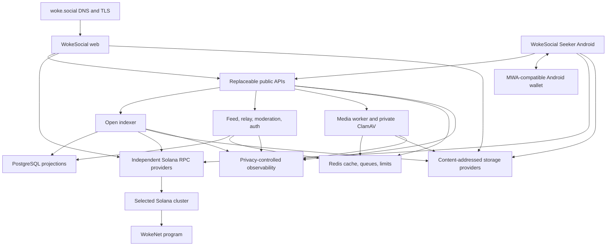

# Deployment

Last reviewed: 2026-07-29

## Document status

This document defines the provider-neutral deployment contract for WokeSocial
and WokeNet.

WokeSocial is the web and Android product plus its replaceable services.
WokeNet is the protocol and Anchor-program deployment layer on Solana. This
repository does not operate a separate blockchain, validator set, or RPC
network.

The verified boundary is local development:

- pinned Node, pnpm, Rust, Solana, and Anchor toolchains;
- a disposable Solana local validator and development WokeNet program ID;
- local PostgreSQL, Redis, Kubo, media, and malware-scanning services;
- locally built web and service artifacts with focused integration evidence;
  and
- a non-release Expo/React Native Seeker foundation with Mobile Wallet Adapter
  connection code, exact deployment checks, a read-only feed, tests, and Android
  export metadata.

No WokeNet program deployment is recorded on Solana devnet or mainnet-beta. No
production service, DNS/TLS deployment, provider account, backup/restore
attestation, `$WOKE` mint, signed APK, store submission, or public release is
claimed.

## Deployment principles

- Solana validators and RPC providers are external dependencies.
- No mandatory hosting, RPC, indexer, relay, media, or storage provider.
- Public protocol state remains independently verifiable without the flagship
  deployment.
- PostgreSQL is a replayable projection; Redis is disposable coordination.
- Services and clients use immutable, provenance-linked artifacts promoted
  between environments.
- Production credentials are never available to pull-request builds.
- Devnet/mainnet-beta program deployment, real-fund actions, Android signing,
  and public distribution are manual, separately approved operations.
- Rollback, backup, provider evacuation, degraded mode, and incident handling
  are designed and rehearsed before launch.
- Every release records the source revision, dependency lock, artifact digest,
  protocol/schema versions, exact Solana genesis hash, program ID, deployment
  slot, deployed program hash, and upgrade authority.

## Target topology



The topology may run on a development machine, container platform, virtual
machines, or multiple providers. Deployment adapters do not change protocol
semantics.

## Environments and authority boundaries

| Environment | Solana target | Funds and data | Purpose | Authority |
| --- | --- | --- | --- | --- |
| Local/CI | Disposable local validator | Generated keys, synthetic fixtures, local SOL only | Program, client, indexer, and connected-flow evidence | Developer or restricted CI identity |
| Devnet | Solana devnet | Devnet SOL and synthetic/non-sensitive data | Public program deployment rehearsal, RPC failover, client/device integration | Protected devnet program authority |
| Staging | Solana devnet or an explicitly recorded non-production target | Synthetic data and staging-only secrets | Production-like services, recovery, monitoring, and release rehearsal | Protected staging quorum |
| Production | Solana mainnet-beta | Real network fees and minimum necessary service data | Public WokeSocial and WokeNet release | Hardware-backed production quorums |

Each environment has distinct program IDs, deployment records, authority keys,
databases, buckets, API tokens, telemetry projects, mobile configuration, and
signing identities. Operator and client surfaces show the cluster and exact
deployment binding:

```text
wokenet:v1:<solana-genesis-hash>:<social-protocol-program-id>
```

Human-readable cluster names never replace observed genesis verification.

## `$WOKE` and payment boundary

No `$WOKE` mint exists. The legacy lamport-denominated payment ABI is
quarantined, cannot execute, cannot be unpaused, and never grants an
entitlement. Deployment and sponsorship tooling must reject it.

Portable signed metadata may describe SOL with `{ kind: "sol" }` or an SPL
asset with exact token metadata. `{ kind: "woke" }` is rejected. A future
`$WOKE` release requires a separately approved SPL or Token-2022 mint, new
mint-aware ABI, migration, devnet rehearsal, legal/security review, and
explicit release authorization.

## Toolchain and local bootstrap

Reproducible inputs include:

- Node and pnpm;
- JavaScript dependencies and the committed lockfile;
- Rust, Anchor, and Solana build/client tools;
- Android, Kotlin, Expo/React Native, Mobile Wallet Adapter, and native-module
  dependencies for Android artifacts;
- container bases by immutable digest; and
- CI actions by immutable commit.

“Latest” is not accepted in a reproducible build or release record.

Local prerequisites are Git, the pinned Node/Corepack/pnpm runtime, and Docker
Engine with Docker Compose. The project-local setup installs the pinned
Rust/Solana/Anchor tools without relying on a global installation.

```sh
corepack enable
pnpm install --frozen-lockfile
pnpm setup
pnpm infra:ps
pnpm dev
```

`pnpm setup` and `pnpm dev` are local/test-only. They do not deploy a program to
a public Solana cluster, publish permanent content, change DNS, create a mint,
sign an APK, or spend real funds.

The disposable local validator is started on demand by the program and
connected-slice test commands; it is not left running as a WokeNet service.

## Build and artifact promotion

Web, service, WokeNet-program, and Android artifacts have separate release
records and approvals.

The application/program release pipeline is:

1. Verify a clean source revision and committed lockfiles.
2. Run formatting, lint, type checks, unit/integration/local-validator tests,
   responsive-web tests, security scans, and production builds.
3. Build each service image once from the reviewed revision.
4. Reproducibly build the WokeNet SBF artifact and record its hash, IDL, source
   revision, and exact toolchain.
5. Generate SBOMs, vulnerability reports, provenance, and immutable digests.
6. Sign or attest artifacts through protected release identities.
7. Deploy the same reviewed artifacts to staging and run smoke, migration,
   failover, replay, accessibility, and security checks.
8. Promote the same artifacts after quorum approval; do not rebuild.

Implemented local interfaces include:

```sh
pnpm format:check
pnpm lint
pnpm typecheck
pnpm test
pnpm test:integration
pnpm test:programs
pnpm test:e2e
pnpm test:vertical-slice
pnpm build
```

Those commands provide local evidence. They do not authorize or perform a
public deployment.

## Configuration and secrets

`.env.example` contains names and safe placeholders only. Real secrets come
from a protected secret interface and are never committed, printed, included in
client bundles, or placed in `EXPO_PUBLIC_*` variables.

| Group | Current names or categories | Requirements |
| --- | --- | --- |
| Public web | `NEXT_PUBLIC_APP_ORIGIN`, `NEXT_PUBLIC_SOLANA_CLUSTER`, `NEXT_PUBLIC_SOLANA_RPC_URL`, `NEXT_PUBLIC_PROGRAM_ID` | Values are public; exact origin, cluster, genesis/program consistency, HTTPS, and non-loopback production target |
| Solana client/service | `SOLANA_COMMITMENT`, `SOLANA_RPC_URLS`, `SOLANA_WS_URLS`, `SOLANA_RPC_ENDPOINTS` | Finalized canonical projection; ordered credential-safe endpoints; method/health/lag checks; independent-provider failover |
| Indexer | `INDEXER_SOLANA_RPC_URLS`, deployment/activation slot, batch, polling, retry, stale, and content-root settings | Immutable deployment metadata, bounded polling/hydration, exact replay, finalized readiness |
| Android | `EXPO_PUBLIC_SOLANA_*`, exact program/deployment ID, public indexer URL | Public values only; HTTPS outside development; no RPC secret; release values fixed in artifact provenance |
| Database | Runtime and separate migration URLs per service | Verified TLS outside local development; least-privilege runtime role; DDL only in one-shot migration job |
| Redis | URL, rate-limit secret/deployment ID, queue namespaces | Noncanonical; authenticated; encrypted outside local development; no raw identity/IP keys |
| Storage | Gateway lists, pinning endpoints, optional permanent-storage settings | Multiple providers; credentials server-only; retrieved bytes locally verified |
| Relay/moderation/auth | Public endpoints, authorizer endpoints, RP origins, session/recovery settings | Exact HTTPS origins; fail closed; secrets injected separately |
| Media | Worker listener/origins, limits, private roots, bearer secret, private ClamAV endpoint | No unrelated secrets; scanner never publicly reachable |
| Sponsorship | Enable flag, Solana cluster, budgets, signer reference | Disabled by default; fee payer isolated; legacy payment instructions rejected |
| Telemetry/operations | OTLP destination, sampling, release ID, admin binds, flags | No private content; private admin endpoints; audited/versioned flags |

Retired `WOKENET_*` RPC aliases fail closed. WokeNet remains the protocol
namespace, not an RPC transport.

Startup fails when required configuration is absent, malformed, inconsistent,
credential-bearing where forbidden, or bound to the wrong Solana
genesis/program pair.

## Provider-neutral infrastructure

### Compute and ingress

Each long-running service has a non-root OCI image, read-only root where
practical, explicit entrypoint, resource bounds, graceful termination, distinct
service identity, and separate liveness/readiness behavior.

`TRUSTED_PROXY_CIDRS` is empty by default. Forwarded client-address headers are
trusted only from explicitly bounded ingress addresses. Application ports stay
private; broad `trustProxy` settings are forbidden.

### PostgreSQL

- PostgreSQL stores replayable projections and purpose-specific service data,
  not canonical identity or social truth.
- Runtime and migration roles are separate; long-running processes do not run
  DDL.
- Nonlocal connections use verified TLS, a certificate-matching DNS name, and
  explicit database/user selection.
- Ordered migration checksums are verified before execution.
- Destructive migrations require a restore rehearsal and compatibility window.
- A fresh indexer database is rebuilt from the recorded Solana deployment slot,
  finalized WokeNet history, and verified signed manifests.

### Redis

- Redis holds caches, queues, rate limits, and ephemeral coordination only.
- Loss of Redis does not corrupt protocol truth.
- Sensitive admission and authorization fail safe when Redis is unavailable.
- Keys use bounded deployment/service prefixes and HMAC-derived identifiers,
  not raw IP addresses or identities.

### Content storage

- Local filesystem storage is for development and tests.
- Production supports independently configurable publication/replication paths
  and read gateways.
- Every object is hash/CID verified locally.
- Permanent publication requires separate, item-specific consent.
- Provider health and deletion requests are recorded without promising
  unprovable persistence or erasure.

### Solana RPC providers

- Configure multiple RPC/WebSocket endpoints with method capability, health,
  latency, error, rate-limit, slot-lag, exact genesis, program, and finalized
  checkpoint checks.
- Never embed privileged RPC credentials in web or Android clients.
- Cross-check sensitive state and finalized observations across independently
  administered providers.
- Record slot/block identity and provider provenance for replay.
- A provider change requires no WokeNet protocol migration.
- Stop unsafe writes and show a degraded state when providers disagree or
  required methods are unavailable.

## Database migration procedure

1. Record the release, current schema, immutable WokeNet deployment metadata,
   row-count invariants, replica health, and recovery point.
2. Verify that the encrypted backup is readable.
3. Confirm old/new application compatibility.
4. Apply expand-only changes through the one-shot migration role.
5. Deploy compatible readers/writers.
6. Run bounded, observable, resumable backfills.
7. Verify invariants, latency, error rate, and replay behavior.
8. Remove obsolete structures only in a later release.
9. Record the migration checksum, duration, evidence, and rollback decision.

An irreversible failure uses the rehearsed restore or roll-forward path; schema
rollback is not improvised.

## Solana devnet program rehearsal

Devnet is the first public WokeNet deployment gate:

1. Reproduce the reviewed SBF artifact and IDL from a clean revision.
2. Confirm the intended Solana devnet genesis hash and protected authority.
3. Deploy the program manually with a devnet-only funded identity.
4. Record deployment signature/slot, program ID/data address, deployed artifact
   hash, source/toolchain, and upgrade authority.
5. Verify executable bytes and exact
   `wokenet:v1:<solana-genesis-hash>:<program-id>` binding independently.
6. Run the connected WokeSocial flow through at least two independently
   administered Solana RPC providers.
7. Exercise indexer rebuild, provider loss/disagreement, blockhash expiry,
   priority-fee bounds, authority compromise, upgrade, and rollback procedures.
8. Run the web and Android staging clients without enabling legacy payments.
9. Publish the devnet release record and limitations.

Automation may use devnet SOL only. It never falls back to a real-fund source.

## Manual mainnet-beta boundary

Mainnet-beta deployment remains disabled until:

- product, protocol, security, privacy, deployment, and operations documents
  match the reviewed release;
- clean builds, tests, accessibility, security, replay, failure, and restore
  gates pass;
- independent program/application/mobile/legal reviews have no unresolved high
  or critical findings in scope;
- reproducible program and application artifacts match reviewed digests;
- the program upgrade multisig, delay, signer ceremony, emergency scope, and
  immutability path are public and verified;
- Solana RPC diversity, failover, indexer rebuild, key compromise, and incident
  exercises pass;
- DNS/TLS, abuse response, on-call coverage, budgets, monitoring, backups, and
  rollback are operational; and
- any future `$WOKE` mint and replacement ABI have separate explicit approval.

General CI has no mainnet-beta program authority or real-fund signer. A
production wrapper requires the exact cluster/genesis, program ID, authority,
artifact digests, deployment limits, and interactive quorum confirmation.

Program upgrades do not roll back like web services. Use a reviewed forward fix
or narrowly scoped, predesigned pause; never redeploy an old binary without
state-compatibility verification.

## Seeker Android release pipeline

The checked-in Android project is a foundation, not a published release.

Before producing or distributing an APK:

1. Pin and review Android/Expo/React Native/MWA/native-module inputs.
2. Test connection, authorization, account switching, signing cancellation,
   timeout, deep-link/callback mutation, background/resume, disconnect, and
   wallet replacement on the approved Seeker/device matrix.
3. Decode and summarize exact Solana transaction bytes before handoff and
   revalidate account, cluster, program, and bytes after return.
4. Review permissions, backup, local storage, logs, telemetry, clipboard,
   screenshots, app links, and data-safety disclosures.
5. Produce an installable reproducible APK from a clean environment.
6. Sign through separated controlled custody using the intended distribution
   certificate.
7. Publish the APK hash, certificate digest, source revision, dependency lock,
   build provenance, reproducibility result, and supported upgrade path.
8. Run device accessibility, performance, offline/degraded-mode, and security
   checks.
9. Rehearse signing-key/update/store compromise and rollback.
10. Obtain explicit legal, privacy, security, accessibility, and distribution
    approval before store submission or direct publication.

A device-model hint is not proof of Seeker ownership and never grants value or
privileges.

## Service deployment sequence

1. Confirm approval, immutable digests, configuration diff, capacity, backups,
   and rollback target.
2. Apply compatible expand migrations.
3. Deploy background consumers paused or in shadow mode.
4. Deploy internal services and verify health.
5. Canary public APIs with limited traffic.
6. Verify error rate, latency, authorization failures, queue/database pressure,
   RPC lag, and content-verification failures.
7. Increase traffic gradually.
8. Deploy web/Android configuration for the exact intended Solana
   genesis/program and provider set.
9. Resume consumers and verify finalized checkpoints and invariants.
10. Run external smoke and critical-path checks and record the release.

Schema, service, and client compatibility allows independent clients/operators
time to upgrade.

## Health and post-deployment checks

- `/healthz` proves process liveness without dependency traversal.
- `/readyz` proves the instance can safely receive its implemented work.
- Check TLS, headers, DNS, asset caching, and absence of client-bundled secrets.
- Verify Solana cluster/genesis, program ID/data address/deployed hash,
  deployment slot, authority, protocol version, and release ID.
- Verify database schema, migrations, pool pressure, projection invariants, RPC
  failover/lag, finalized checkpoints, and alternate content retrieval.
- Verify authentication/revocation, privacy controls, rate limits, relay
  reconciliation, queue backpressure, and telemetry redaction.
- Run responsive web at desktop/mobile viewports separately from the Seeker
  Android device matrix.

## DNS, TLS, and public routing

- `woke.social` is the sole canonical flagship origin.
- `sociallywoke.com` and `www.sociallywoke.com` provide permanent,
  path/query-preserving redirects only; they do not serve an application,
  session, cookie, or WebAuthn origin.
- DNS changes are reviewed and reversible; TLS is automated with expiry alerts.
- HSTS is enabled only when every included subdomain is HTTPS-ready.
- User media uses an isolated origin without application cookies.
- APIs, relays, media, documentation, and mirrors have documented replacement
  paths.

## Backups, rollback, and evacuation

Deployment provides encrypted/versioned service-data backups, point-in-time
recovery where supported, portable configuration without plaintext secrets,
retained source/lockfiles/artifact digests/SBOM/provenance/IDL/deployment
records, separately controlled secret-manager recovery, and regular isolated
restore tests. The indexer also has a full rebuild path without a database
backup.

For web/services, retain the previous compatible immutable digest, stop on
canary breaches, and roll traffic back without reversing incompatible schema.
For the indexer, preserve suspect input, rebuild a fresh projection from the
recorded deployment, and compare deterministic invariants before cutover.

For provider loss or compromise:

1. Determine integrity versus availability impact.
2. Revoke provider-specific credentials where necessary.
3. Activate a preconfigured alternate and validate integrity.
4. Reconcile missed observations or writes.
5. Export required portable configuration/data.
6. Update endpoint metadata/failover lists.
7. Preserve evidence and document user impact.

Android rollback follows the signed update/distribution plan; an unsigned or
differently signed emergency APK is never treated as a valid update.

## Outstanding manual work

- Complete an independent-machine release attestation, SBOMs, signatures, and
  provenance.
- Finish essential WokeSocial web/mobile mutation flows and provider
  infrastructure.
- Deploy and verify the reviewed WokeNet program on Solana devnet.
- Establish production program-authority, service, Android-signing, and
  distribution custody.
- Define and validate measurable SLO/RPO/RTO and capacity budgets.
- Complete independent security, privacy, accessibility, safety, legal, and
  operational review.
- Demonstrate devnet deployment, restore, replay, provider failover, rollback,
  incident response, Seeker-device MWA behavior, and reproducible signed-APK
  verification.
- Keep `$WOKE` out of deployment scope unless a real mint and replacement ABI
  pass their separate approval gates.
