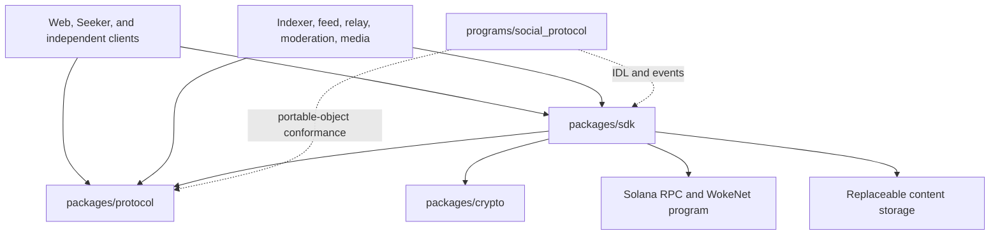
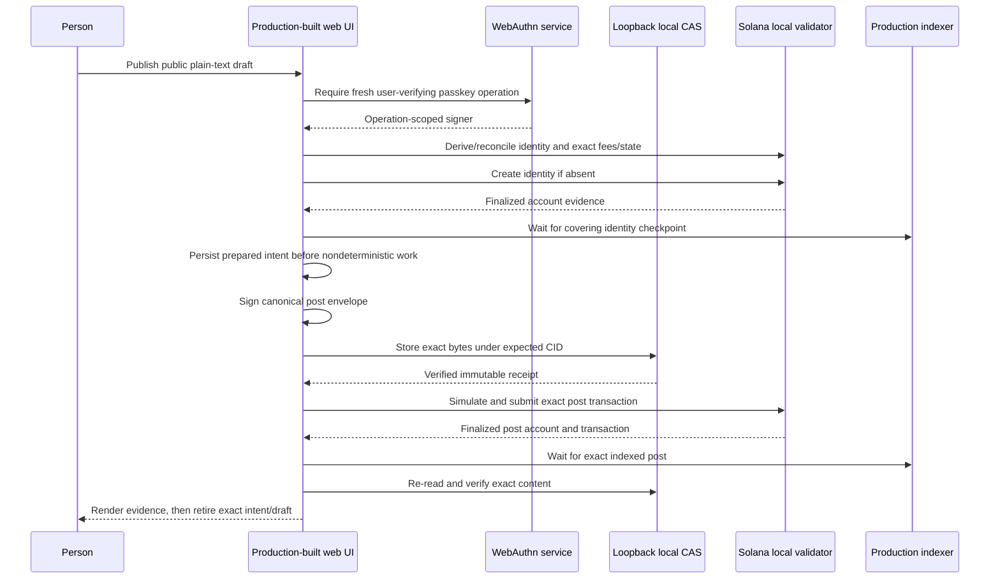

# WokeSocial developer handoff

- **Audience:** Claude Fable or any engineer continuing the repository without
  access to prior task transcripts
- **Repository:** `AlexBTC420/wokesocial`
- **Default branch:** `main`
- **Status:** Active pre-release development
- **Last updated:** 2026-07-29

## 1. Resume here

This document is the operational handoff for the next development session. It
does not replace the specifications or evidence records. Its purpose is to make
the current state, constraints, and next actions recoverable without relying on
chat history.

Before changing anything:

1. Run `git status --short`, `git branch --show-current`, and
   `git log -5 --oneline`.
2. Expect a clean tree at the recorded handoff. If local modifications exist,
   preserve and inventory them before changing anything.
3. Read this document, [TASKS.md](../TASKS.md),
   [FINAL_REPORT.md](../FINAL_REPORT.md), and
   [Platform Expansion](PLATFORM_EXPANSION.md). AI work also requires
   [Woke AI Platform](AI_PLATFORM.md) and
   [Organization and Product Ownership](ORGANIZATION.md).
4. Read closed [GitHub issue #10](https://github.com/AlexBTC420/wokesocial/issues/10)
   for the passkey-publication evidence, then use
   [issue #12](https://github.com/AlexBTC420/wokesocial/issues/12) for the
   expanded product program. The active social-product slices are
   [issue #14](https://github.com/AlexBTC420/wokesocial/issues/14) for
   pseudonymous `.woke` names and
   [issue #15](https://github.com/AlexBTC420/wokesocial/issues/15) for the
   points/reputation foundation.
5. Confirm the repository-local Git identity:

   ```sh
   git config --local user.name
   git config --local user.email
   git config --local user.useConfigOnly
   ```

   The required values are:

   ```text
   AlexBTC420
   alexbtc420@pm.me
   true
   ```

6. Do not deploy a program, create a token, use real funds, publish an Android
   artifact, change public DNS, or weaken a security boundary without explicit
   authorization.

## 2. Product and naming invariants

These definitions are settled:

| Name | Exact meaning |
| --- | --- |
| **WokeSocial** | The social product, web application, services, and planned native clients |
| **WokeNet** | The portable protocol, identifiers, SDK boundaries, and Anchor program deployed on Solana |
| **`woke.social`** | The canonical product origin |
| **`sociallywoke.com`** | A redirect-only legacy hostname |
| **`$WOKE`** | A possible future Solana asset; no mint currently exists |

WokeNet is not a blockchain, Solana fork, validator implementation, RPC
network, Firedancer topology, or Agave topology. Solana is the ledger and
execution environment. RPC providers and validators remain external and
replaceable.

Use `WokeSocial`/`wokesocial` for the platform and app. Use
`WokeNet`/`wokenet` for the protocol and local repository namespace. The remote
repository name is `wokesocial`; the existing local directory may remain
`wokenet`.

The product is open to everyone who follows its community and safety rules.
Documentation and product copy must not narrow the platform to one demographic
or present sensitive identity attributes as required profile data.

Run these checks after naming, copy, configuration, or domain changes:

```sh
pnpm naming:check
pnpm domain:check
```

## 3. Non-negotiable truth and safety boundaries

Preserve these invariants across code, tests, documentation, and GitHub issues:

- Never describe planned work as shipped.
- Local-validator evidence is not devnet, mainnet-beta, production, audit, or
  scale evidence.
- A submitted transaction is not success. Success requires exact finalized
  account evidence and the expected indexer checkpoint.
- Provider receipts are untrusted until exact bytes, hashes, signatures, and
  identifiers are verified locally.
- Private keys, passkey PRF output, seed material, recovery material, and
  plaintext key wrappers must not cross an HTTP boundary or enter logs,
  storage receipts, analytics, screenshots, or fixtures.
- The legacy lamport payment ABI remains quarantined, paused, and impossible to
  unpause. It must never be relabeled as `$WOKE`.
- No `$WOKE` mint, balance, redemption, exchange rate, or investment claim
  exists.
- `.woke` names are versioned WokeNet mappings to real Solana public keys.
  Deterministic anonymous derivation and program-enforced `anon_`
  anti-front-running are implemented locally; atomic registration/claim,
  resolution UX, and custom settlement remain incomplete. They are not native
  Solana addresses or an external DNS top-level domain.
- “No transaction fee” can only mean no hidden WokeSocial platform fee.
  Solana fees and rent must be disclosed or sponsored under published limits.
- “Middle-out” is a benchmark program, not a completed proprietary codec.
- Reputation, platform points, AI credits, promotional grants, and any future
  redemption entitlement are separate accounting domains.
- Identity-document or selfie verification must not store raw evidence on
  chain or in platform databases. Ordinary E2EE alone does not hide plaintext
  from a processor.
- Market automation begins with sourced research and paper trading. Real-money
  execution remains disabled until noncustodial authorization, risk, legal,
  security, and user-protection gates pass.
- Do not make “10x,” profit, safety, privacy, decentralization, or performance
  claims without a named reproducible evaluation.

## 4. Repository map

```text
apps/
  web/                  Next.js flagship application
  mobile/               Non-release Expo/React Native Seeker foundation
  auth-service/         WebAuthn relying party and encrypted wrapper sync
  indexer/              Finalized Solana synchronizer and PostgreSQL projection
  feed-service/         Replaceable feed/recommendation provider
  relay/                Non-authoritative signed WebSocket transport
  moderation-service/   Signed labels, reports, appeals, and restricted cases
  media-worker/         Authenticated media validation and processing
packages/
  protocol/             Canonical schemas, identifiers, hashes, and signatures
  sdk/                  Solana instruction, simulation, finality, and publication APIs
  storage/              Content-addressed storage adapters
  indexer-client/       Strict runtime-neutral indexer client
  crypto/               WebCrypto and passkey key-wrapping helpers
  messaging/            Experimental pairwise encrypted-messaging adapter
  rate-limit/           Shared fail-closed admission limiting
  config/               Typed environment and runtime contracts
  ui/                   Shared accessible UI foundations
programs/
  social_protocol/      WokeNet Anchor program
network/solana/         Exact deployment-manifest and cluster metadata
infra/                  Local provider-neutral infrastructure
scripts/                Setup, verification, operations, and evidence harnesses
tests/vertical-slice/   Connected protocol-to-browser acceptance helpers
docs/                   Product, protocol, safety, operations, and handoff docs
```

Stable contracts point inward:



Applications must not copy protocol schemas. Compatibility-significant changes
must update every affected Rust, TypeScript, IDL, SDK, indexer, fixture, test,
and documentation surface.

## 5. Current implementation boundary

The repository already contains substantial locally tested foundations:

- an Anchor program with identity, profile-reference, handle, delegation,
  recovery, social, community, governance, content-reference, reaction,
  tombstone, and quarantined legacy-payment families;
- a strict portable-object protocol registry with canonical serialization,
  SHA-256 identifiers, Ed25519 proofs, and versioned schemas;
- local, IPFS/Kubo, multi-provider, and consent-gated
  Arweave-compatible storage adapters;
- a finalized Solana indexer with PostgreSQL projections, checkpoints,
  hydration, replay, dead letters, provenance, and consumer-safe APIs;
- replaceable feed, relay, moderation, authentication, media, configuration,
  crypto, messaging, rate-limit, and UI packages or services;
- a complete web route-shell surface with responsive and automated
  accessibility coverage;
- a real browser passkey service lifecycle;
- a non-release Solana Seeker Android foundation with Mobile Wallet Adapter
  boundaries and read-only feeds/community discovery; and
- a connected local-validator fixture that can destroy and rebuild its
  projection from protocol events and signed manifests.

This breadth does not make the product production-ready. Read
[FINAL_REPORT.md](../FINAL_REPORT.md) for the exact verified baseline and known
limitations.

## 6. Completed milestone: passkey-first localnet publication

[GitHub issue #10](https://github.com/AlexBTC420/wokesocial/issues/10) completed
the first real browser-to-WokeNet publication slice:



### 6.1 Important files

| File or area | Responsibility |
| --- | --- |
| `apps/web/components/composer.tsx` | UI, progress, cancellation, resume, evidence, and exact cleanup |
| `apps/web/lib/browser-publication-lock.ts` | Fail-closed cross-tab Web Lock boundary |
| `apps/web/lib/browser-publication-state.ts` | Exact draft/intent selection, save, discard, and finalized cleanup |
| `apps/web/lib/post-publication-intent.ts` | Durable prepared → signed → stored → finalized state machine |
| `apps/web/lib/localnet-post-publication.ts` | End-to-end browser orchestration and reconciliation |
| `apps/web/lib/local-cas-route.ts` | Loopback-only same-origin CAS write boundary |
| `apps/web/lib/auth/browser-auth-client.ts` | Fresh passkey operation signer and zeroization boundary |
| `packages/protocol/src/signatures.ts` | External payload-signer protocol primitive |
| `packages/sdk/src/identity-publication.ts` | Deterministic identity coordinates/instruction |
| `packages/sdk/src/woke-transaction.ts` | Exact RPC, simulation, fee, finality, and account verification |
| `scripts/vertical-slice/run.mjs` | Fresh local-validator/browser/replay acceptance harness |
| `tests/vertical-slice/publication-evidence.mjs` | Evidence validation |
| `apps/web/publication-slice-e2e/` | Real Chromium publication and ambiguity/retry cases |

### 6.2 Durable-state invariants

The browser persists every nondeterministic coordinate before signing or
submitting. A retry must reuse the exact:

- network and program;
- identity and root signing key;
- author sequence;
- created timestamp;
- payload nonce and post nonce;
- post PDA;
- canonical envelope bytes;
- object ID, CID, and payload hash;
- verified storage receipt; and
- finalized transaction evidence.

Composer start/save/discard/cleanup operations run under one exclusive Web
Lock. They must read and parse the exact draft/intent pair after acquiring the
lock. A stale tab must not overwrite an active intent, publish the wrong draft,
or delete a newer tab’s draft. Final cleanup clears only the draft serialized
for that exact publication and then acknowledges that exact finalized intent.

Keep the focused cross-tab tests in
`apps/web/tests/browser-publication-state.test.ts` and
`apps/web/tests/browser-publication-lock.test.ts`.

### 6.3 Standard Solana RPC invariant

Do not depend on nonstandard `simulateTransaction` response fields. Standard
Agave-compatible evidence is assembled from:

- `getFeeForMessage` for the exact compiled message;
- compiled-message-header writable-account derivation;
- `getMultipleAccounts` pre-state;
- `simulateTransaction.accounts` post-state;
- the same context slot for pre-state and simulation; and
- a bounded retry when the context slot advances.

The exact simulation must still pass the WokeNet effect verifier before
broadcast. Preserve the Agave-shaped regression fixtures in
`packages/sdk/test/woke-transaction.test.ts`.

### 6.4 Local CAS invariant

The browser CAS write route is development-only and loopback-only. The direct
browser `Origin` and `Host` must exactly match the configured allowed origin.
Next may internally expose a `localhost` request as a `127.0.0.1` URL and add a
complete `x-forwarded-*` tuple. The route may accept only that internally
consistent same-port, same-path, loopback tuple.

It must reject:

- remote or production mode;
- non-loopback URLs;
- path, query, port, host, protocol, or origin substitution;
- missing, partial, remote, comma-separated, or mismatched forwarding values;
- unknown forwarding headers;
- unsupported content type or encoding;
- oversized or length-mismatched bodies;
- expected-CID substitution or traversal; and
- secret-material headers or non-envelope bodies.

### 6.5 Evidence status at this handoff

Issue #10's development-localnet acceptance gate passed on 2026-07-29 from a
fresh validator, isolated PostgreSQL, rebuilt SBF program/indexer/web source,
and real Chromium virtual authenticator:

```text
tested commit: c8c04944648696fbaf19342077ffa99d64c8d967
retained run: .local/vertical-slice/run-ZM7nNM
evidence: .local/vertical-slice/run-ZM7nNM/publication-evidence.json
evidence mode/size: 0600 / 3418 bytes
evidence SHA-256: 972f049d6afd2343d3b70d9266ef79ca8d60728b23a8e051af8d629739469d46
baseline replay: 10 events / 627c538cd2b03fc5c6c52a601a454870cf95602ac3cd19996285472e8c2d407a
expanded replay: 13 events / 01d69a29076b48fd54fbeaeda6fef9e60227a4bb5a6ec5bb6727b59e5ff6934d
web tests: 19 files / 252 tests
secret matches: 0
forbidden HTTP field names: 0
```

The browser created identity
`J8eUkB7sS8nbH1JDDM3DLF8WkNGo9JF9ZfJF4ACQqM2b` once at finalized slot 142,
published two distinct posts at slots 176 and 288, and restored both exact
transaction signatures after replay. The first publication intentionally lost
one forwarded response after finality and held the indexer unavailable for 60
bounded reads. After one reload, the browser recovered the same finalized
intent with the draft locked and with the send count unchanged at two. Across
the identity plus two posts there were exactly three unique transaction wires.

The secret audit scanned 542 HTTP requests, 621 HTTP responses, 22,621,368
HTTP/browser bytes, 26,164 service-log bytes, and 3,273 Docker-log bytes. It
captured five PRF-output canaries and one seed canary in its test-only
observation channel; request, response, browser, service, Docker, and
forbidden-field match counts were all zero. This is development-localnet
evidence only. It is not a devnet/mainnet deployment, production custody,
recovery, or independent external audit.

## 7. Expanded product program

The approved long-horizon design is specified in
[Platform Expansion](PLATFORM_EXPANSION.md) and tracked through:

| Issue | Workstream |
| --- | --- |
| [#12](https://github.com/AlexBTC420/wokesocial/issues/12) | Umbrella product expansion |
| [#13](https://github.com/AlexBTC420/wokesocial/issues/13) | Long- and short-form video plus benchmarked delivery |
| [#14](https://github.com/AlexBTC420/wokesocial/issues/14) | Random and custom `.woke` names |
| [#15](https://github.com/AlexBTC420/wokesocial/issues/15) | Reputation, points, AI credits, and gated redemption |
| [#16](https://github.com/AlexBTC420/wokesocial/issues/16) | Avatar studio, creator items, marketplace, and subscription |
| [#17](https://github.com/AlexBTC420/wokesocial/issues/17) | Minimal-disclosure verification and age assurance |
| [#18](https://github.com/AlexBTC420/wokesocial/issues/18) | Open-model assistant and content-creation suite |
| [#19](https://github.com/AlexBTC420/wokesocial/issues/19) | Sourced market intelligence and bounded automation |
| [#20](https://github.com/AlexBTC420/wokesocial/issues/20) | Open protocol and product-rule governance |

Do not implement these in issue-number order. Their dependency order is:

1. Preserve the verified passkey identity, text publication, finality,
   indexer, and replay gate.
2. Implement `.woke` names and separate reputation/points/credits ledgers.
3. Ship standards-based video before experimental delivery optimization.
4. Build a portable avatar renderer and off-chain catalog before NFT items.
5. Establish replaceable model evaluation/inference before AI-credit economics.
6. Prove verification privacy and a non-verification path before accepting
   evidence.
7. Simulate abuse and reserves before any external point redemption.
8. Validate sourced research and paper trading before transaction authority.
9. Require independent security and qualified legal review before real-money,
   identity-evidence, creator-sale, or redemption features.

## 8. Environment and setup

Required versions:

| Tool | Version or state |
| --- | --- |
| Node.js | `22.23.1` exactly |
| pnpm | `11.2.2` exactly through Corepack |
| Docker | Running with Docker Compose |
| Rust | Project-local `1.89.0` |
| Solana | Project-local `2.3.0` |
| Anchor | Project-local `0.32.1` |

First setup:

```sh
corepack enable
pnpm install --frozen-lockfile
pnpm setup
pnpm dev
```

Useful diagnostics:

```sh
pnpm dev:check
pnpm infra:ps
pnpm infra:logs
pnpm env:check
```

Stop persistent containers without deleting data:

```sh
pnpm infra:down
```

Do not improvise destructive Docker, database, Git, or filesystem commands.

The checked-in `.env.example` contains development placeholders. `.env` is
ignored and must remain uncommitted. New environment variables require typed
validation in `packages/config`, a safe example, and production fail-closed
behavior.

## 9. Verification ladder

Run the smallest relevant checks while iterating, then widen them.

### 9.1 Fast static boundary

```sh
pnpm format:check
pnpm naming:check
pnpm domain:check
pnpm lint
pnpm typecheck
git diff --check
```

### 9.2 Focused workspaces

Examples:

```sh
pnpm --filter @wokesocial/protocol test
pnpm --filter @wokesocial/sdk test
pnpm --filter @wokesocial/web test
pnpm --filter @wokesocial/web test:e2e
```

Use the actual script names declared by each workspace. Do not assume one
package’s green result covers downstream consumers.

### 9.3 Normal repository gate

```sh
pnpm install --frozen-lockfile
pnpm verify
```

### 9.4 Connected and release-relevant local gates

```sh
pnpm test:integration
pnpm test:e2e
pnpm test:programs
pnpm test:vertical-slice
pnpm measure:performance
pnpm security:audit
pnpm security:secrets
```

`pnpm verify:all` combines the repository’s available local gates, but it does
not prove devnet/mainnet operation, independent infrastructure, production
load, manual accessibility, legal review, external audit, or Seeker-device
behavior.

For every reported gate, record:

- the exact command;
- commit or working-tree identity;
- pass/fail result and count;
- skipped cases;
- artifact path where applicable; and
- what the result does not prove.

## 10. Documentation source of truth

Use these documents by concern:

| Concern | Source |
| --- | --- |
| Product behavior and status | [PRODUCT_SPEC.md](PRODUCT_SPEC.md) |
| Expanded product systems | [PLATFORM_EXPANSION.md](PLATFORM_EXPANSION.md) |
| AI model family, runtime, and training | [AI_PLATFORM.md](AI_PLATFORM.md) |
| Organization and service ownership | [ORGANIZATION.md](ORGANIZATION.md) |
| Architecture and trust boundaries | [ARCHITECTURE.md](ARCHITECTURE.md) |
| Canonical protocol and program contract | [PROTOCOL.md](PROTOCOL.md) |
| Compatibility decisions | [DECISIONS/](DECISIONS/) |
| Privacy and data placement | [PRIVACY.md](PRIVACY.md) |
| Threats and security controls | [THREAT_MODEL.md](THREAT_MODEL.md), [SECURITY.md](SECURITY.md) |
| Development workflow | [DEVELOPMENT.md](DEVELOPMENT.md) |
| Test strategy | [TESTING.md](TESTING.md) |
| Operations and deployment | [OPERATIONS.md](OPERATIONS.md), [DEPLOYMENT.md](DEPLOYMENT.md) |
| Ordered delivery checklist | [TASKS.md](../TASKS.md) |
| Exact evidence and limitations | [FINAL_REPORT.md](../FINAL_REPORT.md) |

When code and documentation disagree, do not silently choose one. Determine
whether the code is wrong, the document is stale, or a compatibility decision
is missing. Update every affected source and keep status language conservative.

## 11. Git and GitHub workflow

The remote is a private repository:

```text
https://github.com/AlexBTC420/wokesocial
```

Use `gh` for issue and repository operations. Keep implementation progress in
issues, commit evidence in Git, and durable architectural decisions in ADRs.

Before committing:

1. Wait for all test and development processes to stop.
2. Restore only generated incidental changes, using a targeted patch rather
   than a broad checkout. In particular, Next development may rewrite
   `apps/web/next-env.d.ts`.
3. Review `git status --short`, `git diff --stat`, `git diff`, and
   `git diff --check`.
4. Run the proportional verification ladder.
5. Scan for secrets and unsupported completion claims.
6. Commit logical units with conventional subjects.

The passkey-first publication and expanded-roadmap milestone was committed as
rewritten commit `c8c04944648696fbaf19342077ffa99d64c8d967`. Start subsequent
work from a clean tree and keep each new product slice independently
reviewable.

Do not commit failed-run `.local/` artifacts. `.local/` is intentionally
ignored.

### 11.1 Completed historical metadata repair

The owner required every commit to show:

```text
AlexBTC420 <alexbtc420@pm.me>
```

The repair completed on 2026-07-29. At the rewrite checkpoint, all 18 existing
commits—including merge commits—used that exact value for both author and
committer. Commit messages, timestamps, tree sequence, parent counts, and merge
topology were preserved. The pre/post tree hash was
`a4874530d580a92fc2f8e8e748b47a5c4f3d5d62`, and the rewritten milestone tip
was `c8c04944648696fbaf19342077ffa99d64c8d967`.

The update used the exact prior remote SHA as a `--force-with-lease`, then
verified the GitHub branch, private visibility, MIT license detection, and
history. A mode-0600 recovery bundle was retained locally at
`.local/history-backups/pre-identity-rewrite-a13dca9.bundle` with SHA-256
`f9d4baf8a9060a0bddd3e65c446d12cfa01459510bf6e52c2ea47c3c037145a7`.
That ignored bundle is a local recovery artifact, not part of a normal clone.

Do not repeat the rewrite. New commits must set both identities correctly before
creation.

## 12. License and contributor posture

The repository uses the MIT License. Root and workspace manifests declare MIT,
and GitHub detects the repository license as MIT.

The project is looking for contributors, but the repository is currently
private and invite-only. Follow [CONTRIBUTING.md](../CONTRIBUTING.md),
[CODE_OF_CONDUCT.md](../CODE_OF_CONDUCT.md), and
[SECURITY.md](../SECURITY.md). Do not invent an unverified public intake or
security mailbox.

Before a future public release, confirm that the project has the rights needed
to license every historical contribution under MIT. A license file does not
retroactively prove ownership of third-party work.

## 13. Prioritized continuation checklist

The publication milestone, final adversarial review, retained evidence run,
workspace/program/browser/connected/security gates, Git history repair, private
repository verification, MIT license verification, and issue #10 closure are
complete.

Continue in this order:

- [x] Specify ADR-0012’s canonical anonymous `.woke` derivation, ASCII
      normalization boundary, identity mapping, and rotation/recovery stability.
- [x] Add protocol derivation/property vectors, an exact SDK claim builder,
      program-enforced `anon_` anti-front-running, adversarial local-validator
      coverage, and stable passkey onboarding/sign-in candidate rendering.
- [ ] Make identity creation plus anonymous-name claim one atomic, durable,
      simulated and finalized registration transaction; never label a derived
      candidate as claimed before that evidence exists.
- [ ] Add independently verifiable name-to-identity-to-current-root resolution,
      checkpoint/cache invalidation, and exact Solana destination disclosure.
- [ ] Specify and implement custom-name reserved policy, eligibility,
      commit/reveal, expiry, grace/cooldown, recovery, transfer, disputes,
      economics, refunds, and appeals before purchase or transfer.
- [ ] Render finalized names consistently in profile, composer, feed, search,
      share, and Seeker surfaces.
- [ ] Implement issue #15’s non-transferable reputation ledger and separately
      accounted spendable points only after abuse simulations and audit rules.
- [ ] Keep points, AI credits, future redemption claims, and any future `$WOKE`
      token as distinct instruments.
- [ ] Continue issue #13’s standards-based long/short video pipeline and
      benchmark the “middle-out” optimization work rather than claiming an
      unmeasured codec.
- [ ] Continue issues #16–#20 only in dependency order, preserving the privacy,
      noncustodial, legal-review, and truthful-status gates documented here.

If a full gate fails, preserve the exact failure evidence, fix the cause at the
correct trust boundary, add a regression, and rerun from a fresh environment.
Do not weaken the test, substitute a mock for a required real dependency, or
edit the report to imply success.

## 14. Definition of a good handoff

Before ending a future development session:

1. Leave the tree either clean or explicitly inventory every uncommitted file.
2. Record exact commands and results in the relevant issue and evidence docs.
3. Update this handoff’s current milestone and next action.
4. State background processes, local ports, and disposable artifact paths.
5. Record any external blocker without marking planned work complete.
6. Never rely on the task transcript as the only record of an architectural,
   security, compatibility, or release decision.

The next engineer should be able to resume from the repository and GitHub
alone.
