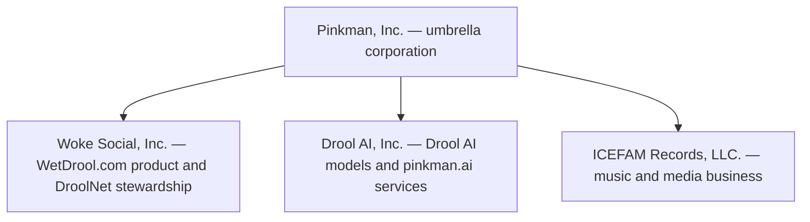
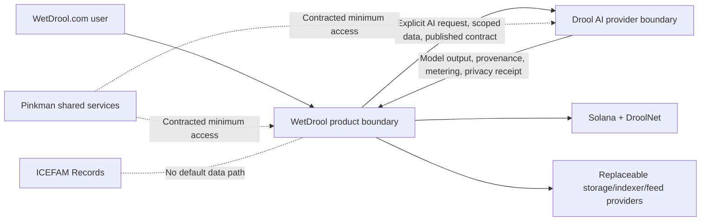

# Organization and product ownership

- **Status:** Owner-provided target structure; legal status not independently
  verified by this repository
- **Last updated:** 2026-07-29

## 1. Target structure

The project owner has specified this intended organization:

The intended entity forms are:

| Entity | Intended form | Product responsibility |
| --- | --- | --- |
| Pinkman, Inc. | C corporation | Umbrella ownership, shared strategy, and approved shared services |
| Woke Social, Inc. | Subsidiary corporation | WetDrool.com application, WetDrool services, DroolNet protocol stewardship, and community products |
| Drool AI, Inc. | Delaware C corporation subsidiary | Drool AI model development, inference, evaluation, and planned `pinkman.ai` services |
| ICEFAM Records, LLC. | Subsidiary limited liability company | Music, recording, artist, and related media operations |

This file records product intent, not a legal opinion, certificate of
incorporation, ownership ledger, tax election, trademark registration, or
intercompany agreement. Public legal claims require review against current
official records.

## 2. Technical ownership boundaries

Woke Social, Inc. is the intended operator of WetDrool.com and steward of the
open DroolNet protocol. Drool AI, Inc. is the intended operator of the Drool AI
model and inference layer. Pinkman, Inc. may provide approved shared services.
ICEFAM Records, LLC. does not receive WetDrool user data or Drool AI prompts
by default.

An ownership relationship does not erase service boundaries. Each cross-entity
data flow requires:

- a named purpose and data classification;
- a controller/processor or equivalent responsibility decision;
- least-privilege access;
- a retention and deletion rule;
- security and incident obligations;
- user-facing disclosure and consent where required;
- an auditable API or administrative path; and
- an exit or provider-replacement plan.

## 3. Agreements required before production

Qualified counsel and finance professionals should determine the actual
documents required. The engineering plan should expect at least:

- intellectual-property assignment and cross-license terms;
- DroolNet open-source stewardship and trademark policy;
- Drool AI inference and data-processing agreement;
- shared employee, contractor, infrastructure, security, and support services;
- brand and domain licensing;
- intercompany pricing, billing, and cost allocation;
- privacy, security-incident, insurance, and records responsibilities;
- creator marketplace, subscription, points, redemption, and refund ownership;
- model and training-data rights;
- treasury, token, wallet, and transaction authority separation; and
- dissolution, sale, provider exit, and user-data migration obligations.

The product must not begin collecting money, verification evidence, training
consent, or real transaction authority merely because an entity name appears
in this document.

## 4. Open-source and governance boundary

Corporate ownership and open protocol governance are separate:

- DroolNet protocol specifications and first-party source are intended to remain
  under the repository’s published open-source license.
- A corporation may operate the flagship client without becoming the only
  valid client, indexer, storage provider, feed provider, RPC provider, or AI
  provider.
- Purchased points, SOL, NFTs, subscriptions, company shares, or a future
  `$DROOL` balance do not automatically grant protocol governance power.
- Trademark, safety, app-store, employment, treasury, and regulated business
  decisions may remain corporate responsibilities even when protocol changes
  use open governance.

## 5. Public naming

Use:

- **WetDrool** for the product and application;
- **DroolNet** for the Solana protocol/program namespace;
- **Drool AI** for the AI model and service family;
- **Drool Athena**, **Drool Kairos**, and **Drool Hermes** for measured model
  product tiers; and
- **Pinkman, Inc.** only when referring to the umbrella organization.

Do not imply that Woke Social, Inc., Drool AI, Inc., ICEFAM Records, LLC.,
`pinkman.ai`, trademarks, or subsidiary relationships have been legally
verified by this repository. Release communications should cite the current
official corporate and domain records.
