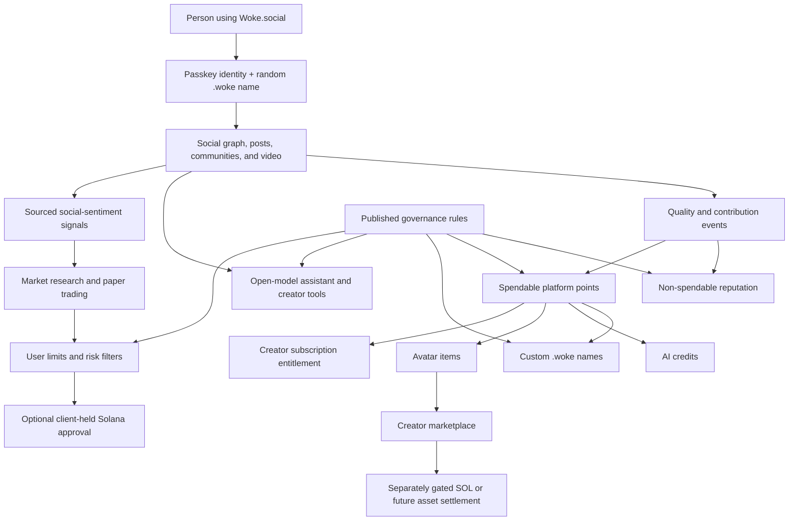

# Woke.social Platform Expansion

- **Status:** Approved product direction; implementation planned
- **Last updated:** 2026-07-29
- **Tracking epic:** [GitHub issue #12](https://github.com/wokesocial/wokesocial/issues/12)

## 1. Purpose

This document turns the expanded Woke.social vision into testable product
systems without presenting planned work as shipped software.

WokeSocial is the platform and flagship application at `woke.social`. WokeNet
is its open protocol and Solana program layer. WokeNet is not a separate
blockchain. The product is open to everyone who follows its community and
safety standards.

The expansion has eight connected workstreams:

1. Decentralized long-form and short-form video
2. Pseudonymous `.woke` names
3. Contribution points and AI credits
4. An avatar studio and creator-item marketplace
5. Minimal-disclosure account verification and age assurance
6. An open-model assistant and multimodal creator suite
7. Social-sentiment market intelligence and bounded automation
8. Open protocol and product-rule governance

Every workstream is **Planned** until its named implementation, test, security,
privacy, operational, economic, and legal gates pass.

## 2. System map

The arrows describe dependencies, not automatic authority. A social action does
not automatically become money, a trade, a governance vote, or a verification
claim.

## 3. Social and video product

### 3.1 Consumer experience

The flagship experience combines familiar short-form conversation with:

- Short and long text
- Replies, reposts, quotes, reactions, bookmarks, and shares
- Following, community, chronological, and user-selected feeds
- Vertical short-form video
- Long-form creator video and channels
- Captions, transcripts, content warnings, and accessibility metadata
- Replaceable recommendation, indexer, storage, and delivery providers

The interface may use established interaction conventions, but it must not copy
another product's protected branding, trade dress, or exact layout.

### 3.2 Verifiable media

Video bytes stay off-chain. A signed, versioned media manifest identifies:

- Source hash and creator signature
- Renditions, codecs, dimensions, bitrate, duration, and frame rate
- Content-addressed segments and playlists
- Captions, transcripts, audio descriptions, thumbnails, and posters
- Storage providers and replication health
- Content warnings, visibility, revision, and tombstone state
- Processing-tool and provenance metadata

Solana may anchor a compact manifest hash and reference when that anchor adds
portable verification. It never stores raw video or large segments.

### 3.3 “Middle-out” performance program

“Middle-out” is the working name for a measurable media-efficiency program, not
an already proven codec.

The first implementation establishes standard codec and packaging baselines.
Candidate improvements may include content-defined chunking, seek-aware segment
priority, bidirectional prefetch around the playhead, deduplicated renditions,
edge caching, hardware-aware encoding ladders, and transport compression for
metadata. A candidate ships only when a public corpus and reproducible
benchmarks show an advantage.

Required measurements include:

- Time to first frame
- Seek latency
- Rebuffer ratio
- Delivered bytes at comparable perceptual quality
- Encode and decode time
- CPU, GPU, memory, and energy use
- Storage and egress cost
- Mid-range mobile behavior

The product must retain a standards-based fallback and an independently
implementable decoder or delivery path.

See [GitHub issue #13](https://github.com/wokesocial/wokesocial/issues/13).

## 4. Pseudonymous `.woke` names

### 4.1 Name semantics

A `.woke` value is a WokeNet name that resolves to a real Solana public key. It
is not itself a native Solana address and does not claim ownership of an
external DNS top-level domain.

The UI may present `alexbtc420.woke` as a username and payment alias only after
it verifies:

- The exact WokeNet deployment
- The active name record
- The current destination public key
- Revocation and expiry state
- The final transaction recipient

Payments and signatures always provide a deliberate view of the underlying
Solana destination.

### 4.2 Registration

A new passkey account derives a pseudonymous name without requiring a legal
name, email, or public wallet label. ADR-0012 fixes the version-1 allocation as
`anon_` plus a 16-character Crockford-base32 encoding of an 80-bit
domain-separated SHA-256 prefix over the identity's immutable origin authority.
This deterministic procedure:

- produces the same candidate after retry, sign-out, root rotation, or recovery;
- reserves the generated namespace from custom allocation;
- lets the Solana program independently reject another identity's claim;
- uses conservative ASCII and rejects Unicode/confusable input for v1 handles;
  and
- avoids server-held allocation randomness or retry coordinates.

The candidate is not usable as a claimed public username until identity
creation and handle claim finalize. Current passkey onboarding renders the
candidate with that warning and the exact underlying Solana root authority.
The development-localnet registration path now sends identity creation plus
claim atomically, migrates legacy identity-only accounts at their current
sequence, and exposes a strict independently verifiable
name-to-identity-to-current-root resolver. The localnet composer—the only
current signature surface—discloses the exact deployment, program, root
authority, derived identity account, and anonymous candidate before enabling a
signature; the disclosure is cached only against the exact account, key, and
deployment binding, is discarded on any change, and signing fails closed if
the fresh passkey key does not match the disclosed destination. No payment
surface exists yet, so payment-destination confirmation remains a design
requirement rather than an implemented control. The open indexer now
serializes each author's canonical active handle into feed, post-detail, and
post-search projections—null for deactivated identities, matching fail-closed
resolution—and the web and Seeker read surfaces render `handle.woke` with an
honest no-active-name state. The web profile route reads one exact identity's
checkpoint-covered public projection and renders its name, `handle.woke`, and
identity receipt with honest degraded states. Share surfaces and
public-cluster execution remain required.

### 4.3 Custom-name eligibility

A custom name can be unlocked through sustained contribution or an optional
purchase. The policy must prevent bulk squatting and pure pay-to-win
allocation.

The protocol and product rules must define:

- Minimum account age and contribution requirements
- Point price or burn
- Optional cash or SOL price
- Reservation lifetime and renewal
- Cooldown after release
- Recovery and key-rotation grace periods
- Transfer restrictions
- Reserved-name and trademark review
- Impersonation response and appeal
- Front-running resistance

Name purchases do not buy reputation, verification, moderation preference, or
governance power.

See [GitHub issue #14](https://github.com/wokesocial/wokesocial/issues/14).

## 5. Fair points and reputation

### 5.1 Separate instruments

One number must not carry every meaning. Woke.social uses separate accounting
domains:

| Instrument | Purpose | Transferable? | Cash value? |
|---|---|---:|---:|
| Reputation | Long-term contribution and trust context | No | No |
| Platform points | Spendable access to names, avatar items, and subscriptions | No at launch | No at launch |
| AI credits | Metered inference and generation allowance | No | No |
| Promotional grants | Expiring campaign or onboarding allowance | No | No |
| Redemption entitlement | Separately reviewed external settlement claim | Disabled initially | Only after release gates |

The UI must never call reputation, points, or credits a wallet balance,
investment, deposit, or guaranteed reward.

### 5.2 Earning principles

Points reward durable community value rather than raw activity. Candidate
signals include:

- Original work that receives sustained positive feedback
- Helpful answers and accepted contributions
- Constructive moderation and successful appeals work
- Accessibility improvements such as captions and descriptions
- Creator-item sales after refund and fraud windows
- Community service and reviewed open-source contributions
- Consistent participation without abuse or manipulation

Raw post count, watch time, controversy, quote volume, or rapid voting cannot be
the sole basis for rewards.

Every earning rule requires:

- A versioned public formula
- Per-action and per-period caps
- Idempotent event processing
- Bot, sybil, collusion, vote-ring, and spam defenses
- Immutable adjustment records
- A user-visible statement and appeal path
- A reconciliation procedure

### 5.3 Spending and redemption

Initial point sinks are custom names, avatar items, AI credits, and creator
subscription access. Highly constructive people must have a realistic
non-payment path to each ordinary platform benefit.

Any future conversion to SOL or `$WOKE` is a separate product and accounting
boundary. It requires a funded reserve model, fraud controls, tax and
consumer-protection analysis, eligibility rules, treasury governance,
noncustodial settlement, security review, and explicit release approval.

“No transaction fee” means Woke.social charges no hidden platform transaction
fee. Solana network fees and rent still exist. The product must either disclose
them before approval or sponsor them under published limits.

See [GitHub issue #15](https://github.com/wokesocial/wokesocial/issues/15).

## 6. Avatar studio and creator marketplace

### 6.1 Avatar system

The avatar studio uses a portable, layered format with deterministic rendering.
It supports broad appearance, clothing, accessory, expression, assistive
device, color, and style choices without requiring a person to disclose private
attributes.

The format requires:

- Versioned geometry and layer contracts
- Safe texture, polygon, animation, and script limits
- Accessible text labels and non-drag editing controls
- Preview and export
- Mobile performance budgets
- Clear item provenance and licensing
- A fallback renderer for independent clients

### 6.2 Creator items

Approved developers and artists may submit item packages containing assets,
metadata, compatibility, preview, rights, and payout instructions. Submission
requires malware scanning, content review, intellectual-property attestations,
versioning, takedown, refund, and appeal processes.

On-chain NFTs are limited to creator items where portable ownership materially
benefits the user. Ordinary profiles, posts, and point balances are not NFTs.
Off-chain previews and metadata remain independently verifiable. The product
does not promise that every external marketplace will enforce royalties.

### 6.3 Creator subscription

The proposed creator subscription includes:

- Item-submission eligibility
- Optional verification application eligibility
- A USD 9.99 monthly lifetime rate lock for the first 1,000 qualifying
  subscribers
- A 30-day initial refund window
- Equivalent access through governed contribution-point thresholds

“Lifetime rate” means the qualifying subscriber keeps the monthly price while
the entitlement remains continuously eligible under the final terms. It does
not mean a one-time USD 9.99 purchase. Final pricing, renewal, cancellation,
refund, tax, regional availability, and continuity terms require qualified
review before sale.

See [GitHub issue #16](https://github.com/wokesocial/wokesocial/issues/16).

## 7. Minimal-disclosure verification

### 7.1 Privacy invariant

Woke.social must not store raw identity documents, selfies, biometric
templates, legal identity, or exact birth dates in its databases, object
storage, logs, analytics, support tools, or Solana accounts.

Ordinary E2EE protects data in transit and at rest but does not hide plaintext
from the processor that must inspect it. A credible design therefore uses:

1. On-device processing when model quality and device capacity permit; or
2. Independently attested, pinned, ephemeral processing with a minimal operator
   access path.

The processor emits only a signed, expiring, minimal-disclosure claim such as:

- Age threshold met
- Uniqueness check completed
- Identity review completed
- Liveness check completed

The attestation does not contain the document, selfie, legal name, birth date,
address, document number, or reusable biometric embedding.

### 7.2 Required safeguards

- Explicit, unbundled consent
- A non-verification path for ordinary social use
- Memory and crash-behavior testing
- No model training on submitted evidence
- Calibrated uncertainty and bias evaluation
- An alternate verification path
- Human review and appeal for adverse outcomes
- Attestation expiry and revocation
- Deepfake, replay, injection, compromised-client, and model-substitution tests
- Regional legal and age-assurance review

Computer vision may assist an age-threshold decision, but it cannot be the sole
irreversible decision-maker.

See [GitHub issue #17](https://github.com/wokesocial/wokesocial/issues/17).

## 8. Open-model AI platform

Woke AI is the planned intelligence layer operated through the owner-provided
Woke AI, Inc. product boundary and planned `pinkman.ai` origin. WokeSocial must
remain usable without it, and the provider remains replaceable.

### 8.1 Initial operator topology

The first operator target is one or two Apple Silicon machines with 96 GB of
unified memory each. A 30–35B-class open-weight model is a candidate range, not
a predetermined selection.

Model selection requires benchmarks on the actual hardware for:

- License and redistribution constraints
- Quantized memory footprint
- First-token and sustained-token latency
- Concurrent throughput
- Context length and retrieval quality
- Tool-use reliability
- Writing and content-planning quality
- Crypto and protocol factuality
- Safety and refusal calibration
- Energy and operating cost

The inference service remains replaceable. It exposes a versioned model
registry, scheduler, health contract, quota system, prompt provenance, and
graceful unavailable state.

The planned product family is:

- **Woke Athena:** highest reasoning and research quality, with the highest
  credit cost;
- **Woke Kairos:** balanced quality, latency, and cost for default use; and
- **Woke Hermes:** fastest and least expensive tier for routing, extraction,
  and bounded agent work.

These are product tiers, not unsupported claims about separate foundation
models. Every release binds the product name to exact weights, revision,
hashes, license, quantization, adapters, policies, hardware, and evaluation
evidence. See [Woke AI Platform](AI_PLATFORM.md).

### 8.2 Product capabilities

Planned tools include:

- Research with citations
- Post and thread drafting
- Image creation
- Video planning and generation workflows
- Caption, transcript, and description assistance
- Community and moderation assistance
- Engagement monitoring and optimization
- Protocol and wallet education

AI output is always distinguishable from sourced fact and user-authored text.
Private content is processed locally or only after explicit provider consent.
It is never silently sent to a third-party model.

### 8.3 Training and evaluation

Fine-tuning and retrieval data require documented rights, provenance, privacy
filtering, opt-out handling, and contamination checks. Private messages and
restricted content are excluded by default.

Platform activity does not flow directly into online training. Improvement
uses versioned offline datasets, explicit permissions, fixed evaluations,
human release review, a canary, and rollback. Marketing and system copy must
not state that a model is literally alive or conscious.

“More powerful” is expressed through named evaluations, not a general “10x”
claim. Every release publishes quality, safety, latency, cost, and known-failure
evidence.

AI credits are metered separately from reputation and points. The interface
shows an estimated credit cost before a generation begins.

See [GitHub issue #18](https://github.com/wokesocial/wokesocial/issues/18).

## 9. Social-sentiment market intelligence

### 9.1 Research before automation

The first release is sourced research and paper trading. It combines:

- Timestamped public social signals
- Bot, spam, and coordinated-promotion estimates
- On-chain activity
- Market price, liquidity, volume, volatility, and concentration
- News and protocol events with provenance
- Model inference with calibrated uncertainty

Every result separates observed facts, computed indicators, model inference,
and user assumptions.

### 9.2 Risk filters

Required filters cover:

- Stale or missing data
- Thin liquidity and high slippage
- Concentrated ownership
- Unsupported or substituted token mints
- Scam and impersonation indicators
- Wash activity and coordinated promotion
- Excessive volatility or drawdown
- User exposure, daily-loss, cooldown, and venue limits
- Transaction expiry and simulation mismatch

### 9.3 Noncustodial execution boundary

Real-money execution remains disabled until paper-trading, security, legal, and
user-protection gates pass. If later enabled:

- Keys remain client-controlled.
- The exact transaction is simulated and previewed.
- Destination, asset, amount, fees, price impact, and limits are explicit.
- Approval scopes are revocable and time-bounded.
- Withdrawals, leverage, lending, silent strategy changes, and secret copying
  are prohibited.
- A local kill switch stops further actions immediately.

The system never promises profit or presents model output as guaranteed
financial advice.

See [GitHub issue #19](https://github.com/wokesocial/wokesocial/issues/19).

## 10. Governance

Protocol changes, name rules, point formulas, marketplace policy, AI model
policy, and automation limits must be published and versioned.

Supported governance mechanisms may include one-member-one-vote,
supermajorities, delegated voting, capped reputation, and moderator councils.
SOL, NFTs, purchased points, or a future `$WOKE` balance do not automatically
control governance.

Material changes require:

- A public proposal and rationale
- Exact rule or code diffs
- Impact and migration analysis
- Conflict-of-interest disclosure
- Security and privacy review
- Delayed activation
- Rollback or supersession rules
- A machine-readable active-policy record

Emergency authority is narrow, logged, time-limited, and subject to mandatory
retrospective review.

See [GitHub issue #20](https://github.com/wokesocial/wokesocial/issues/20).

## 11. Delivery order

The workstreams have a strict dependency order:

1. Finish the passkey identity, signed text publication, finality, indexer, and
   replay slice.
2. Specify `.woke` names and the separated points/reputation ledgers.
3. Ship standards-based long/short video before experimental delivery
   optimization.
4. Build the avatar renderer and off-chain catalog before on-chain creator
   items.
5. Establish model evaluation and replaceable inference before AI credit
   economics.
6. Establish a non-payment verification path and privacy evidence before
   accepting verification submissions.
7. Validate points with abuse simulations before enabling external redemption.
8. Validate market research and paper trading before requesting any transaction
   authority.
9. Require independent security and qualified legal review before external
   redemption, creator sales, identity evidence processing, or real-money
   automation.

## 12. Readiness matrix

| Capability | Current status | Next evidence |
|---|---|---|
| Core social foundation | Passkey localnet publication and atomic anonymous-name registration proven; pre-release | Connect names across product surfaces and prove a public-cluster rehearsal |
| Long/short video | Worker subset only | Versioned manifest and real browser upload/playback |
| Middle-out optimization | Research label | Public benchmark and standards fallback |
| Random `.woke` names | Deterministic derivation, SDK claim ABI, onchain anti-front-running, atomic fresh registration, legacy migration, strict resolver/current-root proof, Rust/TypeScript vectors, local-validator browser proof, replay, and fail-closed signature-destination disclosure with binding-scoped cache invalidation on the localnet composer implemented | Future payment-surface destination UX, cross-surface rendering, and public-cluster evidence |
| Custom names | Planned | Anti-squatting policy and transaction design |
| Reputation and points | Planned | Ledger specification and abuse simulation |
| Avatar studio | Planned | Portable format and deterministic renderer |
| Creator marketplace | Planned | Rights, moderation, entitlement, refund, and settlement design |
| Verification | Planned and disabled | Data-flow threat model and ephemeral-processing proof |
| Open-model assistant | Planned | Actual-hardware model evaluation |
| AI creation tools | Planned | Replaceable inference API and safety evaluations |
| Market intelligence | Planned | Sourced research and paper-trading evaluation |
| Real-money automation | Disabled | Security, legal, risk, and user-protection approval |
| `$WOKE` redemption | Disabled | Mint, economics, authority, legal, devnet, and audit gates |

No row in this matrix authorizes a mainnet transaction, public token,
subscription charge, document upload, or production claim.

## 13. Organization boundary

The owner-provided target places `Woke Social, Inc.`, Woke AI, Inc., and ICEFAM
Records, LLC. under Pinkman, Inc. This repository does not independently verify
legal formation or ownership. It treats WokeSocial and Woke AI as separate
service and data boundaries even if they share a parent.

See [Organization and Product Ownership](ORGANIZATION.md) for the intended
responsibilities, required intercompany controls, and public-claim boundary.
