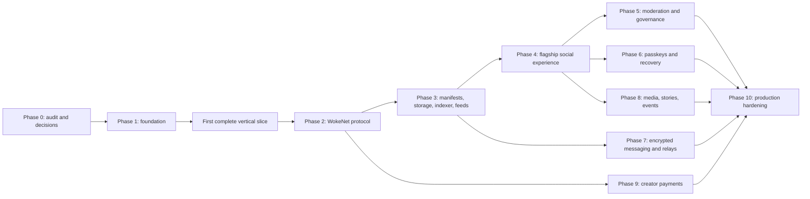

# WokeSocial Delivery Roadmap

**Status:** Active implementation roadmap  
**Last updated:** 2026-07-28

## 1. Current reality

At roadmap creation, the repository had no source, configuration,
infrastructure, tests, or deployment artifacts. It now has a verified local
foundation and experimental subsets across phases 2–4:

- project-local pinned toolchains, healthy PostgreSQL/Redis/Kubo services, and
  the initial migration;
- a Solana-compatible SBF-built program subset tested against an Agave
  local-validator compatibility oracle using development program ID
  `9kFGJEzA7uKvJ1wTvKRWoFadRU7WFnpwWEGP6APro3dD`;
- TypeScript protocol, storage, SDK, and indexer subsets with PostgreSQL and Kubo
  container integration;
- a finalized Solana-format RPC synchronizer and a green one-command connected
  slice from a fresh Agave compatibility oracle through signed CAS, destructive
  projection replay, production API, and desktop/mobile production web;
- independently replaceable crypto, fixture, and seven-mode feed-engine
  packages;
- signed relay and moderation-provider service subsets; and
- a production-built complete required web route surface with 206 passing
  desktop/mobile browser cases, two intentional mobile lifecycle skips, and 90
  automated axe checks across 45 route fixtures.

WokeNet is now the sovereign runtime target. It is forked from Solana,
uses native WOKE with 9 decimals, and retains `lamports` only as the compatible
wire/base-unit name (`1 WOKE = 1,000,000,000 lamports`). Native validator and
RPC operation is Firedancer only. Native Firedancer/RPC remains
**Experimental**, has no verified connected-slice result, and blocks production
activation. Agave and Solana tooling are compatibility oracles only and cannot
supply native or production evidence.

The existing compatibility vertical slice is verified locally; the native
WokeNet vertical slice is not. No public test-network, production-network
deployment, or expenditure is authorized by this roadmap. The canonical public
origin is `https://woke.social`; `sociallywoke.com` is redirect-only.
[`../TASKS.md`](../TASKS.md) is the checkbox-level evidence record.

## 2. Status vocabulary

- **Planned:** Required but not started or lacking implementation evidence.
- **In progress:** Active work exists; exit criteria have not all passed.
- **Experimental:** A feature exists behind an explicit flag and is excluded from production claims.
- **Verified:** All phase exit criteria pass from a clean environment.
- **Externally blocked:** All possible repository work is complete; a named external action remains.

A phase is never “done” because files exist. It is **Verified** only when the formatter, lint, type checks, relevant automated tests, production builds, documentation reconciliation, and phase-specific checks pass.

## 3. Dependency order

The planned dependency chain follows the required implementation sequence:

The first complete vertical slice spans Phases 1–3. It has priority over broad mock screens because it proves the central protocol-to-product claim.

## 4. Phase overview

| Phase | Scope | Status | Required exit evidence |
| --- | --- | --- | --- |
| 0 | Repository audit, product/specification baseline, architecture and ADR decisions, dependency plan | Verified baseline | Required documents reviewed; decisions recorded; no unsupported implementation claims |
| 1 | Monorepo, design system, local infrastructure, documentation foundation | In progress; implemented local subset verified | Clean install; real setup/dev/test/build commands; local dependencies healthy |
| 2 | WokeNet identity, profile, delegation, follows, communities, post references | Experimental Solana-compatible core subset; native Firedancer unverified | Anchor/Rust compatibility checks plus native Firedancer build and tests; account/PDA/cost documentation matches code |
| 3 | Signed manifests, storage adapters, publication, open indexer, feeds | Experimental connected subset; Agave compatibility slice verified, native WokeNet slice open | Native connected slice; complete object/event breadth; alternate-provider reconciliation; operator conformance |
| 4 | Complete flagship core social experience | Complete route surface and local-state subset; authenticated transactions incomplete | Essential browser flows and accessible responsive states pass |
| 5 | Moderation, reports, appeals, blocklists, governance, safety center | Signed provider and one-member-one-vote program subsets implemented | Permission, evidence privacy, tombstone, appeal, and audit tests pass |
| 6 | Passkeys, recovery, sponsorship, device management | Key wrapping, replaceable relying-party service, durable ceremonies/sessions, atomic credential/wrapper registration, same-root service-passkey list/add/revoke, and browser registration/sign-in implemented; protocol onboarding, WokeNet delegation lifecycle, and recovery remain open | Recovery/delegation and sponsor anti-abuse tests pass; custody design reviewed |
| 7 | E2EE messages and relay infrastructure | Relay plus pairwise real-WASM adapter implemented; volatile storage/browser integration keep messaging non-production | One-to-one E2EE and metadata tests pass; group path remains Experimental until gated |
| 8 | Media pipeline, vertical video, stories, events, livestream architecture | Hardened resumable media-worker subset implemented; flagship upload, stories/events/live product flows remain open | Real processing/storage/accessibility/expiry tests pass |
| 9 | WOKE tips, subscriptions, entitlements, paid memberships/events | Native WOKE tip/weekly-subscription program, SDK, receipt/entitlement, and indexer compatibility subset implemented; UX and native execution open | Native Firedancer public-test payment and adversarial tests pass; no custody or production-network action |
| 10 | Security, accessibility, performance, resilience, deployment, independent operation | Planned | All completion gates and independent migration tests pass |

## 5. Phase 0 — audit, specifications, and decisions

### Planned outcomes

- Inspect repository and record the actual baseline.
- Establish product, moderation, privacy, roadmap, architecture, protocol, security, threat, deployment, operations, and decentralization documents.
- Create a dependency-aware task plan.
- Record ADRs for decisions that affect compatibility, custody, privacy, authority, or irreversible storage.

### Required decisions

- Compatible pinned Node, pnpm, TypeScript, Next.js, Rust, Anchor, native
  Firedancer, and Solana-format compatibility-oracle versions
- Onchain/offchain boundary and public/private relationship treatment
- WebAuthn-to-WokeNet custody and signing model
- WOKE fee and settlement rules, fixed 9-decimal precision, and explicit
  `lamports` wire/base-unit compatibility
- Canonical manifest serialization, hashing, signature, and identifier rules
- PDA seeds, account sizing, compute and cost budget
- Default deletion-compatible storage and item-specific permanent-storage consent
- Indexer finality, replay, checkpoint, and corruption model
- Relay authentication, failover, and metadata retention
- One-to-one E2EE library and group-encryption production gate
- Moderation label/policy format and appeal authority
- Feed-provider contract and privacy boundary
- Payment asset allowlist, recipient binding, replay defense, and entitlement privacy
- Program upgrade authority, multisig, emergency powers, and immutability path

### Exit criteria

- Every decision above has an approved ADR or an explicit unresolved owner and deadline.
- Documentation uses the same terminology and implementation-status rules.
- The task plan links dependencies, tests, and completion evidence.
- No document describes planned behavior as delivered.

## 6. Phase 1 — foundation

### Planned outcomes

- Strict TypeScript pnpm/Turborepo monorepo
- Next.js App Router flagship client and documented Tailwind/headless styling system
- Rust/Anchor workspace
- PostgreSQL and disposable Redis local services
- Docker Compose, an experimental native Firedancer/RPC harness, and a
  separately labeled Agave local-validator compatibility oracle
- Shared configuration, runtime validation, logging, health, and telemetry foundations
- Vitest, Playwright, Rust/Anchor test harnesses
- Formatting, linting, type checking, secret scanning, and CI
- Design tokens, light/dark/high-contrast themes, reduced motion, responsive navigation, and baseline states

### Exit criteria

- A clean machine can run the documented install and setup commands.
- `pnpm dev`, `pnpm test`, `pnpm lint`, `pnpm typecheck`, and `pnpm build` execute real work.
- Local PostgreSQL, optional Redis, content storage, and the Agave compatibility
  oracle pass health checks; the phase remains incomplete until native
  Firedancer/RPC health and genesis checks pass.
- No committed secrets or placeholder endpoints are presented as functional.
- Baseline marketing, error, offline, and status surfaces render accessibly.

## 7. First complete vertical slice

This milestone is the highest-priority proof of architecture.

### Required flow

1. Create an identity.
2. Create or update an inclusive profile.
3. Publish a canonically serialized, signed text-post manifest to local content-addressed storage.
4. Anchor its hash and reference through the WokeNet program.
5. Ingest and verify the event.
6. Display the verified post in the web feed.
7. Follow another identity.
8. Rebuild the feed projection from protocol data.
9. Run the entire flow through a native Firedancer validator and WokeNet
   RPC.

### Exit criteria

- No manual database edits.
- No fake transaction, storage upload, signature, hash, or indexing success.
- The browser test asserts content before and after a clean projection rebuild.
- Corrupted manifests and invalid signatures are rejected.
- A failed publication can retry without duplication.
- The exact clean-run and verification commands are documented.

The compatibility-oracle version of this gate passed locally via
`pnpm test:vertical-slice`: nine Solana-format transactions finalized on an
Agave local validator, the verified post reached the production API and
browser, the tombstoned post was suppressed, and a cleared projection replayed
to exact state equivalence with zero dead letters.

This proof does not satisfy native WokeNet/Firedancer evidence and does not
complete the broader product, protocol, provider, security, or public-network
gates.

## 8. Phase 2 — WokeNet protocol

### Planned outcomes

- Protocol configuration and versioning
- Identity roots, profiles, handles, delegated keys, rotation, and revocation
- Follow representation and selected public social actions
- Community creation, roles, memberships, and governance configuration
- Post references, revisions, reactions where economically justified, and tombstones
- Events for deterministic indexing
- Checked arithmetic and explicit authorization

### Exit criteria

- Program tests cover initialization, PDAs, constraints, authorization, duplicate actions, replay, overflow, closes, and malformed input.
- Account layouts, seeds, instruction data, emitted events, sizes, rent, transaction bytes, compute, and cost estimates match the built program.
- Upgrade authority and emergency powers are explicit.
- Privacy review confirms that service-private data and secrets cannot enter public instructions.

## 9. Phase 3 — content, indexing, and feeds

### Planned outcomes

- Versioned signed public manifests and canonical validation
- Local, IPFS, and Arweave-compatible adapters behind a multi-provider interface
- Deletion-compatible publication default and permanent-storage consent
- CID/hash verification, gateway fallback, pin/replication health
- Open-source idempotent indexer with finality, checkpoints, backfill, replay, DLQ, migrations, and metrics
- Documented replaceable API and deterministic initial feed scoring

### Exit criteria

- The vertical slice passes with a native Firedancer validator and WokeNet
  RPC; the Agave local-validator compatibility oracle remains a separate
  regression lane.
- Indexer rebuild from configured deployment slot produces the same verified projection.
- Tampered content, CID substitution, replays, reorg/finality cases, and corrupt checkpoints are tested.
- Loss of a primary gateway or RPC uses a configured fallback.
- A third party can run the indexer using public information and documentation.
- Permanent publication cannot occur without item-specific consent.

## 10. Phase 4 — flagship core product

### Planned outcomes

- Humane wallet and read-only onboarding
- Profiles, posting, threads, following, reactions, quotes, reposts, bookmarks
- Chronological, following, community, media, trending, recommendation, and third-party feeds
- Search, discovery, notifications, communities, settings, provider configuration, export, migration, and deletion
- All required loading, empty, error, offline, permission, and retry states

### Exit criteria

- Essential desktop and mobile end-to-end flows pass without database intervention.
- Block, mute, audience, identity-visibility, and sensitive-content controls are enforced at data boundaries.
- “Why am I seeing this?”, reset, opt-out, and chronological fallback work.
- Current chosen name replaces obsolete name in ordinary current-profile surfaces.
- Alternate endpoint configuration survives failure and can be reversed.
- Automated and manual WCAG checks cover all essential flows.

## 11. Phase 5 — moderation, governance, and safety

### Planned outcomes

- Four-layer moderation authority model
- Personal controls, shared blocklists, safety mode, and anti-dogpile controls
- Community policy, scoped roles, reports, restricted evidence, actions, audit trails, and appeals
- Signed client/indexer policies and moderation labels
- Doxxing, nonconsensual-intimate-media, child-safety, coordinated-harassment, and crisis-resource hooks
- Transparency-report export

Current evidence covers the replaceable signed-label/report/appeal provider,
including locked authorization, restricted intake/case reads, supersession,
expiry, idempotence, OpenAPI, and 17 service/API tests. It does not yet satisfy
the phase exit criteria.

### Exit criteria

- All automated and manual criteria in [MODERATION.md](./MODERATION.md) pass.
- A reporter previews exact private evidence disclosure.
- An actor cannot exceed scope or review their own action.
- Valid tombstones suppress official client and indexer delivery.
- Specialist and legal review gates are recorded as completed or externally blocked.

## 12. Phase 6 — passkeys, recovery, and sponsorship

### Planned outcomes

- Passkey-first account path — credential-bound PRF key wrapping, replaceable
  WebAuthn service, durable one-time ceremony/session state, ciphertext-only
  sync, and real-browser registration/discoverable sign-in implemented;
  native WokeNet protocol onboarding remains open
- Device-bound delegated keys with scope and expiry
- Multiple wallets, link/unlink, rotation, device revocation
- Guardian/social recovery with delay and cancellation
- Email-assisted recovery that is not protocol identity
- Optional sponsored transactions with strict rate and abuse controls

### Exit criteria

- Custody, signing, recovery, and compromise behavior receive security review.
- End-to-end tests cover new device, lost device, compromised device, rotation, delayed recovery, cancellation, and wallet unlink.
- Recovery email never enters public protocol data or logs.
- Sponsor limits reject replay, farming, unauthorized actions, and budget exhaustion safely.
- A user explores before funding and completes onboarding without already
  holding WOKE.

## 13. Phase 7 — encrypted messaging and relays

### Planned outcomes

- Replaceable multi-relay protocol and failover — implemented and real-loopback
  tested for advisory events
- One-to-one E2EE using established primitives
- Device keys, rotation, safety verification, replay defense, attachment encryption, message requests, and blocks
- Metadata-minimizing delivery and bounded retention
- Voluntary selective disclosure for abuse reports
- Group encryption behind an explicit feature flag until mature

The current relay starts locked without a finalized-state key authorizer and
implements signed advisory envelopes, short bounded retention, metadata-safe
logs/metrics, origin and rate controls, reconnect, deduplication, and endpoint
failover. The pairwise-only adapter now delegates real Olm ratchets and
authenticated encryption to pinned Matrix Rust crypto WASM, binds device keys
to current WokeSocial authorization, verifies sender-signed outer metadata
before stateful Olm processing, and passes 13 independent-device adversarial
cases. It is not production messaging: state/replay history is
volatile, browser packaging and relay integration are absent, attachment and
safety UX are incomplete, and no room/group API is exposed.

### Exit criteria

- Relay/database inspection cannot recover message or attachment plaintext.
- Revoked devices cannot decrypt messages after rotation.
- Replayed or tampered envelopes are rejected.
- Metadata disclosure matches measured relay behavior.
- Group messaging is either security-gated and verified or visibly **Experimental** and excluded from production claims.

## 14. Phase 8 — media, stories, events, and live experiences

### Planned outcomes

- Direct/resumable uploads, cancellation, client hashing, MIME checks, size limits, metadata stripping
- Thumbnails, responsive images, transcode architecture, HLS, captions, waveform metadata
- Malware hooks, content-addressed publication, replication and health
- Vertical video, stories, events, and livestream signaling

The worker subset now provides authenticated resumable uploads, exact hashes,
strict MIME/container checks, bounded metadata-free image/video/audio
processing, poster/HLS/waveform output, validated accessibility references,
real ClamAV scanning with fresh engine/database provenance, content-addressed
publication, and a client-independent preprocessed path. Its output is unsigned
and the flagship browser does not yet perform the publication flow.

### Exit criteria

- Real worker integration tests process representative safe fixtures.
- Client independently verifies output hashes.
- Stories use deletion-compatible storage by default and expire from official delivery.
- Alt text, captions, transcripts, keyboard controls, reduced motion, and lazy loading pass.
- Third-party clients can publish compliant preprocessed media without the flagship worker.

## 15. Phase 9 — creator economy

### Planned outcomes

- Noncustodial native WOKE tips with fixed 9-decimal accounting
- Optional allowlisted WokeNet token tips; any SPL-format identifiers are
  explicitly compatibility-labeled
- Creator subscriptions, paid communities/events, splits, receipts, refund metadata, and entitlement verification
- Encrypted delivery of paid content

### Exit criteria

- Native WokeNet test network tests cover recipient substitution, WOKE/base-unit
  confusion, asset spoofing, duplicate payment, replay, rounding, simulation
  mismatch, and fake entitlement.
- The application never controls a custodial hot wallet.
- Unauthorized storage retrieval returns ciphertext.
- Fee, asset, recipient, network, split, and recurrence are previewed before signing.
- Production WokeNet activation remains blocked pending native
  Firedancer/RPC evidence, external review, and a documented manual operator
  action.

## 16. Phase 10 — production hardening and independent operation

### Planned outcomes

- Formal threat-model closure and security-focused tests
- WCAG 2.2 AA verification and keyboard-only essential journeys
- Performance measurements and Core Web Vitals work
- RPC, gateway, indexer, relay, and storage failover
- Provider-neutral deployment, monitoring, privacy-aware errors, backups, rollback, incident, and disaster recovery
- Native Firedancer/RPC test-network automation, verifiable program build,
  multisig authority, and immutability path
- Independent client/indexer/operator and migration documentation

### Exit criteria

- All build, test, product, protocol, security, accessibility, documentation, and decentralization gates pass.
- A clean independent environment migrates away from company-operated infrastructure.
- No high-severity known vulnerability remains.
- Production authorities, program IDs, providers, and remaining external actions are transparent.
- `FINAL_REPORT.md` distinguishes Verified, externally blocked, Experimental, Planned, and not implemented.

## 17. Required end-to-end journey program

The roadmap must ultimately verify:

1. Passkey account creation
2. Inclusive profile completion
3. Follow
4. Text publication
5. Image publication with alt text
6. Video publication with captions
7. Reply, repost, quote, and reaction
8. Community creation and join
9. Moderator report handling
10. Appeal
11. Encrypted message
12. Feed algorithm switch
13. Block and mute
14. Native WokeNet test network creator tip
15. Data export
16. Delegated-key rotation
17. Migration to another indexer and relay
18. Primary RPC and gateway failure survival
19. Deletion request and tombstone enforcement
20. Keyboard-only completion of essential flows

The fast suite may use mocks, but native Firedancer, Agave compatibility-oracle,
storage, indexer replay, media, relay, and payment claims require distinct real
integration tiers. A passing compatibility tier cannot be relabeled as native
WokeNet evidence.

## 18. Cross-phase quality loop

At the end of every phase:

1. Run the formatter.
2. Run lint.
3. Run strict type checking.
4. Run relevant unit, program, integration, and browser tests.
5. Run production builds.
6. Fix failures before changing phase status.
7. Update the dependency-aware task plan.
8. Reconcile documentation with actual behavior.
9. Record important decisions.
10. Commit a clear conventional change if Git is configured.

Passing one phase does not waive later regression checks.

## 19. Critical path and safe parallel work

### Critical path

Pinned native Firedancer and compatibility toolchains → protocol serialization
and identity → local storage publication → WokeNet reference → native
indexer verification/rebuild → web feed → portable provider configuration →
hardening.

### Parallel tracks after interfaces stabilize

- Design system and accessible public surfaces
- Moderation policy schemas and safe synthetic fixtures
- Media worker research and fixture preparation
- Deployment/runbook development
- Privacy inventory and redaction tests
- Independent operator documentation

Parallel work must not duplicate canonical schemas or commit incompatible versions.

## 20. Experimental and externally dependent work

The following must remain **Experimental** or **Externally blocked** until their specific gate passes:

| Capability | Required gate |
|---|---|
| Group E2EE | Mature protocol/library integration, security tests, independent review |
| Arweave permanent publication | Provider credentials/funding, item-specific consent, deletion disclosure |
| Livestream delivery | Replaceable media/signaling operator and abuse controls |
| Email delivery/recovery | Provider configuration, privacy review, domain authentication |
| Sponsored transactions | Funded sponsor and anti-abuse operational limits |
| Child-safety escalation | Jurisdiction, trained operators, specialist/legal review |
| Production legal policies | Qualified legal review for actual operator and regions |
| Native Firedancer/RPC runtime | Reproducible native build, WokeNet genesis, RPC conformance, connected slice, and independent operator evidence |
| WokeNet public test network deployment | Native Firedancer RPC, funded WOKE deployer, and recorded program authority |
| WokeNet production network deployment | Native runtime gate, independent security audit, multisig authority, legal/operations approval, and explicit funded action |
| Production DNS/TLS | Domain-owner action and deployment target |

An external dependency does not block unrelated local implementation and tests.

## 21. Completion gate checklist

### Build

- Clean install succeeds.
- All production applications and WokeNet programs build; Solana-format
  compatibility artifacts remain separately identified.
- Generated clients are current.
- No unresolved type errors.

### Test

- Unit, program, integration, browser, accessibility, and critical security suites pass.
- Native Firedancer validator/RPC and independent rebuild tiers pass.
- The Agave/Solana compatibility-oracle tier passes without being counted as
  native WokeNet evidence.

### Product

- Essential flows require no manual database editing.
- Mobile/desktop and all key states are polished.
- Onboarding is crypto-humane.
- Decentralization controls are understandable.

### Protocol

- Schemas are versioned.
- Hashes and signatures are validated.
- Indexer rebuild and alternate endpoints work.
- Third-party compatibility and migration are tested.

### Security and privacy

- Threat model is complete.
- No high-severity known vulnerability remains.
- Secrets are externalized.
- Authority, wallet prompts, recovery, E2EE, deletion, and retention behavior are verified.

### Documentation and operations

- Clean setup instructions work.
- Documentation matches implementation.
- APIs and operator procedures are reproducible.
- Limitations and external configuration are explicit.

## 22. Roadmap update rules

Every roadmap update must include:

- Status changed
- Date and responsible owner
- Linked code or artifact
- Exact verification command
- Test/build result
- Known limitation or external dependency
- Documentation affected

Do not report percent complete without a defined denominator. Prefer verified requirements and passing gates.

## 23. Immediate next milestone

The next engineering milestone is **native Firedancer/RPC bring-up followed by
the first native WokeNet vertical slice**. The success criterion is a
reproducible native flow from WokeNet genesis and identity through signed-manifest
anchoring, verified indexing, feed display, follow, tombstone suppression, and
projection rebuild. It must preserve the existing Agave lane as a separately
labeled Solana-format compatibility oracle.

Until that native evidence exists, the sovereign runtime remains
**Experimental** and production activation remains blocked.
