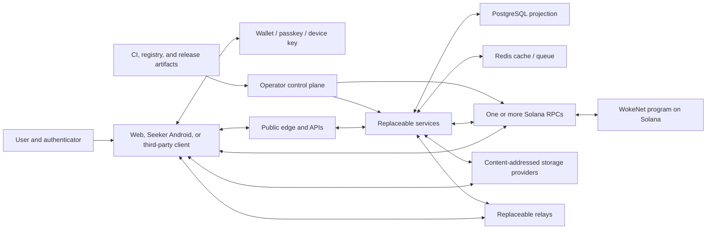

# Threat Model

Last reviewed: 2026-07-29

## Status and method

This is the initial design threat model for WokeSocial and WokeNet. The repository now
contains a narrow experimental foundation with selected protocol, storage,
program, indexer, container, and web tests. Those tests provide partial evidence
for integrity, authorization, and availability mitigations, but the threat model
has not received a release review or independent security assessment. Unless a
mitigation is explicitly linked to evidence in `TASKS.md` or `SECURITY.md`, treat
it as **Planned**. See [SECURITY.md](./SECURITY.md) for the project-wide status
vocabulary and control requirements.

The model uses asset and trust-boundary analysis with STRIDE categories:
spoofing, tampering, repudiation, information disclosure, denial of service, and
elevation of privilege. It also treats privacy harm, financial harm, harassment,
governance abuse, and supply-chain compromise as first-class risks.

The model MUST be updated when:

- A protocol schema, instruction, trust boundary, provider, or key type changes.
- A service starts retaining a new data class.
- A production dependency with cryptographic or authorization responsibility is
  selected or replaced.
- A security incident or high-severity vulnerability occurs.
- A release changes program authority, recovery, sponsorship, payments,
  encryption, moderation evidence, or permanent storage behavior.

## Assets

### Critical assets

- User root authorities, wallet keys, passkeys, device keys, recovery
  configuration, and revocation state.
- WokeNet social-program source/SBF binaries, program-data accounts, upgrade
  authority, program IDs, exact Solana genesis binding, protocol configuration,
  deployment slot, and deployment attestations.
- Future mint-aware payment recipients, exact token programs/mints/accounts,
  entitlement state, sponsor keys, and sponsor budgets. Legacy payment state is
  never an entitlement asset.
- Android package-signing keys/certificates, wallet-association configuration,
  release provenance, update channels, and distribution identities.
- Private-message and restricted-content keys and plaintext.
- Signed manifest bytes, canonical serialization rules, signatures, content
  hashes, tombstones, and moderation label feeds.
- Production deployment credentials, database credentials, signing keys, backup
  keys, and CI release identities.
- Sensitive recovery data, moderation evidence, and legal-request records.

### Important availability and integrity assets

- Public social graph and community state reconstructible from protocol data.
- Indexer checkpoints, finality observations, dead-letter records, and projection
  invariants.
- Content-provider replication state and gateway health.
- Relay envelopes, presence state, and reconciliation cursors.
- Database migrations, service configuration, observability, runbooks, release
  provenance, and audit records.

## Adversaries and failure actors

- Opportunistic attackers, spammers, scrapers, phishers, and wallet drainers.
- A targeted attacker pursuing a user, moderator, creator, or operator.
- A malicious user, community moderator, feed provider, indexer, relay, storage
  provider, RPC provider, wallet, browser extension, or content publisher.
- A compromised dependency maintainer, CI runner, operator account, service
  credential, signing device, or deployment host.
- A financially motivated attacker exploiting sponsorship or payments.
- Coordinated harassment groups, sybil networks, and governance capture attempts.
- Insider threats with legitimate operator or moderation access.
- Faulty software, cloud/provider outages, data corruption, chain reorganization,
  inconsistent RPC responses, and operator error.

## Assumptions and invariants

- Solana cryptographic, transaction, and finality primitives are external
  dependencies trusted within their documented limits. Individual RPC responses
  are never trusted, and local-validator evidence does not prove public-cluster
  deployment or operations.
- Standard, independently reviewed cryptographic libraries are trusted only at
  pinned versions and when used according to their intended protocol.
- User devices and wallets can be compromised. Delegation scope, revocation,
  recovery, and clear transaction intent limit but cannot eliminate that harm.
- Public signed content may be copied indefinitely even after official clients
  honor a tombstone.
- PostgreSQL, Redis, indexers, feeds, relays, and flagship APIs are convenience
  layers and cannot authorize protocol mutations on their own.
- No single provider may be required to verify public protocol objects or
  reconstruct the public social graph.
- Private keys, private-message plaintext, and authentication secrets never
  belong onchain, in public manifests, in analytics, or in logs.
- Unknown instructions, schemas, mints, or signing requests fail closed for
  sensitive operations.

## System and data-flow boundaries

Every arrow that crosses between nodes is an untrusted input boundary. TLS
protects transport where used; signatures, hashes, authorization, and protocol
validation establish object-level trust.

## Severity

| Severity | Meaning |
| --- | --- |
| Critical | Likely or demonstrated compromise of many root keys, production program authority, private-message confidentiality at scale, or user funds; or unauthenticated protocol control |
| High | Account takeover, durable authorization bypass, targeted plaintext disclosure, payment diversion, signed-content forgery, or extended canonical-service outage |
| Medium | Limited data exposure, bounded integrity loss, abuse-control bypass, or recoverable service degradation |
| Low | Minor hardening issue with narrow impact and meaningful prerequisites |

Likelihood is reassessed from implementation evidence and deployment exposure.
Residual risks require a named owner and review date before production.

## Identity, wallet, and recovery threats

All mitigations below are **Planned**.

| ID | Threat and impact | Planned mitigations | Required verification |
| --- | --- | --- | --- |
| ID-01 | Root wallet or passkey theft enables identity takeover | Hardware/passkey support, scoped delegation, device inventory, prompt revocation, recovery delay and notification | Compromised-device and root-rotation tests; recovery tabletop |
| ID-02 | Phishing challenge is replayed or used on another origin | Domain-bound human-readable challenge, nonce, expiry, audience, single-use consumption | Cross-origin, stale, duplicate, and concurrent replay tests |
| ID-03 | Broad delegated key silently becomes a root authority | Signed scope/action allowlist, short expiry, high-impact root reauthentication | Authorization matrix and property tests |
| ID-04 | Revoked device continues through stale caches | Onchain/signed revocation check, bounded cache TTL, fail-closed sensitive actions | Cache race and offline/reconnect tests |
| ID-05 | Email or support recovery bypasses protocol authority | Email is notification/recovery assistance only; delayed threshold recovery; no support override | Social-engineering tabletop and end-to-end recovery tests |
| ID-06 | Attacker initiates recovery and suppresses alerts | Multi-channel notification, cancellation, visible delay, guardian threshold, attempt rate limits | Cancellation, notification failure, and repeated-attempt tests |
| ID-07 | Session fixation, token theft, or CSRF causes account action | Rotated secure cookies, short sessions, origin/CSRF checks, device-bound reauth for sensitive actions | Session fixation, cross-site mutation, logout/revocation tests |
| ID-08 | Logs or analytics capture keys or auth material | Structured allowlisted logging, centralized redaction, test fixtures with canary secrets | Automated log-leak and secret-scan tests |

Residual risk: a fully compromised device can act within active delegation scope
until revocation is observed. The UI must show this honestly and make scope,
expiry, and revocation accessible.

## Seeker Android and Mobile Wallet Adapter threats

The current Android project is a non-release foundation. These mitigations and
release checks remain **Planned** unless linked to evidence elsewhere.

| ID | Threat and impact | Planned mitigations | Required verification |
| --- | --- | --- | --- |
| MOB-01 | A fake or tampered APK steals wallet authorization, content, or credentials | Controlled signing key, published certificate digest and APK hash, reproducible build, verified distribution links | Independent rebuild/install and signature verification |
| MOB-02 | MWA intent, deep link, callback, or selected account is substituted | Explicit intents, package/association validation where supported, bounded callback state, account/cluster/program revalidation after return | Malicious-wallet, callback-mutation, cancellation, timeout, background/resume tests |
| MOB-03 | The app asks a wallet to sign different bytes or an unknown instruction | Decode and summarize the exact compiled message, reject unknown programs/instructions, compare pre/post-handoff bytes | Golden summaries and transaction-substitution device tests |
| MOB-04 | Excess permissions, logs, telemetry, backup, clipboard, or screenshots disclose sensitive data | Minimum permissions, structured redaction, secure storage, backup policy, privacy-safe analytics, screen/clipboard controls for sensitive views | Manifest/data-safety review and device leakage tests |
| MOB-05 | Signing key, update channel, store account, or dependency is compromised | Separated hardware-backed custody, quorum/approval, pinned dependencies, provenance, monitoring, revocation and rollback runbook | Release compromise tabletop and rollback drill |
| MOB-06 | A spoofable Seeker model hint grants value or privileges | Treat model metadata as presentation-only; require wallet proof and an independently verified entitlement for any future benefit | Spoofed-device and replay tests |

## WokeNet program, Solana RPC, and transaction threats

All mitigations below are **Planned**.

| ID | Threat and impact | Planned mitigations | Required verification |
| --- | --- | --- | --- |
| WN-01 | Malicious prompt drains funds or grants unintended authority | Decode allowlisted instructions, show recipients/assets/amounts/fees, reject unknown programs | Golden transaction summaries and adversarial substitution tests |
| WN-02 | Transaction changes after simulation | Compare the exact compiled message, accounts, instructions, and blockhash immediately before signing | Message mutation and wallet-adapter integration tests |
| WN-03 | RPC lies about account state, simulation, or confirmation | Multiple configurable RPCs, exact genesis/program-ID checks, finality policy, cross-provider reconciliation | Fault-injected RPC and failover tests |
| WN-04 | Wrong genesis or lookalike program receives a transaction | Genesis-bound `wokenet:v1` namespace, pinned program IDs, visible network indicator | Wrong-genesis and program-substitution tests |
| WN-05 | PDA/account substitution bypasses authority | Domain-separated seeds, ownership/signer/has-one constraints, explicit relationships | Account substitution and seed-collision tests |
| WN-06 | Duplicate initialization or replay creates duplicate effects | Nonces/idempotency state, uniqueness constraints, checked state transitions | Duplicate, stale, and reordered transaction tests |
| WN-07 | Overflow, underflow, account growth, or compute exhaustion corrupts state | Checked arithmetic, bounded strings/vectors, fixed sizing, compute and transaction-size analysis | Boundary, fuzz/property, and compute-budget tests |
| WN-08 | Unauthorized close or realloc steals rent or destroys state | Close authority checks, destination checks, lifecycle invariants, tombstones | Unauthorized close/realloc tests |
| WN-09 | Program upgrade authority compromise deploys malicious code | Independent hardware-backed multisig, delay, verifiable build, public authority monitoring | Key ceremony, binary verification, emergency tabletop |
| WN-10 | Sponsor is drained or abused as an oracle | Transaction-shape allowlist, subject/action budgets, idempotency, isolated low-balance key, kill switch | Abuse load tests, policy bypass tests, loss-limit drill |
| WN-11 | A client or sponsor attempts the quarantined lamport ABI, relabels SOL as `$WOKE`, or tries to unpause legacy payments | Permanently fail-closed program policy, client/sponsor denylist, truthful portable asset schema, legacy events never grant access | Attempted execute/unpause, `{kind:"woke"}`, mislabeled-asset, and fake-entitlement tests |
| WN-12 | A future SPL/Token-2022 mint, token account, recipient, decimals, or extension is substituted | Separately approved mint-aware ABI, exact token-program/mint/account constraints, signed terms, deterministic splits, simulation and finalized receipt verification | Recipient/mint/token-account/extension/rounding/replay tests |
| WN-13 | A malicious or misconfigured Solana RPC omits transactions or returns incomplete/inconsistent state | Exact genesis/program binding, capability checks, finalized commitment, provider diversity and cross-checking | Submit/simulate/status/history/program-account fault and failover suite |
| WN-14 | A compromised build or deployment publishes different WokeNet program bytes | Pinned toolchain/dependencies, reproducible SBF build, artifact hash, deployed-byte and program-data verification | Independent build/deployment reproduction and provenance check |
| WN-15 | Wrong Solana cluster, program ID, deployment slot, or upgrade authority is advertised | Signed deployment manifest, exact observed genesis, executable/program-data checks, public authority monitoring | Lookalike-cluster/program and authority-substitution tests |
| WN-16 | Priority-fee, blockhash, simulation, or commitment handling causes false success or excess spend | Bounded fee policy, fresh blockhash, same-byte signing, finalized confirmation, reconciliation and explicit pending/degraded UI | Expiry, fee-spike, simulation drift, timeout and delayed-finality tests |
| WN-17 | Solana outage, congestion, reorganization, or provider concentration blocks or delays writes | Multiple RPC providers, cached verified reads, safe write stop, retry/reconciliation policy, transparent status | Provider evacuation, congestion, reorg and degraded-mode exercises |
| WN-18 | Program upgrade-governance or external Solana network changes harm users | Hardware-backed multisig, timelock, deployed-byte monitoring, narrow emergency powers, version gates and migration plan | Authority compromise tabletop, upgrade rehearsal and dependency-change review |
| WN-19 | A creator assigns membership without consent, a moderator action is disguised as join/leave, a banned member rejoins, or a stale sequence corrupts governance eligibility | Separate member and creator/scoped-delegate authority paths, exact action/state/role pairs, deterministic PDA, signed membership-v2 manifest, optimistic identity/state/policy/community sequences, terminal ban, proposal membership-sequence snapshot | Root/delegate substitution, self-moderation, invalid transition, stale sequence, response-loss retry, same-slot join/proposal, and post-snapshot rejoin tests |

Residual risk: transaction finality and availability depend on Solana and its
provider ecosystem, which WokeSocial does not operate or control. Clients must
expose pending/finalized/degraded states and never claim success early.

## Manifest, storage, indexer, and feed threats

All mitigations below are **Planned**.

| ID | Threat and impact | Planned mitigations | Required verification |
| --- | --- | --- | --- |
| CNT-01 | Manifest author or fields are spoofed | Canonical serialization, signature, delegation, version, and authorization validation | Shared vectors and malformed/cross-version tests |
| CNT-02 | Valid signature is replayed in another context | Bind object type, protocol/network, author, parent/context, nonce or stable ID | Cross-object and cross-network replay tests |
| CNT-03 | Gateway returns bytes different from the signed hash/CID | Hash every response locally, reject mismatch, quarantine provider | CID substitution and corrupt-stream tests |
| CNT-04 | Malicious SVG/HTML/media executes in the app origin | Isolated media origin, safe content disposition, sanitizer, MIME detection, CSP | Stored/reflected XSS and polyglot upload tests |
| CNT-05 | Permanent content is published without informed consent | Deletion-compatible default; explicit separate permanence confirmation | UX and state-machine tests |
| CNT-06 | Indexer poisoning creates false social state | Verify program/source/finality, signature/hash/schema checks, idempotent ingestion, dead letters | Poisoned log/manifest and replay invariant tests |
| CNT-07 | Reorg or checkpoint error loses or duplicates events | Finality-aware cursor, slot/block identity, rollback/replay, deterministic projections | Fork/reorg simulation and full rebuild comparison |
| CNT-08 | Feed provider bypasses blocks, mutes, or safety policy | Client-side final filtering, signed provider response metadata where applicable, local fallback | Adversarial feed and privacy-control tests |
| CNT-09 | An author uses a future/backdated manifest timestamp, equal-time cursor collision, or nonpublic visibility to pin, skip, or disclose a post | Indexer chronology binds to finalized event time plus object-ID tie-break; bounded opaque composite cursors; unauthenticated feeds are public-only | Memory/PostgreSQL/API adversarial timestamp, pagination, and unlisted-plaintext tests |
| CNT-10 | Gateway/storage outage removes public content | Multiple providers/gateways, local verification, health state, operator-independent publication | Provider-loss and cold-recovery exercises |
| CNT-11 | Tombstoned content remains in official projections | Tombstone precedence, purge queue, cache invalidation, provider deletion attempts | Deletion propagation and rebuild tests |
| CNT-12 | A public indexer turns membership events into a roster or leaks member/actor identity, signer, moderation reason, or manifest location | Exact membership-address lookup only; verified open public/unlisted parent; covering finalized checkpoint; uniform not-found response; no list/search/filter contract or identity-bearing fields | Memory/PostgreSQL/API parity, protected/restricted/checkpoint-incomplete denial, exact-key response, and roster-route absence tests |

Residual risk: copied public content can survive deletion. The composer and
deletion UI must explain the difference between removal from operated services
and erasure from third-party or permanent storage.

## Private messaging and relay threats

The signed, bounded relay transport mitigates parts of MSG-03 and MSG-05 and
fails closed without an authoritative key resolver. The experimental
pairwise-only adapter delegates real device keys, Olm ratchets, signatures, key
agreement, and authenticated encryption to pinned Matrix Rust crypto WASM. Its
13 real-WASM cases mitigate portions of MSG-01 through MSG-05, including
sender-signed outer metadata verified before state mutation, honest-copy
survival after relay tampering, before/after local and remote authorization
checks, replay/corruption/wrong-device rejection, logical revocation, and
bounded/cancellable directory and resolver failures. Persistent encrypted browser state, pre-key
retransmission, attachments, safety UX, deployed relay integration, disclosure
workflows, and independent review remain **Planned**; group APIs are absent.

| ID | Threat and impact | Planned mitigations | Required verification |
| --- | --- | --- | --- |
| MSG-01 | Relay or database reads message plaintext | Established end-to-end protocol; encryption before send; encrypted attachments | Server-storage inspection and known-answer vectors |
| MSG-02 | Malicious device joins a conversation | Authenticated device membership, safety-number change warning, explicit device list | Unauthorized-device and membership-race tests |
| MSG-03 | Old ciphertext is replayed or reordered | Protocol counters/ratchets, unique message IDs, bounded deduplication | Replay, reorder, duplicate, and offline tests |
| MSG-04 | Revoked device receives future keys | Membership change and key rotation on revocation | Multi-device revocation tests |
| MSG-05 | Push or relay metadata reveals sensitive content | Generic pushes, minimal envelopes, short retention, metadata documentation | Notification payload and retention audit |
| MSG-06 | Custom or immature group encryption gives false assurance | Use maintained reviewed library; feature flag groups until review and vectors pass | Independent cryptographic review and interoperability suite |
| MSG-07 | Abuse reporting creates a hidden decryption path | Reporter explicitly selects and uploads disclosed plaintext; access-limited evidence store | Consent-flow and evidence-access tests |

Current residual risk includes volatile replay history, retained Olm session
material until machine close after logical revocation, directory/relay denial
of service, and loss of an unretransmitted session-opening pre-key message.
These limitations keep the adapter out of production even though the
cryptographic round trips are real.

Residual risk: relays observe timing, sender connection metadata, recipient route,
and ciphertext size unless an adopted protocol provides stronger metadata
protection. This must be documented, not implied away.

## Web, API, and worker threats

All mitigations below are **Planned**.

| ID | Threat and impact | Planned mitigations | Required verification |
| --- | --- | --- | --- |
| APP-01 | XSS steals sessions, changes wallet prompts, or exposes local plaintext | Strict sanitizer, output encoding, CSP, isolated media origin, no unsafe embeds | Unit, browser, and CSP regression tests |
| APP-02 | CSRF performs cookie-authenticated mutation | SameSite cookies, origin validation, CSRF token, reauthentication for sensitive actions | Cross-origin browser tests |
| APP-03 | SSRF reaches metadata, admin, or private services | URL parser/allowlist, DNS/IP and redirect checks, egress policy, time/size limits | DNS rebinding, redirect, IPv6, and metadata tests |
| APP-04 | SQL injection changes projections or exposes sensitive data | Runtime schemas, parameterized queries, limited DB roles | Injection suite and role-permission tests |
| APP-05 | Command injection or path traversal escapes a worker | No shell interpolation, fixed argv, generated paths, jailed roots, sandboxed worker | Malicious filename/path and argument tests |
| APP-06 | Upload bomb or parser exploit exhausts/compromises workers | Streaming byte limits, parser isolation, resource caps, patched codecs, quarantine | Decompression bomb, timeout, and malformed media tests |
| APP-07 | Broken object authorization exposes private data or moderator actions | Central action/resource authorization, scoped roles, negative tests | Cross-user/community/moderator authorization matrix |
| APP-08 | Rate-limit or queue bypass causes denial of service | Layered quotas, bounded queues, backpressure, cost budgets, fail-safe sensitive limits | Distributed load and Redis-loss tests |
| APP-09 | Error handling leaks secrets or personal data | Stable public errors, structured redaction, restricted traces | Snapshot and canary-secret log tests |

## Abuse, moderation, privacy, and governance threats

All mitigations below are **Planned**.

| ID | Threat and impact | Planned mitigations | Required verification |
| --- | --- | --- | --- |
| ABU-01 | Sybil/spam network floods posts, follows, reports, or sponsorship | Progressive limits, proof/cost appropriate to action, reputation signals with appeal, sponsor budgets | Adversarial load and false-positive review |
| ABU-02 | Coordinated harassment or dogpiling overwhelms a user | Reply/mention/DM controls, block/mute, safety mode, bounded virality, anti-dogpile signals | Scenario testing with at-risk-user review |
| ABU-03 | Doxxing or nonconsensual intimate media spreads rapidly | Reporting priority, hash/match hooks where lawful, distribution friction, evidence controls, trained escalation | Incident tabletop and access audit |
| ABU-04 | Child-safety material enters operated services | Upload/report escalation architecture, access-minimized evidence, preservation/reporting process subject to legal review | Specialized legal and operational review |
| ABU-05 | Moderator abuses access or retaliates | Scoped permissions, conflict rules, immutable action log, second approval for high-impact actions, appeals | Privilege and audit-log tests; insider tabletop |
| ABU-06 | Shared blocklist or automated label targets protected groups | Preview, provenance, opt-in, versioning, appeal, no sensitive-trait inference | Bias/abuse review and rollback test |
| ABU-07 | Governance capture changes rules or treasury | Non-wealth default, quorum/threshold/caps, timelock, transparent proposal history, emergency review | Sybil/capture simulations and policy review |
| ABU-08 | Feed inference reveals sensitive traits or optimizes outrage | No inference of protected attributes, user-controlled signals, bounded popularity, explanation/reset/opt-out | Privacy review, explainability and manipulation tests |
| ABU-09 | Moderation evidence or recovery data is over-retained or accessed | Purpose limitation, segregation, encryption, access logs, retention deletion, legal review | Retention job and unauthorized-access tests |
| ABU-10 | Alternate providers are used to evade user safety controls | Client-enforced personal controls and signature validation independent of provider | Provider-switch and blocked-content tests |

Residual risk: technical controls cannot prevent every harmful republication or
off-platform coordination. Operational response, user control, transparency,
appeals, and qualified legal/safety review remain required.

## Infrastructure and supply-chain threats

All mitigations below are **Planned**.

| ID | Threat and impact | Planned mitigations | Required verification |
| --- | --- | --- | --- |
| SUP-01 | Malicious dependency or install script compromises builds | Lockfiles, review, restricted scripts, dependency scanning, isolated builds | Clean build and dependency-review evidence |
| SUP-02 | Mutable CI action or image changes after review | Commit/digest pins, minimal workflow permissions, protected environments | Pin-policy enforcement |
| SUP-03 | CI runner or release token publishes malicious artifact | Ephemeral runners, workload identity, approval, provenance, artifact signatures | Release rehearsal and signature verification |
| SUP-04 | Secret is committed, logged, or included in an image | Pre-commit/CI scanning, runtime injection, image inspection, rotation runbook | Seeded-canary scan and image-layer test |
| SUP-05 | Database or backup theft exposes sensitive operator data | Data minimization, encryption, least privilege, separate backup keys, restore auditing | Access review and restore drill |
| SUP-06 | Redis loss becomes authorization bypass | Redis is noncanonical; sensitive limits fail safe; durable authorization elsewhere | Redis-loss chaos test |
| SUP-07 | Administrative account takeover changes production | Phishing-resistant MFA, just-in-time roles, separation of duties, audit and alerting | Access review and takeover tabletop |
| SUP-08 | Single provider outage disables all clients | Replaceable endpoints, multi-provider config, degraded mode, independent-node docs | Provider failover and evacuation exercise |
| SUP-09 | Telemetry vendor receives private content or identifiers | Allowlisted fields, redaction, regional/retention controls, consent for analytics | Payload capture and privacy review |
| SUP-10 | Denial of service exhausts compute, storage, or provider spend | Budgets, quotas, backpressure, autoscaling caps, circuit breakers, degraded modes | Load, cost-limit, and dependency-failure tests |

## Risk decisions required before production

The following decisions cannot be silently delegated to implementation:

1. The specific reviewed protocols and libraries for one-to-one and group
   messaging.
2. Production Solana cluster/program binding, WokeNet program-upgrade and
   emergency-authority quorums, signer organizations, delays, and immutability
   criteria.
3. Recovery guardian model, delay ranges, notification channels, and risk
   acceptance.
4. Default storage deletion/permanence policy and Arweave consent boundary.
5. Sponsor loss ceilings and abuse controls.
6. Whether `$WOKE` remains in scope and, if so, the SPL/Token-2022 mint,
   authorities, extensions, supply/distribution/tokenomics, replacement ABI,
   migration, consumer/legal posture, and entitlement rules. No mint or payment
   baseline exists today.
7. Moderation evidence retention and legally reviewed child-safety escalation.
8. Operator SLO, RPO, and RTO commitments.
9. Telemetry providers, regions, retention, and analytics consent behavior.
10. Android permissions, package signing custody, update/rollback policy, MWA
    transaction-intent controls, device matrix, and store/direct-distribution
    approval.

Each decision needs an ADR, an accountable owner, tests or exercises, and a
review date.

## Verification record

Current local evidence is summarized in `TASKS.md`, `SECURITY.md`, and
`TESTING.md`; it is not a signed release threat-model record. A release
threat-model review MUST record:

- Source revision and release identifier.
- Changed assets, boundaries, schemas, providers, and authorities.
- Threats added, retired, or severity-adjusted.
- Test, scan, audit, chaos, tabletop, and restore evidence.
- Open findings with owners and deadlines.
- Accepted risks with explicit scope and expiry.
